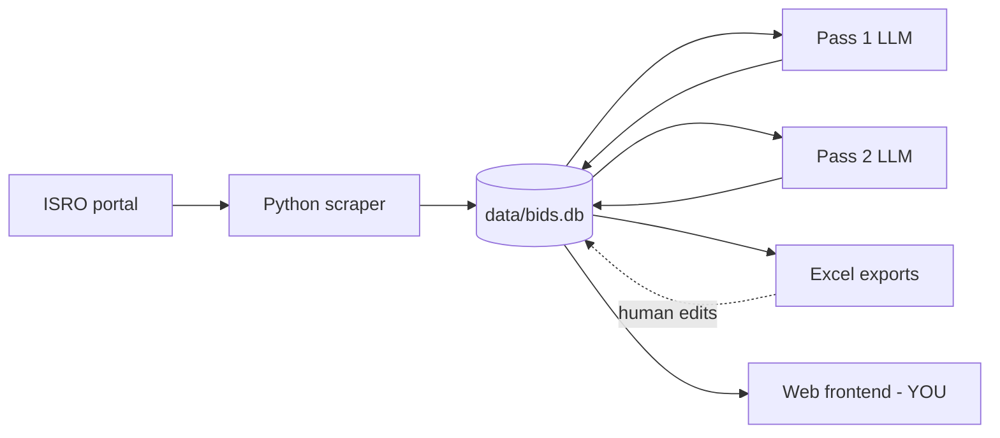
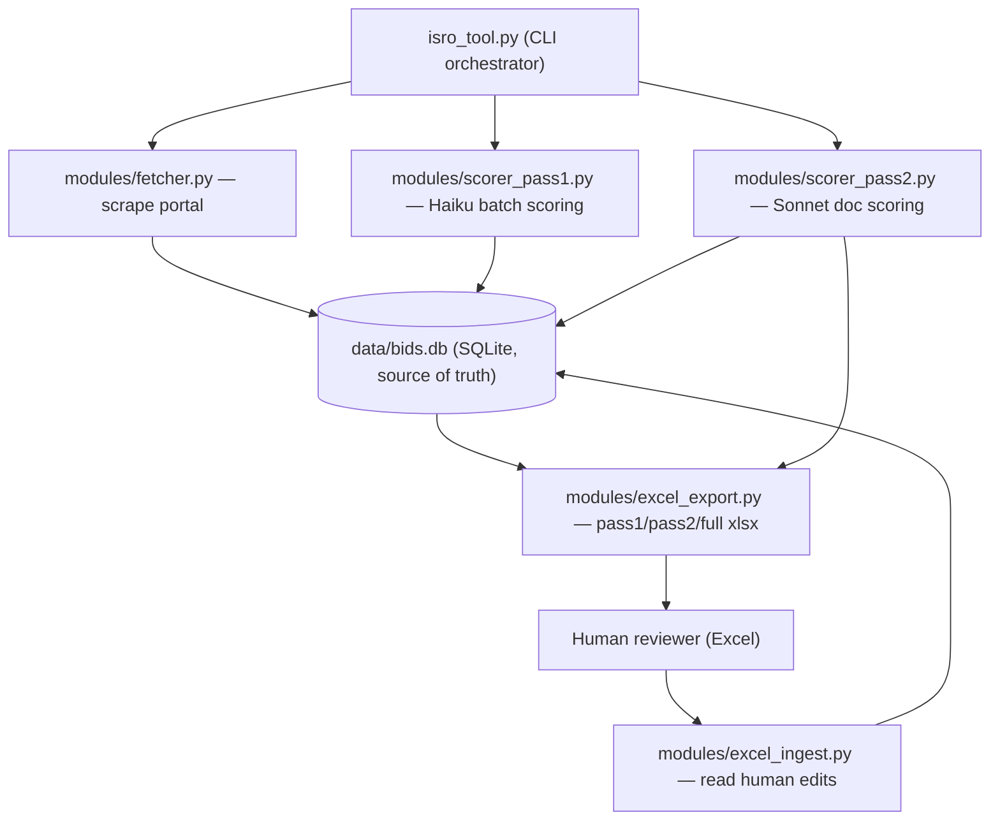

=== FILE: /Users/kartrama/Documents/Projects/AI/BidAnalysisPortal/gem_portal/data/capability_reference.md ===

# Company Capability & Technology Reference Guide
**Purpose:** Evaluation matrix for determining whether a prospective project aligns with company capabilities. Used by an LLM to produce a structured 0–5 capability score.

---

## 1. Evaluation Instructions

When analyzing a new project description:

- **Direct Match (score 4–5):** Project domain and technology stack align with a Core Domain below and technologies appear in the Primary Technology Stack.
- **Adjacent Match (score 2–3):** Project requires a technology or domain not explicitly listed but functionally equivalent to what is proven (e.g., Google Cloud instead of AWS/Azure, Vue.js instead of React, a Siemens PLC instead of Beckhoff TwinCAT, Azure OpenAI instead of AWS Bedrock). Engineering foundation allows adaptation within established domains.
- **Out of Scope (score 0–1):** Project has no meaningful overlap with the engineering, aerospace, defense, enterprise SaaS, or heavy industrial focus. Examples: consumer mobile games, social media marketing, SAP/Oracle ERP implementation, chip/ASIC design, pure cybersecurity red-teaming, blockchain/Web3, general e-commerce retail.

---

## 2. Scoring Rubric

| Score | Label | Criteria |
|-------|-------|----------|
| **5** | Direct in-scope | Domain is a proven Core Domain AND majority of required tech appears in the Primary Technology Stack AND client type matches the proven portfolio (defense PSU, ISRO, US Federal, enterprise SaaS). |
| **4** | Strong match | Domain is proven but tech stack has 1–2 gaps that are learnable extensions, OR domain is adjacent with near-complete tech overlap. |
| **3** | Moderate — pursue with ramp-up | Domain is adjacent (e.g., automotive HIL vs. avionics ATE, energy SCADA vs. industrial automation), OR tech stack is ~50% proven, OR standards are unfamiliar but methodology is transferable. |
| **2** | Weak — assess further | Only one dimension aligns (tech OR domain but not both); significant new capability investment required. |
| **1** | Fringe | Superficial overlap only (e.g., uses a language we know but domain is entirely foreign). |
| **0** | Out of scope | No meaningful overlap in domain, technology, or standards. Decline. |

**Scoring note:** Weight domain alignment and technology stack match most heavily. A project scoring 5 on domain but 2 on tech stack should yield an overall ~3. Use intermediate scores freely — they are expected.

---

## 3. Core Domains

1. **Aviation Simulator Systems** — Real-time simulation interfaces, outside visual imagery systems, data acquisition/control for aircraft and engine simulation environments. Clients: HAL, ADA.

2. **Cloud and Data Services** — Cloud migration, infrastructure automation, multi-cloud scalability, serverless optimization. Clients: startups, EdTech, media, logistics firms.

3. **Custom Electronics & Product Engineering** — Turnkey hardware/software product engineering, embedded systems, RTOS porting, BSP/driver development, edge computing device design. Clients: BEL, ADA, ADE, ISRO IPRC, automotive OEMs.

4. **Data & Telemetry** — Real-time data acquisition, telemetry system design, ground station integration, environmental monitoring for aerospace/defense/space. Clients: ADA, SDSC SHAR, ADE, NTT DoCoMo.

5. **Data Acquisition Systems (DAS)** — High-channel-count DAS (up to 6,000+ channels) for propulsion, engine, and battery test facilities; real-time FFT, trending, and automated reporting. Clients: ISRO IPRC, Battery OEMs.

6. **Industrial Automation** — PC-based and RTOS-driven control systems for industrial automation, scientific instruments, propulsion test facilities, and additive manufacturing machines. Clients: CMTI, IIAP, ISRO LPSC, Indian Defence.

7. **IT Services & Enterprise SaaS** — Enterprise platform development, compliance SaaS, and CRM implementations. Proven in fintech, mortgage, and US Federal Government compliance contexts. Clients: SavvyMoney, VIP Mortgage, US Federal Govt via MGT Consulting.

8. **Next-Generation Tech** — LLM/RAG pipelines, Agentic AI, AI analytics automation, autonomous ground vehicles (ROS). Clients: US Federal Govt via MGT Consulting, ADA, CVRDE.

9. **Onboard Avionics** — Embedded software to DO-178C Level A/B standards, CSU-level testing, dual-redundant subsystem design for flight-critical LRUs. Clients: ADA, HAL.

10. **Specialized Engineering Services** — Avionics simulator integration, software IV&V, legacy Fortran/Ada migration, LRU software upgradation. Clients: BEL, ADA, ADA via Safran.

11. **Test Rigs & Checkout Systems** — Automated test equipment (ATE) and checkout systems for avionics LRUs, flight control computers, and mission computers. Largest domain: 13 delivered projects. Clients: HAL, BEL, ADA, ADE.

---

## 4. Primary Technology Stack

### Languages & Frameworks
- **Languages:** C, C++, Embedded C, Python, Java, Ada 95, Fortran, C#, HTML, ReactJS
- **Frameworks:** QT, PyQT, JavaFX, Spring Boot, Django, Apache Tomcat, LabVIEW, MATLAB/Simulink

### AI, Cloud & Enterprise
- **AI / ML:** AWS Bedrock, LLMs, RAG, Vector DB, Agentic AI, Machine Learning (Python/ETL), Pandas, Einstein AI (Salesforce), YoLo (edge/FPGA)
- **Cloud:** AWS (EC2, S3, RDS, Lambda, EKS, Step Functions, Bedrock), Azure (VMs, AKS, Migrate, Site Recovery), GCP (GKE)
- **DevOps:** Terraform, Ansible, Docker, Kubernetes
- **Enterprise CRM:** Salesforce (Community, Sales, Marketing Cloud, Lightning, Visualforce, Einstein AI)
- **Databases:** Oracle 12c, PostgreSQL, MySQL, MongoDB

### Embedded, RTOS & Hardware
- **RTOS / OS:** Xenomai RTOS, RT Linux, WindRiver RT Linux, Hard RTOS, Linux (embedded), TwinCAT 3 (Beckhoff), ROS-Humble, Android OS (customized)
- **Processors / SoC / FPGA:** TI Sitara AM5718, ADI Blackfin 609, Xilinx Zynq-7000, MPC5777C (PowerPC), MC68332, STM32, PXI, UEI hardware
- **Protocols:** MIL-STD-1553B, ARINC 429, EtherCAT, RTnet, OPC/OPC UA, RS-232/422/485, SPI, I2C, UART, PCIe, MQTT, RTSP, Ethernet/UDP, Synchro, TSN Ethernet
- **Automation Hardware:** Beckhoff (TwinCAT 3, EtherCAT terminals, TwinSAFE), PXI rack/instrumentation, UEI DAQ modules
- **Tools:** LDRA TBvision/TBrun, Keil uVision, SPIL, SCADA, Wonderware HMI, AdaMULTI IDE, PCM Decommutation, IMAT21 DPMAS V1.0

### Standards & Certifications
- **Avionics:** DO-178C (Level A, B, D), MISRA C, CEMILAC qualification
- **Defense / Test:** MIL-STD-1553B, IMTAR (Indian MoD ATE standard), ARINC 429
- **Enterprise / Federal:** 2 CFR Part 200 (US Federal cost allocation)

---

## 5. Domain-Specific Keywords

*Terms that appear in project descriptions and map to a Core Domain. Presence of these signals strong domain alignment even if not mentioned in the tech stack.*

**Aviation Simulator Systems**
Full Flight Simulator, FFS, Level-D simulator, cockpit interface, cockpit signal management, simulation host computer, outside visual system, OWS, terrain rendering, visual imagery system, DACS, METF, mobile engine test

**Cloud and Data Services**
Cloud migration, lift-and-shift, IaC, infrastructure as code, disposable lab environment, serverless architecture, cloud-native re-architecture, multi-cloud deployment, VMWare migration, on-premises to cloud, auto-scaling, CDN, object storage

**Custom Electronics & Product Engineering**
BSP, board support package, device driver development, RTOS porting, kernel module, bare-metal, hard real-time, PXI porting, dual-server redundancy, cryogenic control, HDVSD, airborne video recorder, sonar product, edge AI, YoLo FPGA, Zynq SoC, multimedia middleware

**Data & Telemetry**
Flight test instrumentation, FTI, PCM decommutation, ground telemetry station, telemetry ground station, GCS, ground control station, UAV data collection, met tower, meteorological monitoring, launch range monitoring, emergency warning system, EWS, cell broadcast, EMPLTS, EOT, ELCF, engine parts life tracking

**Data Acquisition Systems**
DAQ, DAS, data acquisition system, propulsion test facility, engine test stand, test bench DAQ, EtherCAT DAQ, UEI modules, high channel count, 1553-channel, analog input channel, FFT on test data, real-time trending, battery test bench, BMS test, battery management validation, semi-cryo engine test, liquid propulsion test

**Industrial Automation**
Beckhoff, TwinCAT, EtherCAT motion control, telescope control system, TCS, observatory control, directed energy deposition, DED machine, additive manufacturing control, SLM control, hard real-time process control, Wonderware HMI, OPC UA, SCADA control, liquid propulsion valve control, cryogenic valve

**IT Services & Enterprise SaaS**
Salesforce implementation, Salesforce Apex, Lightning Web Components, CRM customization, fintech SaaS, compliance platform, 2 CFR Part 200, OMB A-87, federal cost allocation, multi-tenant SaaS, mortgage software, loan origination, credit score platform, billing automation

**Next-Generation Tech**
RAG pipeline, retrieval augmented generation, agentic AI, AI agent, LLM pipeline, knowledge assistant, document QA, autonomous ground vehicle, UGV, UGCV, ROS2, navigation stack, SLAM, path planning, aircraft health monitoring, AHM, predictive maintenance ML, ETL ML pipeline, AI report generation, Map-Reduce LLM, variance analysis automation

**Onboard Avionics**
DO-178C Level A, DO-178C Level B, avionics LRU software, CSU-level testing, Computer Software Unit, MISRA C compliance, LDRA analysis, Ada 95, GNAT, dual-redundant avionics, flight-critical software, BCCIU, BHEEM, engine vibration tracking, environmental control system software, fuel management software, LCA Mk2, AMCA, CEMILAC, RCMA

**Specialized Engineering Services**
IV&V, independent verification and validation, IMTAR compliance, ATE IV&V, Fortran cross-compilation, Fortran porting, legacy avionics migration, VOB migration, ClearCase, avionics bird simulator, pilot-in-the-loop, LRU validation simulator, software qualification, LDRA certification support

**Test Rigs & Checkout Systems**
ATE, automated test equipment, LRU tester, SRU tester, checkout system, DFCC tester, FCMC tester, WMC ATE, weapons management computer tester, mission computer ATE, DUCTE, DARIN3, IFCC tester, PXI ATE, MIL-1553 bus simulation, ARINC bus simulation, RS-422 signal simulation, Synchro signal, GO/NOGO, PBIT, PLBIT, squadron tester, field maintenance tester, avionics integration rig, AIR, SPIL, LabVIEW ATE, MATLAB Simulink HIL, HIL test

---

## 6. Required Output Format

Always respond with the following structure. Do not deviate.

```
SCORE: [0–5]
CONFIDENCE: [High / Medium / Low]
DOMAIN MATCH: [Primary Core Domain name(s)]
MATCHING TECH: [Comma-separated list of matched technologies/standards from Section 4]
GAPS: [Technologies or domain knowledge required but absent from portfolio. Write "None" if score is 5.]
RATIONALE: [2–3 sentences citing specific evidence from this document.]
RECOMMENDATION: [PURSUE | PURSUE WITH RAMP-UP | ASSESS FURTHER | DECLINE]
```

**Recommendation mapping:** PURSUE = score 4–5 | PURSUE WITH RAMP-UP = score 3 | ASSESS FURTHER = score 2 | DECLINE = score 0–1

---

## 7. Worked Example

**Input project description:**
> "Development of a LabVIEW-based automated test system for a radar LRU for DRDO NPOL, requiring MIL-STD-1553B bus simulation and RS-422 signal interfaces."

**Expected output:**
```
SCORE: 4
CONFIDENCE: High
DOMAIN MATCH: Test Rigs & Checkout Systems
MATCHING TECH: LabVIEW, MIL-STD-1553B, RS-422
GAPS: Radar / EW LRU domain is new — portfolio covers avionics LRUs (DFCC, WMC, mission computers), not radar or electronic warfare hardware. DRDO NPOL is a new lab within the known DRDO client group.
RATIONALE: LabVIEW-based ATE with MIL-1553B and RS-422 is a direct technical match across multiple delivered projects (DUCTE mission computer ATE, IFCC channel testers, DFCC squadron tester). DRDO is a proven client type (CVRDE engagement exists). The radar LRU domain requires modest domain ramp-up but the test architecture is identical to proven work.
RECOMMENDATION: PURSUE
```

---

=== FILE: /Users/kartrama/Documents/Projects/AI/BidAnalysisPortal/gem_portal/README.md ===

# GeM Portal — Starter Kit for the Vector-DB Pivot

This folder is a **self-contained snapshot** of the GeM portal logic, copied verbatim
from `../Implementation/` to seed a **new project** built around a vector database.

> The original `../Implementation/` tool is still in active use and was **not modified**.
> Everything here is a copy. Treat this folder as the starting point for the new build.

> **Note on the brief:** the request mentioned "the HAL portal" — this repo only contains
> the **GeM** (`bidplus.gem.gov.in`) fetch mechanism, so that is what is captured here.
> HAL/ISRO will be added later as separate portals following the same pattern.

---

## 1. The pivoted design (new workflow)

The old two-pass + Excel workflow is being replaced. The new daily flow:

1. **Daily morning fetch** — fetch all *new* bids not already in the DB; mark *closed*
   and *extended* bids. **This fetch logic does not change** (see §4).
2. **Snapshot the DB** — copy the database into this folder each run.
3. **Pass 1 scoring** — score new bids with the rubric (Haiku). For every bid scored
   **≥ 3**: fetch the **primary bid document**, parse it for **links to supporting
   documents**, fetch all relevant ones, and hold them in a **temporary location**.
4. **Ingest to vector DB** — all fetched documents are embedded into a **vector
   database**, keyed by **bid ID**. Then the pipeline stops. **No document is ever
   written to disk** — the vector DB is the only store of document content.

Then the system is idle until a user acts:

- The user opens the **web app** and sees the new bids.
- For a bid of interest, the user **requests further information**. Using a **separate
  rubric**, the system retrieves that bid's chunks from the vector DB, sends them to an
  **LLM to summarize**, shows the summary, and **saves the summary to the DB**.
  This happens **one bid at a time**.
- At that point the user **accepts or rejects** the bid.
- **Forced disposition:** every bid scored ≥ 3 has documents in the vector DB. A bid the
  user has **viewed** must be explicitly **accepted or rejected**. A bid the user
  **never views** is treated as **rejected**.
- **Vector-DB cleanup:** on rejection, that bid's documents are **removed** from the
  vector DB. Bids that become **CLOSED** in a future run are also **removed**.

### What is NET-NEW (to build in the new project — not present here)
- The **vector database** + embedding/ingest layer (keyed by bid ID).
- The **on-demand summary** step (second rubric → retrieve → LLM summarize → save).
- The **web application** (bid list, "request info", accept/reject, forced disposition).
- **Vector-DB lifecycle** hooks (remove on reject, remove on CLOSED).
- Replacing on-disk document saving with **temp-location → vector-DB** ingestion.

### What is REUSED from this folder
- Daily fetch + closed/extended marking (§4) — unchanged.
- Pass 1 scoring + rubric.
- The **document-fetch engine** (primary doc → link discovery → supporting docs).
- The SQLite bid lifecycle / schema.

---

## 2. File-by-file guide

### Orchestration & config
| File | Contents | Role in new workflow |
|------|----------|----------------------|
| `gem_tool.py` | The original CLI orchestrator. Wires the phases: ingest → **fetch** → CLOSED sweep → **Pass 1 score** → (Pass 2) → export. | **Reference for sequencing.** Reuse the fetch / sweep / Pass-1 phases. Drop the Pass-2-scoring and Excel-export phases; insert the doc-fetch → vector-DB-ingest step after Pass 1. |
| `config.py` | Paths (DB, state, exports, downloads, rubric), `PASS2_THRESHOLD=3`, loads `TARGET_ORGS` from `organizations.json`. | Keep. `PASS2_THRESHOLD=3` is your **"score ≥ 3"** cutoff for which bids get documents fetched. |
| `requirements.txt` | Python dependencies (`requests`, `anthropic`, `pdfplumber`, `openpyxl`, `pandas`). | Baseline deps. Add your vector-DB + embedding libs; `openpyxl`/`pandas` only needed if you keep Excel (you won't). |

### Fetch mechanism (GeM) — **the core deliverable**
| File | Contents | Role |
|------|----------|------|
| `modules/csrf_handler.py` | Establishes an authenticated `requests.Session` with GeM and extracts the CSRF token (`csrf_bd_gem_nk`). Detects CSRF-failure HTML pages. | **Required for every fetch.** GeM rejects requests without a valid session + token. See §4. |
| `modules/fetcher.py` | `search_bids()` (POST to `/search-bids`), `_parse_doc()` (maps raw Solr doc → bid dict), `fetch_all_bids_for_org()` (full pagination, no date filter, `numFound` coverage check). | **The fetch engine.** Unchanged in the new design. See §4. |
| `data/organizations.json` | `TARGET_ORGS` — the ministries/organizations to scan (Defence, MEITY, Space, Heavy Industries). | Drives which orgs are fetched. |
| `data/state.json` | Per-org `last_run` + crash-recovery checkpoints (`completed_orgs`). | Crash-recovery for long full-fetch runs. |

### Pass 1 scoring
| File | Contents | Role |
|------|----------|------|
| `modules/scorer_pass1.py` | Haiku batch scoring (batch size 25): builds a cached system prompt from the rubric + few-shots, runs an exclusion pre-filter, parses scores. | **Reuse as-is.** Produces the 0–5 score; **≥ 3 triggers document fetch**. |
| `data/capability_reference.md` | The scoring rubric / system prompt describing Teclever's capabilities. | The **Pass 1 rubric**. NOTE: the new **summary** step needs a **separate, second rubric** you will author. |
| `modules/feedback.py` | Seeds exclusion rules + few-shot examples; promotes feedback to rules. | Feeds the Pass 1 exclusion filter and few-shots. Keep. |

### Document-fetch engine (your step 3) — inside `scorer_pass2.py`
`modules/scorer_pass2.py` is a **mixed file**. Only the **document-retrieval half** is
relevant to the pivot; the LLM-scoring half is being retired.

| Function | Keep? | Why |
|----------|-------|-----|
| `download_pdf(internal_id)` | ✅ | Fetches the **primary bid PDF** (step 3a). |
| `extract_spec_links(pdf_bytes)` + `_rank_spec_url` / `_SKIP_URL_RE` / `_SPEC_URL_RANKS` | ✅ | Parses the primary PDF's hyperlink annotations to find **supporting/spec documents**, ranked & filtered (step 3b). |
| `_download_spec_pdf(url, session)` | ✅ | Downloads each supporting doc (auth vs public domains). |
| `extract_and_clean(pdf_bytes)` | ✅ (adapt) | Extracts + cleans PDF text (strips boilerplate, CID artifacts). Useful to produce **text for embedding**. |
| `_fetch_spec_texts()` | ✅ (adapt) | Orchestrates link → download → clean. **But it currently writes PDFs to disk (`_save_spec_pdf`) — remove that; route bytes/text to the vector DB instead.** |
| `_save_pdf` / `_save_spec_pdf` | ❌ | Disk saving — the new design stores **nothing on disk**. |
| `score_bid_pass2()` LLM call, `_handle_single_tender`, `extract_emd_amount` | ❌ (legacy) | Old Pass-2 scoring. Replaced by the on-demand vector-DB summary. EMD extraction can be salvaged later if needed. |

### Data layer
| File | Contents | Role |
|------|----------|------|
| `modules/db.py` | All SQLite ops: schema, `upsert_raw_bid` (NEW/ACTIVE/EXTENDED transitions + extension detection), `sweep_closed_bids`, `get_unscored_bids`, `query_pass2_candidates` (score ≥ threshold), human-override + run-flag preservation. | **Reuse the schema + bid lifecycle.** `query_pass2_candidates()` already selects the **≥ 3** set whose docs you must fetch. Add columns for the new flow: `summary_text`, vector-DB doc status, user disposition (accept/reject/viewed). |
| `data/bids.db` | **The live database snapshot** (~13 MB) — all bids with Pass 1/2 scores and lifecycle state. | Your **starting dataset**. Per workflow step 2, the daily run should also copy the DB into this folder. |

### Intentionally **excluded** (not copied)
- `excel_export.py`, `excel_ingest.py` — the Excel review workflow is replaced by the web
  app (human accept/reject + summaries live in the DB / UI, not spreadsheets).

---

## 3. Bid lifecycle (carried over unchanged)
`NEW → ACTIVE / EXTENDED → CLOSED`. Rules (enforced in `db.py`):
- `bid_number` is the primary key — always UPSERT.
- Extension detected when a re-fetched bid's `end_date` changes → `EXTENDED`, `extension_count++`.
- `sweep_closed_bids()` sets `CLOSED` where `end_date < today`. **CLOSED bids → remove from vector DB** (new).
- Human-owned fields are never overwritten by automated runs.

---

## 4. The GeM fetch mechanism (how it works)

**Daily fetch = full fetch, no date filtering.** Every run paginates *all* active bids per
org; "new vs updated vs extended" is decided at upsert time, not by a date window.

1. **Session + CSRF** (`csrf_handler.get_session()`): GET a GeM page to obtain cookies and
   scrape the `csrf_bd_gem_nk` token. All subsequent requests reuse this session + token.
   GeM returns a **200 HTML error page** on CSRF failure (not an HTTP error), so the code
   inspects the response and re-handshakes if needed.
2. **Search** (`fetcher.search_bids(ministry, org, page, session, token)`): POST to
   `/search-bids` with a JSON `payload` (search type = `ministry-search`, the ministry,
   the organization, and the page number) plus the CSRF token as form data. Returns Solr-style JSON.
3. **Parse** (`fetcher._parse_doc`): map each raw doc → bid dict:
   `bid_number`, `internal_id` (needed to download the PDF later), `ministry`,
   `organization`, `department`, `items`, `quantity`, `start_date`, `end_date`.
4. **Paginate** (`fetcher.fetch_all_bids_for_org`): loop pages until the portal returns
   `code 404` / `status 0` / empty `docs`. Page 1 captures `numFound`; if total fetched
   `< numFound`, emit a coverage warning (detects portal-side pagination caps). Polite
   `0.8s` delay between pages. An `on_page` callback upserts each page immediately.
5. **Upsert** (`db.upsert_raw_bid`): insert new bids as `NEW`; on re-fetch, detect
   `end_date` change → `EXTENDED`; otherwise `ACTIVE` (never reopen `CLOSED`).
6. **Closed sweep** (`db.sweep_closed_bids`): mark anything past its `end_date` as `CLOSED`.

> **TLS note (from the original project):** GeM switched to an eMudhra CA cert not in the
> default `certifi` bundle. If you hit `NO_CERTIFICATE_OR_CRL_FOUND`, append the GeM cert
> chain to certifi's bundle (do **not** use `REQUESTS_CA_BUNDLE`, it breaks the Anthropic SDK).

---

## 5. Suggested build order for the new project
1. Stand up fetch + DB lifecycle (copy §4 logic) → confirm daily fetch populates `new/closed/extended`.
2. Add Pass 1 scoring → produce ≥ 3 candidate set (`query_pass2_candidates`).
3. Adapt the doc-fetch engine to write to a **temp dir → vector DB** (drop disk saves).
4. Stand up the vector DB ingest keyed by bid ID.
5. Build the web app: bid list → request-info (2nd rubric → retrieve → summarize → save) → accept/reject + forced disposition.
6. Wire vector-DB cleanup on reject + on CLOSED.

---

=== FILE: /Users/kartrama/Documents/Projects/AI/BidAnalysisPortal/hal_portal/ARCHITECTURE_FRONTEND.md ===

# Architecture — Front-End Integration

> **⚠️ SCOPE: FRONT-END INTEGRATION ONLY.**
> This document describes how the standalone **HAL Bid Automation** tool plugs
> into the new multi-portal **front-end web application**, and the target
> end-to-end workflow that application implements. It is **not** a description of
> the HAL tool's current standalone behaviour — for that, see `README.md` and
> `context/`. Where the target workflow differs from what the HAL tool does
> today, this document flags it explicitly under **"Delta vs. the standalone
> tool"**. Nothing here changes the HAL tool until those deltas are implemented.

---

## 1. Why this document exists

The HAL tool is one of several portal scrapers (GeM is another). The front-end
app is a single pane of glass over all of them. Each scraper stays
self-contained and portable; the front end owns everything cross-cutting:
consolidated storage, authentication, per-portal views, the vector database, the
summariser LLM, and retention/cleanup.

```
                         ┌────────────────────────────────────┐
                         │        FRONT-END WEB APP            │
                         │  (auth, per-portal views, API)      │
                         │                                     │
                         │  ┌───────────────┐  ┌────────────┐  │
   ┌──────────┐          │  │ Consolidated  │  │  Vector DB │  │
   │ HAL tool │──fetch──▶│  │   bids table  │  │ (per-bid   │  │
   │ (this    │  Pass 1  │  │ (tool + entry │  │  doc chunks)│  │
   │  repo)   │  docs    │  │  references)  │  └────────────┘  │
   └──────────┘          │  └───────────────┘  ┌────────────┐  │
   ┌──────────┐          │                     │ Summariser │  │
   │ GeM tool │──fetch──▶│        ...          │    LLM     │  │
   └──────────┘          │                     └────────────┘  │
                         └────────────────────────────────────┘
```

The HAL tool is the **scraper adapter**: it discovers bids, scores them (Pass 1),
and — when asked — fetches a bid's documents. It does **not** own the vector DB,
the summaries, or the UI.

---

## 2. Consolidated data model (front-end owned)

The front end maintains its **own** database, separate from each tool's local
SQLite. One consolidated `bids` row per (portal, source bid), with a hard link
back to the exact entry inside the originating tool so any bid can be traced to
"which tool, which row".

| Consolidated field | Source | Notes |
|--------------------|--------|-------|
| `id` | front end | Front-end surrogate key |
| `tool` | constant | `"hal"`, `"gem"`, … — identifies the scraper adapter |
| `source_pk` | tool | HAL: composite `(tender_number, line_number)` |
| `portal` | tool | Display/grouping key; HAL → `eproc.hal-india.co.in` |
| `title` / `description` | tool listing | `tender_description` for HAL |
| `buyer`, `region`, `closing_date`, `estimated_cost`, `emd` | tool listing | Listing fields |
| `pass1_score`, `pass1_rationale`, `pass1_domain`, `pass1_confidence` | tool Pass 1 | |
| `bid_status` | tool lifecycle | `NEW / ACTIVE / EXTENDED / CLOSED` |
| `docs_ingested` | front end | True once this bid's documents are in the vector DB |
| `summary` | front end | LLM summary text, generated on demand, then cached |
| `summary_generated_at` | front end | Timestamp of the cached summary |
| `user_state` | front end | e.g. `new / viewed / irrelevant / rejected` |

**Identity contract (HAL):** a bid is uniquely `(tender_number, line_number)`.
The front end must store both and treat them as the join key back into the HAL
tool. Tender numbers contain `/`; keep them raw in the DB and sanitise to `_`
only for any filesystem path.

**Portal isolation:** the UI never shows bids from multiple portals at once. The
user selects a portal first, then sees that portal's bids. The consolidated table
makes this a simple `WHERE tool = ?` / `WHERE portal = ?` filter.

---

## 3. Target end-to-end workflow

### 3.1 Ingest pipeline (scheduled, per portal)
For each scraper tool, on a schedule:

1. **Fetch** all new/active bids and upsert into the tool's local store, then
   sync listing fields up into the consolidated `bids` table (tagged with
   `tool` + `source_pk`).
2. **Pass 1 only.** Run the cheap capability score on every unscored bid. (Pass 2
   / Sonnet deep-scoring from the standalone tool is **not** part of this
   pipeline — see §5.)
3. **Conditional document download.** For every bid with `pass1_score >= 3`,
   download its required documents immediately (no human gate in between).
4. **Vectorise.** As soon as Pass 1 finishes and a qualifying bid's documents are
   downloaded, push the extracted/chunked document text into the **vector DB**,
   keyed by the bid's identity. Set `docs_ingested = true`.
5. **Delete the files.** Once vector-DB ingestion for a bid completes, **delete
   the downloaded files from disk**. No documents are stored permanently (§6).

### 3.2 Read path — login and browse
- User logs in and sees the newly-fetched bids **for one selected portal**.
- Each bid shows its listing fields + Pass 1 score/rationale.

### 3.3 "Fetch More Details" (on-demand summary)
When the user clicks **Fetch More Details** on a bid:

- **If the bid already has documents in the vector DB** (`docs_ingested = true`,
  i.e. it scored ≥ 3 and was ingested during §3.1):
  1. Retrieve the bid's chunks from the vector DB.
  2. Feed them to the summariser LLM.
  3. Show the summary to the user and **store it** in the consolidated DB
     (`summary`, `summary_generated_at`) so future opens are instant.
- **If the bid has no downloaded documents** (scored < 3, or not yet fetched):
  1. Trigger an **on-demand document fetch** for that single bid (the HAL tool's
     document-download path).
  2. Ingest the documents into the vector DB (set `docs_ingested = true`).
  3. Summarise via the LLM, show the user, store the summary.
  4. Delete the downloaded files from disk (§6).

The summary is generated once and cached; it is regenerated only if the bid's
documents change (e.g. an EXTENDED tender re-issues documents).

### 3.4 Retirement — closed / irrelevant / rejected
When a bid becomes `CLOSED`, or the user marks it **irrelevant** or **rejected**:

- **Purge all pertinent material from the system except the consolidated DB
  record.** Specifically: drop its chunks from the vector DB, delete any
  on-disk files, and (optionally) drop the cached `summary`.
- The **consolidated DB row is kept** as the durable record of what was seen and
  what the user decided. Nothing else about the bid survives.

---

## 4. What the HAL tool provides to the integration

These existing capabilities are the integration surface the front end drives.
(File references are in this repo.)

| Capability | Where | Output the front end consumes |
|-----------|-------|-------------------------------|
| Full scrape | `modules/fetcher.fetch_all_tenders` → `db.upsert_raw_tender` | Tenders in `data/bids.db`, keyed `(tender_number, line_number)`, with `bid_status` lifecycle |
| Pass 1 scoring | `modules/scorer_pass1.score_bids_pass1_bulk` | `pass1_score`, `pass1_confidence`, `pass1_domain`, `pass1_rationale`, `pass1_gaps` |
| Document download | `modules/fetcher.open_tender_documents` + `download_document` | Raw PDF **bytes** + filenames per tender (currently also written to `downloads/`) |
| PDF text extraction | `modules/scorer_pass2.extract_and_clean` | Cleaned, boilerplate-stripped text — ready to chunk for the vector DB |
| Lifecycle | `db.upsert_raw_tender`, `db.sweep_closed_tenders` | `NEW / ACTIVE / EXTENDED / CLOSED`, `extension_count`, `previous_closing_date` |
| CLI entry | `hal_tool.py` (`run`, `score-pending`, …) | Subprocess-invokable today |

**Identity & lifecycle are already correct for this design** — composite PK,
monotone flags, and the NEW→ACTIVE→EXTENDED→CLOSED transitions all hold.

---

## 5. Delta vs. the standalone tool

The current HAL tool implements a **different** Pass-2 stage than the target
workflow. These are the gaps a front-end integration must close. None are bugs in
the standalone tool; they are intentional differences in the new architecture.

| Concern | Standalone HAL tool today | Target front-end workflow |
|---------|---------------------------|---------------------------|
| Gate before documents | Human reviews `pass1_*.xlsx`, sets `Run Pass 2 = Y/N`, then `run-pass2` | **Automatic**: any `pass1_score >= 3` downloads documents immediately, no human gate |
| Document stage purpose | Pass 2 = **Sonnet deep-scoring** of cleaned text → `pass2_*` columns + recommendation | Documents → **vector DB**; deep analysis is replaced by **on-demand LLM summary** |
| Document persistence | Saved permanently under `downloads/{rec}/{date}/{tender}/` | **Deleted after vector-DB ingestion**; nothing kept on disk |
| Output surface | Daily Excel files (`pass1`, `pass2`, `bids`) | Consolidated DB + UI; Excel not required |
| Summaries | None | LLM summary generated on demand, cached in DB |
| Retention | DB + Excel + PDFs retained | DB record only after CLOSED/irrelevant/rejected; vector chunks + files purged |
| Vector DB | None | New component owned by the front end |

**Implication for the HAL tool.** To serve this workflow it needs (a) a
document-download entry point callable for a **single** bid without the Sonnet
scoring step (the building blocks — `open_tender_documents`, `download_document`,
`extract_and_clean` — already exist and just need a thin orchestration wrapper),
and (b) the auto-at-≥3 trigger moved out of the human-Excel gate. Pass 1
(`score_bids_pass1_bulk`) and the scrape are reusable as-is.

---

## 6. Retention & cleanup rules (hard requirements)

1. **No permanent file storage.** Downloaded documents are transient. The moment
   a bid's documents are ingested into the vector DB, the on-disk files are
   deleted. (In the standalone tool, `downloads/` is permanent — that behaviour
   must be turned off for the integrated pipeline.)
2. **Vector DB is the only document store**, and only for bids that are active and
   relevant.
3. **On CLOSED / irrelevant / rejected:** purge the bid's vector-DB chunks, any
   residual files, and optionally the cached summary. **Keep only the
   consolidated DB row.**
4. **Summaries are cached, not authoritative source** — they can be regenerated
   from the vector DB while the bid is still active, and are discarded on
   retirement.

---

## 7. Integration options (front end → HAL tool)

| Option | How | Trade-off |
|--------|-----|-----------|
| **Subprocess CLI** | Call `python hal_tool.py run` / `score-pending`; read `data/bids.db` | Lowest coupling; works today; coarse-grained (no single-bid doc fetch yet) |
| **Import as a library** | Import `modules.fetcher` / `modules.scorer_pass1` / `modules.scorer_pass2` directly | Fine-grained (single-bid document fetch, custom orchestration); requires the new wrapper from §5 |
| **Read shared SQLite** | Treat `data/bids.db` as the tool's output contract; sync into the consolidated DB | Good for the listing/Pass-1 sync; documents still need an explicit fetch call |

Recommended: **library import** for the ingest pipeline (gives the single-bid,
no-Sonnet document fetch the workflow needs) plus **shared-DB read** for syncing
listing + Pass 1 fields into the consolidated table.

When the multi-portal dashboard lands, this whole folder is intended to drop in
as `portals/hal/` with shared `core/` logic owned by the front-end project (see
`README.md`).

---

=== FILE: /Users/kartrama/Documents/Projects/AI/BidAnalysisPortal/hal_portal/context/01_project_context.md ===

# HAL Bid Automation — Project Context

## Purpose

Monitors HAL India's e-procurement portal (https://eproc.hal-india.co.in), automatically discovers all open tenders, scores them against company capability using Claude AI, and generates daily Excel review files for human decision-making — identical in purpose to the existing GEM portal automation tool.

Company: Teclever. HAL is a primary client across multiple domains (Test Rigs, Avionics, Simulators). This tool automates daily tender monitoring and pre-screening so no relevant HAL bid is missed.

## Key Design Decisions

| Decision | Choice | Reason |
|----------|--------|--------|
| Scrape strategy | Full scrape every run | ~145 total active tenders — delta logic adds complexity without benefit |
| Authentication | None required | Entire portal publicly accessible including PDF downloads |
| Pass 1 model | `claude-haiku-4-5-20251001` | Fast, cheap, batch 25 at a time |
| Pass 2 model | `claude-sonnet-4-6` | Strict deep document analysis |
| Pass 2 trigger | score ≥ 3 auto-qualifies; score < 3 only if human flags Y | Mirrors GEM tool logic |
| Pass 2 documents | Download ALL PDFs, strip boilerplate, send cleaned text | Option B — more complete than RFQ-only |
| Excel format | Daily pass1 + pass2 delta files, same structure as GEM | Consistent with existing workflow |
| PDF storage | `downloads/{recommendation}/{YYYY-MM-DD}/{tender_number}/` | Matches GEM pattern with date subfolder |
| Exclusion rules | Not implemented | Pass 1 score/recommendation is the gate |
| Feedback/few-shot | Yes — same as GEM | Human corrections feed future scoring |
| Schema | HAL-specific, not 1:1 GEM copy | HAL data structure differs significantly |

## Pass 1 Input Fields (sent to Haiku)
- Tender Description (from listing)
- Tender Region (HAL division)
- Buyer (IMM / WORKS / OUTSOURCING)
- EMD (from listing)
- Closing Date
- Bidder Type (Both / Indian / Foreign)
- Estimated Cost (from listing)

## Pass 2 Trigger Logic
- `run_pass2 = 1` → always run (human forced yes)
- `run_pass2 = -1` → never run (human forced no)
- `run_pass2 = 0` (default) → run if `pass1_score >= 3`
- Human rejection (override_score set ≤ 0) blocks even score ≥ 3

## PDF Financial Extraction (Pass 2)
- **`emd_amount`**: precise EMD from PDF (listing value often RS0/--NA--)
- **`contract_value`**: total project value from RFQ PDF — key for go/no-go judgment

## File Layout (planned)
```
HALAutomation/
  capability_reference.md     ← scoring system prompt (active tool component)
  references/                 ← GEM reference docs and sample Excel files
  context/                    ← this design context (all four files)
  data/                       ← runtime: bids.db, state.json (created at runtime)
  exports/                    ← runtime: pass1_*.xlsx, pass2_*.xlsx, bids_*.xlsx
  downloads/                  ← runtime: PDFs organised by recommendation
  modules/                    ← Python modules (created at implementation)
  hal_tool.py                 ← main entry point (created at implementation)
  config.py                   ← paths and settings (created at implementation)
```

---

=== FILE: /Users/kartrama/Documents/Projects/AI/BidAnalysisPortal/hal_portal/context/02_portal_mechanics.md ===

# HAL Portal — Scrape Mechanics (Playwright)

> **Implementation note.** This document describes the **current implementation**,
> which drives a headless Chromium browser via **Playwright**. An earlier design
> (preserved in this file's git history) planned a plain-HTTP `requests.Session`
> "8-step enc/chkSum chain". That approach was **abandoned** — the portal's
> Aurelia SPA front end and session-bound `enc`/`chkSum` tokens made full browser
> automation far more robust. There is no `requests` code path anywhere in the
> tool. The schema/pipeline *logic* in the sibling docs remains valid; only the
> transport mechanism changed.

## Platform
TenderWizard (C1 India / Antares Systems), fronted by an **Aurelia single-page
app** served from `https://eproc.hal-india.co.in/HAL/` and rendered inside a
"Mobility" iframe. All in-portal navigation uses encrypted `enc` + `chkSum`
tokens that are **session-specific and server-generated** — they cannot be
constructed offline. Rather than chase those tokens by hand, the tool lets a real
browser session generate and carry them.

- **Entry URL** (`config.HAL_BASE_URL`): `https://eproc.hal-india.co.in/HAL/`
- **Origin** (`fetcher._ORIGIN`): `https://eproc.hal-india.co.in`

## Session & browser profile
The tool launches a **persistent** Playwright Chromium context
(`pw.chromium.launch_persistent_context`):

| Setting | Value |
|---------|-------|
| `user_data_dir` | `BROWSER_PROFILE_DIR` = `.browser_profile/` (gitignored, regenerated per machine) |
| `headless` | `True` |
| `accept_downloads` | `True` |
| `ignore_https_errors` | `True` |
| `args` | `config.chromium_launch_args()` |

- Cookies (`JSESSIONID`, etc.) and storage **persist across runs**, so the portal
  session stays warm between the scrape and the Pass 2 document fetch — no
  re-authentication needed.
- **No login, no CAPTCHA** — the entire portal, including PDF downloads, is
  publicly accessible. `JSESSIONID` is auto-issued on first navigation.
- `chromium_launch_args()` probes the portal host's A-records at launch and pins
  Chromium to the first reachable IP via `--host-resolver-rules=MAP <host> <ip>`.
  The host publishes several A-records and occasionally leaves one dead; headless
  Chromium (unlike curl) does not fail over and would hang the full navigation
  timeout on a dead IP. It also sets `--disable-blink-features=AutomationControlled`.

---

## Scrape flow (`modules/session.py`, `modules/fetcher.py`)

The list scrape is **driven by clicks and captured from network responses** — it
never parses the visible HTML table. Entry point: `fetcher.fetch_all_tenders()`.

### Step 1 — Open the Free View (`session.open_free_view`)
1. `page.goto(HAL_BASE_URL)`.
2. Poll every frame for a link whose text matches one of
   `"Go to Tender Free View"`, `"Tender Free View"`, `"Free View"`.
3. Click it. The portal opens the search form in a **new tab**; that tab's `Page`
   is returned (falls back to the same page if no new tab appears).

### Step 2 — Submit the search (`session.find_results_scope`)
`find_results_scope(context)` polls all open pages for `#myTable tbody tr`. On the
first pass, if the results table is not present yet, it clicks the Search button
(trying selectors `#submitsearch`, `input.SearchButton[onclick*='search']`,
`[onclick='search()']`, …) or, as a fallback, invokes the portal's own `search()`
JS function. It returns a **`Page`** (not a `Frame`) because pagination reloads the
page and detaches frame handles. The default search returns **all active
tenders** — no buyer/stage/bidder filter is applied in the UI default.

### Step 3 — Capture tender JSON from network responses (`_collect_records_with_listener`)
A **context-level response listener** is attached for the duration of the scrape:

```python
def on_response(resp):
    if "Renderer" not in resp.url and "UiRenderer" not in resp.url:
        return
    text = resp.body().decode("utf-8", "replace")
    for rec in _parse_records_from_response(text):
        json_acc[str(rec["Serial Number"])] = rec
```

`_parse_records_from_response` handles **two response shapes**:

| Shape | Where it appears | How it is parsed |
|-------|------------------|------------------|
| HTML page with an inline `jsonBusinessDatails = '[…]';` JS variable | initial search result page | regex `_JSON_RECORDS_RE` |
| JSON envelope with a `lmBusinessDatails` (or `sTenderHeaderDetails`) string key holding a JSON array | paginated scroll responses | `json.loads`, then verify `arr[0]` has a `"Serial Number"` key |

The first-window page is **also** seeded directly via `_seed_from_page(scope,
json_acc)`. Records are de-duplicated by their `"Serial Number"` value.

### Step 4 — Paginate by scrolling (`_click_next`)
There is no page-number control; results load in windows via an infinite-scroll
button `#scroll-right`:
1. Record the first row's text signature (`#myTable tbody tr` innerText, first 80 chars).
2. Click `#scroll-right`; wait up to ~12 s for the signature to change.
3. The response listener captures each new window's JSON automatically.

**Stop conditions** (any one): `len(json_acc) >= NO_OF_ROWS` (total scraped from
`"NO_OF_ROWS"` in the page content), `#scroll-right` disappears, no new records
after 4 consecutive scrolls (`stagnant >= 4`), or `max_pages` (60) reached.
`SCRAPE_DELAY_SECONDS` (0.7 s) throttles between scrolls.

### Step 5 — Progressive upsert
After each window, newly-seen serials are converted to DB records and handed to an
`on_page(batch)` callback, which the CLI wires to `db.upsert_raw_tender`. The DB
fills incrementally, so a mid-scrape crash still persists everything captured so
far. `fetch_all_tenders` returns the total count of unique tenders.

---

## Tender record fields (`_FIELD_MAP`, `_build_record`)

Each captured JSON record is normalised to DB columns. Values in
`{"--NA--", "N/A", "NA", "-- NA --", …}` (`_NA_VALUES`) are blanked to `""`.

| Portal JSON field | DB column |
|-------------------|-----------|
| `Buyer` | `buyer` (IMM / WORKS / OUTSOURCING) |
| `Tender Number` | `tender_number` (primary identifier) |
| `Tender Description` | `tender_description` |
| `Estimated Cost` | `estimated_cost` (e.g. `RS1,27,89,00,000.00` or `RS0`) |
| `Form Fee` | `form_fee` |
| `EMD` | `emd_listing` (often `RS0` / `--NA--`) |
| `Tender Stage` | `tender_stage` (Latest / Opened / Awarded / …) |
| `Tender Region` | `tender_region` (HAL division, e.g. `Design Complex -MCSRDC`) |
| `Tender Closing Date & Time` | `closing_date` (`dd-mm-yyyy HH:MM`) |
| `Bidder Type(Nationality)` | `bidder_type` (Both / Indian / Foreign) |
| `Serial Number` | (de-dup key only, not stored) |
| `Line Number` | split → `line_number` + `detail_url` (see below) |

**Line Number format:**
`"<line_no>$/$/$/ROOTAPP/servlet/venderdisplayservlet?enc%3D…%26chkSum%3D…"`
Split on `$/$/$/`: left half = `line_number`; right half = the
`venderdisplayservlet` detail-page path, turned into an absolute URL in
`detail_url` (origin prepended). The composite **primary key is
`(tender_number, line_number)`** — one tender number can have multiple line numbers.

> ⚠️ **`enc`/`chkSum` must stay percent-encoded** (`%3D`, `%26`). Decoding them to
> `=`/`&` causes the server to reject the request. `_abs_download_url` replaces
> `&amp;` with `%26`, never with a literal `&`.

> **Note — unused schema columns.** The current scraper's `_FIELD_MAP` captures
> only the 10 listing fields above. The richer columns in the schema
> (`tender_cover`, `announcement_date`, `tender_type`, `submission_type`,
> `tender_for`, `directory_id`, `issue_date_from`, `issue_date_to`, and the
> detail-page fields `opening_date`, `cost_open_date`, `tender_mode`,
> `validity_of_bid`, `contact_email`, `contact_person`, `qualification_criteria`,
> `additional_notes`) exist (added by `db._migrate`) but are **not populated** by
> the current implementation — there is no detail-page or pagination-JSON field
> extraction in the live code path. They remain available for a future enhancement.

---

## Document retrieval (Pass 2) — `fetcher.open_tender_documents`, `fetcher.download_document`

Per shortlisted tender (one shared search page is reused across all tenders within
a Pass 2 run — see `scorer_pass2.score_tender_pass2`):

1. **Reset & filter** — reload the search page to its empty-form URL, fill the
   tender-number field (`session.fill_tender_number`, which tries known selectors
   then a JS regex scan across all frames), click Search.
2. **Locate the row** — `fetcher.find_tender_row` scans `#myTable` rows for the
   tender number, scrolling forward through windows if needed. (The text filter
   does not always narrow to one result, so the row index is found explicitly.)
3. **Open the documents view** — click the row's Actions gear (`.setting-image2`)
   → "Show tender documents". This usually opens the `VendorDocumentsController`
   page in a **new tab**; if it renders in place, the current page is scanned.
4. **Collect download URLs** — `collect_download_urls` scans **every frame** of the
   documents page for `asl.tw.DownloadController?…` URLs in any element's
   `onclick`/`href` attribute.
5. **Download** — each URL is fetched with `context.request.get(url)` so the shared
   browser session cookies are sent automatically. `download_document`:
   - skips responses whose `content-type` is `text/html` (a viewer/error page, not
     a real file);
   - derives the filename from `Content-Disposition`, sanitising to
     `[A-Za-z0-9._-]`, capped at 120 chars;
   - **de-duplicates by filename** — the portal exposes each file twice
     (attachment + inline), so the second copy is dropped.

GeM-routed tenders legitimately have **no attachments**; that is a valid outcome,
and Pass 2 still scores them from listing data alone. Only popup pages opened
during a tender's document fetch are closed afterwards; the shared search page
stays open for the next tender.

### Quick reference — key selectors & tokens

| Thing | Value |
|-------|-------|
| Entry link text | `Go to Tender Free View` (and fallbacks) |
| Search button | `#submitsearch` / `input.SearchButton` / `search()` JS |
| Results table | `#myTable tbody tr` |
| Next-window button | `#scroll-right` |
| Row Actions gear | `#myTable tbody tr:nth-child(N) .setting-image2` |
| Documents menu item | text `Show tender documents` (container `#HideSubmit1{row}`) |
| Total-count source | `"NO_OF_ROWS"` in page content |
| Download URL pattern | `asl.tw.DownloadController?enc=…&chkSum=…` |
| Detail URL pattern | `venderdisplayservlet?enc=…&chkSum=…` (from Line Number) |
| Response-listener match | URL contains `Renderer` or `UiRenderer` |

---

## Reference values (from listing data)

**Buyer** (`buyer` column) — the portal exposes IMM, WORKS, and OUTSOURCING
buyers. The tool's default search applies **no buyer filter**, so all three are
captured in one sweep:

| Buyer | Meaning |
|-------|---------|
| `IMM` | Inventory / materials management |
| `WORKS` | Civil / infrastructure works |
| `OUTSOURCING` | Job work / outsourced manufacturing |

**Tender Stage** (`tender_stage` column): `Latest` (active, pre-opening),
`Opened` (bids opened), `Awarded`, `Declined`, `Archived`. The default search
returns active tenders; the `db.sweep_closed_tenders` step then flips any whose
`closing_date` is before today to `bid_status = CLOSED`.

## Important Notes
- `enc` + `chkSum` tokens are **session-specific** — generated and carried by the
  live browser session; never cached across runs or constructed by hand.
- Keep `enc`/`chkSum` **percent-encoded** end-to-end (`%3D`, `%26`).
- The list scrape reads tender JSON from **network responses**
  (`Renderer`/`UiRenderer` URLs), not from the visible HTML table.
- The persistent browser profile (`.browser_profile/`) keeps the `JSESSIONID`
  session warm between the scrape and the Pass 2 document fetch.
- Documents are downloaded with `context.request.get()` so the browser session
  cookies are reused automatically — no separate auth.
- Tender numbers contain `/`, which must be sanitised to `_` for folder/filenames.
- Total active tenders observed: **~143** (`NO_OF_ROWS`, 2026-05-30) — varies daily.

---

=== FILE: /Users/kartrama/Documents/Projects/AI/BidAnalysisPortal/hal_portal/context/03_schema_and_pipeline.md ===

# HAL Tool — Database Schema, Excel Formats, and Pipeline

## Database Schema (SQLite)

HAL-specific schema — not a 1:1 copy of GEM. Will be revisited during implementation if new fields are discovered. Use `_migrate()` pattern from GEM for safe column additions post-launch.

**Primary key:** `(tender_number, line_number)` composite.

```sql
CREATE TABLE tenders (
    -- Identity
    tender_number           TEXT NOT NULL,
    line_number             TEXT NOT NULL,

    -- Listing fields (from jsonBusinessDatails — Step 4 of scrape)
    buyer                   TEXT,       -- IMM / WORKS / OUTSOURCING
    tender_description      TEXT,       -- short description of work
    estimated_cost          TEXT,       -- often RS0 for IMM/outsourcing tenders
    form_fee                TEXT,
    emd_listing             TEXT,       -- EMD from listing; often RS0 or --NA--

    tender_stage            TEXT,       -- Latest / Opened / Awarded / etc.
    tender_region           TEXT,       -- HAL division name
    bidder_type             TEXT,       -- Both / Indian / Foreign
    closing_date            TEXT,       -- dd-mm-yyyy HH:MM

    -- Additional listing fields (from TenderDetails in Step 5 pagination JSON)
    tender_cover            TEXT,       -- TENDERSTAGE: onestage / Twostage
    announcement_date       TEXT,       -- TEND_AUTH_DATE: dd-mm-yyyy HH:MM:SS
    tender_type             TEXT,       -- TENDER_TYPE_ID: Open / Limited
    submission_type         TEXT,       -- MANUALTENDERFLAG: Online / Manual
    tender_for              TEXT,       -- TENDER_FOR: Domestic / International
    directory_id            INTEGER,    -- DIRECTORY: portal internal record ID
    issue_date_from         TEXT,       -- ISSUEOFTENDDOCFROMDATE: dd-mm-yyyy HH:MM
    issue_date_to           TEXT,       -- ISSUEOFTENDDOCTODATE: dd-mm-yyyy HH:MM

    -- Detail page fields (from Step 6 — only these still require the detail page fetch)
    opening_date            TEXT,       -- techno-commercial open date
    cost_open_date          TEXT,
    tender_mode             TEXT,       -- IMM / WORKS / OUTSOURCING (from detail)
    validity_of_bid         TEXT,
    contact_email           TEXT,
    contact_person          TEXT,
    qualification_criteria  TEXT,
    additional_notes        TEXT,

    -- PDF-extracted financial values (populated during Pass 2)
    emd_amount              TEXT,       -- precise EMD from RFQ PDF (more reliable than emd_listing)
    contract_value          TEXT,       -- total project/contract value from RFQ PDF

    -- Pass 1 scoring (Haiku)
    pass1_score             INTEGER,
    pass1_confidence        TEXT,       -- High / Medium / Low
    pass1_domain            TEXT,
    pass1_rationale         TEXT,
    pass1_gaps              TEXT,

    -- Pass 2 scoring (Sonnet)
    pass2_score             INTEGER,
    pass2_confidence        TEXT,
    pass2_domain            TEXT,
    pass2_rationale         TEXT,
    pass2_gaps              TEXT,
    pass2_recommendation    TEXT,       -- PURSUE / PURSUE WITH RAMP-UP / ASSESS FURTHER / DECLINE

    -- Human review columns
    human_override_score    INTEGER,
    human_override_reason   TEXT,
    run_pass2               INTEGER DEFAULT 0,  -- 0=auto-threshold, 1=force-yes, -1=force-no

    -- Pass 2 execution tracking
    pass2_attempted         INTEGER DEFAULT 0,  -- 1 = attempted (even if failed); prevents endless retry

    -- Lifecycle
    bid_status              TEXT DEFAULT 'NEW', -- NEW / ACTIVE / EXTENDED / CLOSED
    previous_closing_date   TEXT,               -- saved when deadline extends
    extension_count         INTEGER DEFAULT 0,
    first_seen_date         TEXT,
    last_seen_at            TEXT,
    last_updated_date       TEXT,
    pass1_exported          INTEGER DEFAULT 0,  -- 1 = included in a pass1 delta file

    PRIMARY KEY (tender_number, line_number)
);

CREATE TABLE excel_log (
    filename            TEXT PRIMARY KEY,   -- e.g. pass1_2026-05-30.xlsx
    ingested_date       TEXT,
    overrides_found     INTEGER,
    overrides_applied   INTEGER
);

CREATE TABLE feedback (
    id                  INTEGER PRIMARY KEY AUTOINCREMENT,
    tender_number       TEXT,
    line_number         TEXT,
    original_score      INTEGER,
    corrected_score     INTEGER,
    reason              TEXT,
    promoted_to_rule    INTEGER DEFAULT 0,
    created_date        TEXT
);

CREATE TABLE few_shot_examples (
    id              INTEGER PRIMARY KEY AUTOINCREMENT,
    tender_title    TEXT,
    correct_score   INTEGER,
    reason          TEXT,
    created_date    TEXT
);
```

**No `exclusion_rules` table** — pass 1 score/recommendation is the sole gatekeeper for pass 2.

---

## PDF Financial Extraction (Pass 2)

Extracted from RFQ and technical PDFs using regex on cleaned text:

- **`emd_amount`** — Search for: `EMD`, `Earnest Money Deposit`, `Security Deposit` near a rupee/numeric value. Stored in DB; shown in pass2 Excel. More reliable than `emd_listing`.
- **`contract_value`** — Search for: `Estimated Cost`, `Estimated Value`, `Total Value`, `Contract Value`, `Project Value`, `Total Project Cost` near a rupee/numeric value. NULL if not found.

Both give reviewers the financial context for a proper go/no-go judgment alongside the capability score.

---

## Excel Column Mappings

### pass1_YYYY-MM-DD.xlsx (Sheet: Pass1)
Daily review file. Contains all newly-scored tenders plus any EXTENDED ones.

| Column | DB Field |
|--------|----------|
| Tender Number | `tender_number` |
| Line Number | `line_number` |
| Buyer | `buyer` |
| Region | `tender_region` |
| Tender Description | `tender_description` |
| Estimated Cost | `estimated_cost` |
| Closing Date | `closing_date` |
| Pass 1 Score | `pass1_score` |
| Pass 1 Confidence | `pass1_confidence` |
| Pass 1 Domain | `pass1_domain` |
| Pass 1 Rationale | `pass1_rationale` |
| Pass 2 Score | `pass2_score` |
| Pass 2 Confidence | `pass2_confidence` |
| Pass 2 Domain | `pass2_domain` |
| Pass 2 Rationale | `pass2_rationale` |
| Pass 2 Recommendation | `pass2_recommendation` |
| EMD (Listing) | `emd_listing` |
| **Run Pass 2** | `run_pass2` — human edits Y/N here |
| **Human Override Score** | `human_override_score` — human edits here |
| **Human Override Reason** | `human_override_reason` — human edits here |
| Bid Status | `bid_status` |
| Extension Count | `extension_count` |
| First Seen | `first_seen_date` |

**Bold columns** = human-editable. Ingest reads these back into DB.

### pass2_YYYY-MM-DD.xlsx (Sheet: Pass2)
Daily pass 2 results file. Contains only tenders scored in this pass 2 run.

| Column | DB Field |
|--------|----------|
| Tender Number | `tender_number` |
| Line Number | `line_number` |
| Buyer | `buyer` |
| Region | `tender_region` |
| Tender Description | `tender_description` |
| Closing Date | `closing_date` |
| Pass 2 Score | `pass2_score` |
| Pass 2 Confidence | `pass2_confidence` |
| Pass 2 Domain | `pass2_domain` |
| Pass 2 Rationale | `pass2_rationale` |
| Pass 2 Recommendation | `pass2_recommendation` |
| EMD Amount (PDF) | `emd_amount` |
| Contract Value (PDF) | `contract_value` |
| Bid Status | `bid_status` |
| Extension Count | `extension_count` |

### bids_YYYY-MM-DD.xlsx (Sheet: Bids)
Full database snapshot. All columns. CLOSED rows hidden by default.

---

## PDF Storage Structure
```
downloads/
  Pursue/
    YYYY-MM-DD/
      {sanitized_tender_number}/     ← '/' in tender number → '_'
        RFQ_filename.pdf
        Annexure_1.pdf
        ...
  Pursue_with_Ramp_Up/
    YYYY-MM-DD/
      {sanitized_tender_number}/
  Assess_Further/
    YYYY-MM-DD/
      {sanitized_tender_number}/
  Decline/
    YYYY-MM-DD/
      {sanitized_tender_number}/
```
Folder assigned from pass 2 recommendation. Date subfolder added per run (matches GEM pattern).

---

## End-to-End Processing Pipeline

### Phase 1: Scrape (Playwright — see `02_portal_mechanics.md`)
```
python hal_tool.py run
```
1. Launch a persistent headless Chromium context (`.browser_profile/`).
2. `open_free_view`: goto `/HAL/` → click "Go to Tender Free View" (new tab).
3. `find_results_scope`: click Search → wait for `#myTable`.
4. Attach a context response listener that captures tender JSON
   (`jsonBusinessDatails` / `lmBusinessDatails`) from `Renderer`/`UiRenderer`
   network responses; also seed from the loaded first-window page.
5. Paginate by clicking `#scroll-right`; stop at `NO_OF_ROWS`, 4 stagnant
   scrolls, or when the scroll control disappears.
6. Progressively upsert each window's new records via `on_page` →
   `upsert_raw_tender` (NEW on first sight, ACTIVE/EXTENDED on re-fetch).
7. CLOSED sweep: `closing_date < TODAY` → `bid_status = CLOSED`.

> The pre-implementation design planned a plain-HTTP `requests.Session`
> "8-step enc/chkSum chain"; the shipped tool uses Playwright instead. The DB
> upsert/lifecycle logic below is unchanged.

### Phase 2: Pass 1 Scoring
Runs automatically after scrape in `hal_tool.py run`.

1. Query all tenders where pass1_score IS NULL and bid_status != CLOSED
2. Batch 25 at a time → Haiku with capability_reference.md system prompt + few-shot examples
3. Validate response (all IDs present, no identical consecutive rationales)
4. Write scores to DB; set run_pass2=1 if score >= 3
5. Export pass1_YYYY-MM-DD.xlsx (newly scored + EXTENDED tenders)
6. Mark pass1_exported=1 on exported tenders

### Phase 3: Human Review
Human opens pass1_YYYY-MM-DD.xlsx and edits:
- `Run Pass 2`: Y = force include, N = force exclude, blank = use auto-threshold
- `Human Override Score`: corrected score (any integer 0–5)
- `Human Override Reason`: explanation (feeds few-shot examples)

### Phase 4: Pass 2 Ingest
```
python hal_tool.py run-pass2 pass1_YYYY-MM-DD.xlsx
```
1. Read Excel → sync Run Pass 2 flag (Y→1, N→-1) to DB
2. Apply Human Override Score/Reason to DB
3. Human overrides feed feedback + few_shot_examples tables
4. Idempotency: excel_log tracks ingested filenames; re-ingestion is a no-op unless force=True

### Phase 5: Pass 2 Scoring
Runs after ingest in same `run-pass2` command.

Candidates: `run_pass2=1` OR (`pass1_score >= 3` AND `run_pass2 != -1`)
Excluded: `pass2_score IS NOT NULL`, `pass2_attempted=1`, `bid_status=CLOSED`

A single Playwright context and one shared search page are opened for the whole
Pass 2 run; the search page is reused (reloaded to the empty-form URL) between
tenders so the portal session stays warm.

Per tender (`scorer_pass2.score_tender_pass2`):
1. Mark `pass2_attempted=1` immediately (prevents retry on failure)
2. Reload the shared search page → fill tender number → click Search →
   `find_tender_row` → click the Actions gear → "Show tender documents" →
   collect `DownloadController` URLs from every frame
3. Download ALL PDFs via `context.request.get()`; skip filename-matched
   boilerplate docs (`is_boilerplate_document`) and HTML viewer responses
4. Extract text (pdfplumber) → strip boilerplate sections/phrases + CID artifacts
   (`extract_and_clean`)
5. Extract emd_amount and contract_value from cleaned text (regex)
6. Send cleaned text to Sonnet for deep analysis — or, if cleaned text
   < `PASS2_LOW_TEXT_CHARS` (500), send the raw PDFs as base64 document blocks
7. Parse the structured response; store pass2 scores + financial values to DB
8. Save PDFs to downloads/{recommendation}/{date}/{sanitized_tender_number}/
9. Export pass2_YYYY-MM-DD.xlsx

---

## Pass 2 Document Handling

### Download ALL documents, then filter:

**Skip entire document** if name matches known boilerplate:
- AS9100D Compliance
- Checklist
- Debar letter undertaking
- PBG Format
- Omnibus IP Format / Standalone IP Format
- Annexure II A and B (integrity pact)

**Keep and clean:**
- Request for Quotation (RFQ) — always primary
- Annexure 1, 2, 3, 4 (unless name matches boilerplate above)
- Scope of Work, Technical Specification, BOQ, Drawings
- Enclosure 1, Quality Requirements

**Within kept PDFs — strip before sending to Sonnet:**
- CID encoding artifacts (undecoded Devanagari / non-English glyphs)
- Standard T&C and compliance clauses
- Signature blocks and blank pages
- Page headers and footers

**Low text-yield PDF (< 500 chars after extraction):** Send as base64 native PDF to Sonnet instead of extracted text.

---

=== FILE: /Users/kartrama/Documents/Projects/AI/BidAnalysisPortal/hal_portal/context/04_gem_implementation_patterns.md ===

# GEM Implementation Patterns — Reference for HAL Tool

GEM source (read-only reference): `/Users/kartrama/Documents/Projects/AI/geminiTest/GEMAutomation/Implementation`

**Do NOT copy modules directly.** Rewrite from scratch for HAL, using these patterns as design blueprints. The HAL tool has different session handling, data shapes, and schema.

---

## Module Structure to Replicate

```
hal_tool.py               ← CLI entry point (run / run-pass2 / ingest-excel / export-excel / score-pending)
config.py                 ← BASE_DIR, DB_PATH, EXPORTS_DIR, DOWNLOADS_DIR, CAPABILITY_REF_PATH,
                             ANTHROPIC_API_KEY, PASS2_THRESHOLD=3
modules/
  session.py              ← HAL session handler (replaces csrf_handler.py — no CSRF for HAL)
  fetcher.py              ← scrape listings + download PDFs via enc chain
  scorer_pass1.py         ← Haiku batch scoring, validation gates, few-shot injection
  scorer_pass2.py         ← Sonnet deep analysis, PDF extraction, financial value parsing
  db.py                   ← all SQLite ops (connection per function, migrate pattern)
  excel_export.py         ← export_to_excel, export_pass1_delta, export_pass2_delta
  excel_ingest.py         ← read human edits from Excel → write to DB
  feedback.py             ← few-shot example management
```

---

## Session Handler — superseded by Playwright

> **What shipped.** The original plan (below) was a plain-HTTP `requests.Session`
> following an "enc/chkSum chain". The implemented `modules/session.py` uses
> **Playwright browser automation** instead — see `02_portal_mechanics.md`. GEM:
> CSRF token from cookie, sent in POST body. HAL: no token; a persistent headless
> Chromium context carries `JSESSIONID` automatically and generates the
> session-bound `enc`/`chkSum` tokens by navigating the real portal SPA.

Current session model:
- `config.chromium_launch_args()` + `pw.chromium.launch_persistent_context(
  user_data_dir=BROWSER_PROFILE_DIR, headless=True, accept_downloads=True,
  ignore_https_errors=True)` — one persistent profile (`.browser_profile/`) reused
  across runs so the session survives between scrape and Pass 2.
- `session.open_free_view` → `session.find_results_scope` reach the results table;
  `enc`/`chkSum` tokens are never constructed by hand or cached across runs.

~~Original plan (not implemented):~~
```python
# def get_session() -> requests.Session:  # NOT USED — replaced by Playwright
#     session = requests.Session()
#     session.get("https://eproc.hal-india.co.in/ROOTAPP/servlet/"
#                 "asl.tw.homepage.controller.HomePageAjaxController?DB_COMPANY=HAL")
#     return session
```

---

## Pass 1 Scoring Patterns

### Batch Size
25 bids per API call. Larger batches risk response collapse.

### API Call
```python
client.messages.create(
    model="claude-haiku-4-5-20251001",
    max_tokens=8192,
    system=[{"type": "text", "text": capability_ref + few_shot_text,
             "cache_control": {"type": "ephemeral"}}],
    messages=[{"role": "user", "content": numbered_bid_list}],
)
```
Response format: JSON array `[{tender_number, line_number, score, confidence, domain, rationale}]`

### Validation Gates (before writing any result)
1. **All input IDs present** — if any missing, retry those bids individually
2. **No consecutive identical rationales** — indicates response collapse; retry flagged pairs individually

### Prompt Note for HAL
Input is richer than GEM (which only had a one-liner title). HAL pass 1 sends:
- Tender Description
- Region (HAL division)
- Buyer type (IMM / WORKS / OUTSOURCING)
- EMD (from listing)
- Estimated Cost
- Closing Date
- Bidder Type

Still use "generous leeway" note — short descriptions shouldn't be penalised.

### Few-Shot Injection
```python
examples_text = "\n\n---\n## Calibration examples from human feedback\n"
for ex in few_shots[:8]:
    examples_text += f'\nTender: "{ex["tender_title"]}"\nCorrect score: {ex["correct_score"]}\nReason: {ex["reason"]}\n'
system = capability_ref + examples_text
```

---

## Pass 2 Scoring Patterns

### Execution Order
1. `set_pass2_attempted(tender_number, line_number)` — called BEFORE download; prevents retry on failure
2. Reuse the shared Playwright search page → fill tender number → Search →
   find row → Actions gear → "Show tender documents" → collect download URLs →
   download each PDF via `context.request.get()`
3. Extract + clean text per PDF
4. Extract `emd_amount` and `contract_value` from cleaned text before LLM call
5. Combine cleaned texts from all kept documents
6. Call Sonnet

### Sonnet Call
```python
client.messages.create(
    model="claude-sonnet-4-6",
    max_tokens=600,
    system=[{"type": "text", "text": capability_ref,
             "cache_control": {"type": "ephemeral"}}],
    messages=[{"role": "user", "content": [
        {"type": "text", "text": f"Bid document:\n\n{combined_text}\n\n{strict_prompt}"}
    ]}],
)
```

For low text-yield PDFs (< 500 chars): send as base64 native PDF document block instead:
```python
{"type": "document", "source": {"type": "base64", "media_type": "application/pdf", "data": b64}}
```

### Response Parsing
Parse the structured text output for: SCORE, CONFIDENCE, DOMAIN MATCH, MATCHING TECH, GAPS, RATIONALE, RECOMMENDATION.
Reuse `parse_score_response()` pattern from GEM's scorer_pass1.py, rename keys to `pass2_*`.

---

## Database Patterns

### Connection per Function
```python
def _get_conn():
    conn = sqlite3.connect(DB_PATH)
    conn.row_factory = sqlite3.Row
    return conn
```
Open and close per operation. No persistent connection. Use context managers.

### Migration Pattern
```python
def _migrate():
    migrations = [
        "ALTER TABLE tenders ADD COLUMN new_col TEXT",
    ]
    with _get_conn() as conn:
        for sql in migrations:
            try:
                conn.execute(sql)
            except Exception:
                pass  # Column already exists
```

### Upsert — Preserve Human Fields
On re-fetch (upsert_raw_tender): never overwrite pass1_score, pass2_*, human_override_*, run_pass2, pass2_attempted, pass1_exported.
Update: buyer, description, estimated_cost, emd_listing, closing_date, last_seen_at.
Transition logic:
- First time seen → bid_status = NEW
- Re-fetched, closing_date unchanged, not CLOSED → ACTIVE
- Re-fetched, closing_date changed, not rejected → EXTENDED, extension_count++, save previous_closing_date

### run_pass2 Flag
- `0` = default (auto-threshold: pass1_score >= 3 → qualifies)
- `1` = human forced YES (always runs, regardless of score)
- `-1` = human forced NO (never runs, even if score >= 3)
- Rule: once set to 1, never auto-downgrade. Upgrade from -1 → 1 is allowed.

### pass2_attempted Flag
Monotone: once set to 1, stays 1. Prevents endless retry if PDF download or Sonnet call fails.

### pass1_exported Flag
Set to 1 after a tender is included in a pass1 delta export.
Cleared back to 0 when bid_status transitions to EXTENDED (deadline pushed = needs re-review).
`get_unexported_pass1_bid_numbers()` recovers any scored-but-not-yet-exported bids from prior runs.

---

## Excel Export Patterns

### Human Column Merge on Re-export
Before writing `bids_YYYY-MM-DD.xlsx`, read back the three human columns from the existing file:
- Run Pass 2
- Human Override Score
- Human Override Reason

Merge them into the new DataFrame so human edits are never lost when the file is regenerated after pass 2 scoring.

### CLOSED Row Hiding
Include CLOSED bids in the export but set `ws.row_dimensions[n].hidden = True`. They remain in the file for history but don't clutter the default view.

### Conditional Formatting (score-based colours)
- Pass 2 PURSUE / PURSUE WITH RAMP-UP → green fill (stops further formatting)
- Pass 2 rec present but non-PURSUE → no colour (stops P1 rules firing)
- Pass 1 score 5 → blue; 4 → yellow; 3 → orange

### Delta Export Append
If the delta file already exists (same-day second run), read it and concat + deduplicate on Tender Number before writing. Prevents wiping morning exports when afternoon scoring adds more rows.

---

## Excel Ingest Patterns

### Idempotency
`excel_log` table tracks ingested filenames. `is_excel_ingested(filename)` returns True if already done. `ingest_excel(path, force=True)` bypasses this for pass 2 ingest.

### Run Pass 2 Sync
```
Y  →  upsert_run_pass2_flag(tn, ln, 1)
N  →  upsert_run_pass2_flag(tn, ln, -1)
blank →  no change
```

### Feedback Loop
Every human override → `process_feedback()`:
1. Insert into `feedback` table
2. Insert into `few_shot_examples` table (for future Haiku calibration)
No auto-promotion to exclusion rules (HAL tool has no exclusion_rules table).

---

## Key HAL Differences from GEM

| Aspect | GEM | HAL |
|--------|-----|-----|
| Transport | `requests` HTTP | Playwright headless Chromium (persistent profile) |
| Session | CSRF token + cookie | `JSESSIONID` auto-issued; carried by browser |
| Data format | JSON API response | JSON captured from `Renderer` network responses |
| Primary key | `bid_number` (single) | `(tender_number, line_number)` composite |
| Navigation | Direct API URLs | SPA clicks + session-bound enc/chkSum tokens |
| Documents | 1 PDF per bid | Multiple PDFs per tender |
| PDF access | Session auth required | Public, no auth |
| Classification | ministry / org / dept | buyer / tender_region |
| Quantity | Present | Absent for most HAL tenders |
| Delta logic | Yes (24hr window) | No — full scrape every run |
| Exclusion rules | Yes | No |
| Financial extraction | emd_amount only | emd_amount + contract_value |

---

=== FILE: /Users/kartrama/Documents/Projects/AI/BidAnalysisPortal/hal_portal/context/CONTEXT_INDEX.md ===

# HAL Bid Automation — Design Context Index

This folder contains the full design context for the HAL e-procurement portal bid automation tool.
Established through a structured requirements session on 2026-05-30.
Use these files to orient any agent or developer starting work on this project.

## Files

| File | Contents |
|------|----------|
| `01_project_context.md` | Goals, scope, and all key design decisions |
| `02_portal_mechanics.md` | Complete HTTP request chain, session handling, data structures |
| `03_schema_and_pipeline.md` | Database schema, Excel formats, PDF storage, end-to-end pipeline |
| `04_gem_implementation_patterns.md` | GEM source patterns to carry forward (models, batch logic, upsert, export) |

## Quick-Start Summary

- **Portal**: https://eproc.hal-india.co.in — publicly accessible, no login
- **Scrape transport**: Playwright headless Chromium (persistent profile) — the
  planned plain-HTTP "enc/chkSum chain" was abandoned; see `02_portal_mechanics.md`
- **Data**: Tenders captured as JSON (`jsonBusinessDatails` / `lmBusinessDatails`)
  from `Renderer` network responses — not HTML-table scraping
- **Pipeline**: Full scrape → Haiku pass 1 → human review Excel → Sonnet pass 2 → Excel
- **Models**: `claude-haiku-4-5-20251001` (pass 1), `claude-sonnet-4-6` (pass 2)
- **DB**: SQLite, primary key `(tender_number, line_number)`
- **GEM reference source**: `/Users/kartrama/Documents/Projects/AI/geminiTest/GEMAutomation/Implementation`
- **GEM reference docs**: `../references/` folder

---

=== FILE: /Users/kartrama/Documents/Projects/AI/BidAnalysisPortal/hal_portal/data/capability_reference.md ===

# Company Capability & Technology Reference Guide
**Purpose:** Evaluation matrix for determining whether a prospective project aligns with company capabilities. Used by an LLM to produce a structured 0–5 capability score.

---

## 1. Evaluation Instructions

When analyzing a new project description:

- **Direct Match (score 4–5):** Project domain and technology stack align with a Core Domain below and technologies appear in the Primary Technology Stack.
- **Adjacent Match (score 2–3):** Project requires a technology or domain not explicitly listed but functionally equivalent to what is proven (e.g., Google Cloud instead of AWS/Azure, Vue.js instead of React, a Siemens PLC instead of Beckhoff TwinCAT, Azure OpenAI instead of AWS Bedrock). Engineering foundation allows adaptation within established domains.
- **Out of Scope (score 0–1):** Project has no meaningful overlap with the engineering, aerospace, defense, enterprise SaaS, or heavy industrial focus. Examples: consumer mobile games, social media marketing, SAP/Oracle ERP implementation, chip/ASIC design, pure cybersecurity red-teaming, blockchain/Web3, general e-commerce retail.

---

## 2. Scoring Rubric

| Score | Label | Criteria |
|-------|-------|----------|
| **5** | Direct in-scope | Domain is a proven Core Domain AND majority of required tech appears in the Primary Technology Stack AND client type matches the proven portfolio (defense PSU, ISRO, US Federal, enterprise SaaS). |
| **4** | Strong match | Domain is proven but tech stack has 1–2 gaps that are learnable extensions, OR domain is adjacent with near-complete tech overlap. |
| **3** | Moderate — pursue with ramp-up | Domain is adjacent (e.g., automotive HIL vs. avionics ATE, energy SCADA vs. industrial automation), OR tech stack is ~50% proven, OR standards are unfamiliar but methodology is transferable. |
| **2** | Weak — assess further | Only one dimension aligns (tech OR domain but not both); significant new capability investment required. |
| **1** | Fringe | Superficial overlap only (e.g., uses a language we know but domain is entirely foreign). |
| **0** | Out of scope | No meaningful overlap in domain, technology, or standards. Decline. |

**Scoring note:** Weight domain alignment and technology stack match most heavily. A project scoring 5 on domain but 2 on tech stack should yield an overall ~3. Use intermediate scores freely — they are expected.

---

## 3. Core Domains

1. **Aviation Simulator Systems** — Real-time simulation interfaces, outside visual imagery systems, data acquisition/control for aircraft and engine simulation environments. Clients: HAL, ADA.

2. **Cloud and Data Services** — Cloud migration, infrastructure automation, multi-cloud scalability, serverless optimization. Clients: startups, EdTech, media, logistics firms.

3. **Custom Electronics & Product Engineering** — Turnkey hardware/software product engineering, embedded systems, RTOS porting, BSP/driver development, edge computing device design. Clients: BEL, ADA, ADE, ISRO IPRC, automotive OEMs.

4. **Data & Telemetry** — Real-time data acquisition, telemetry system design, ground station integration, environmental monitoring for aerospace/defense/space. Clients: ADA, SDSC SHAR, ADE, NTT DoCoMo.

5. **Data Acquisition Systems (DAS)** — High-channel-count DAS (up to 6,000+ channels) for propulsion, engine, and battery test facilities; real-time FFT, trending, and automated reporting. Clients: ISRO IPRC, Battery OEMs.

6. **Industrial Automation** — PC-based and RTOS-driven control systems for industrial automation, scientific instruments, propulsion test facilities, and additive manufacturing machines. Clients: CMTI, IIAP, ISRO LPSC, Indian Defence.

7. **IT Services & Enterprise SaaS** — Enterprise platform development, compliance SaaS, and CRM implementations. Proven in fintech, mortgage, and US Federal Government compliance contexts. Clients: SavvyMoney, VIP Mortgage, US Federal Govt via MGT Consulting.

8. **Next-Generation Tech** — LLM/RAG pipelines, Agentic AI, AI analytics automation, autonomous ground vehicles (ROS). Clients: US Federal Govt via MGT Consulting, ADA, CVRDE.

9. **Onboard Avionics** — Embedded software to DO-178C Level A/B standards, CSU-level testing, dual-redundant subsystem design for flight-critical LRUs. Clients: ADA, HAL.

10. **Specialized Engineering Services** — Avionics simulator integration, software IV&V, legacy Fortran/Ada migration, LRU software upgradation. Clients: BEL, ADA, ADA via Safran.

11. **Test Rigs & Checkout Systems** — Automated test equipment (ATE) and checkout systems for avionics LRUs, flight control computers, and mission computers. Largest domain: 13 delivered projects. Clients: HAL, BEL, ADA, ADE.

---

## 4. Primary Technology Stack

### Languages & Frameworks
- **Languages:** C, C++, Embedded C, Python, Java, Ada 95, Fortran, C#, HTML, ReactJS
- **Frameworks:** QT, PyQT, JavaFX, Spring Boot, Django, Apache Tomcat, LabVIEW, MATLAB/Simulink

### AI, Cloud & Enterprise
- **AI / ML:** AWS Bedrock, LLMs, RAG, Vector DB, Agentic AI, Machine Learning (Python/ETL), Pandas, Einstein AI (Salesforce), YoLo (edge/FPGA)
- **Cloud:** AWS (EC2, S3, RDS, Lambda, EKS, Step Functions, Bedrock), Azure (VMs, AKS, Migrate, Site Recovery), GCP (GKE)
- **DevOps:** Terraform, Ansible, Docker, Kubernetes
- **Enterprise CRM:** Salesforce (Community, Sales, Marketing Cloud, Lightning, Visualforce, Einstein AI)
- **Databases:** Oracle 12c, PostgreSQL, MySQL, MongoDB

### Embedded, RTOS & Hardware
- **RTOS / OS:** Xenomai RTOS, RT Linux, WindRiver RT Linux, Hard RTOS, Linux (embedded), TwinCAT 3 (Beckhoff), ROS-Humble, Android OS (customized)
- **Processors / SoC / FPGA:** TI Sitara AM5718, ADI Blackfin 609, Xilinx Zynq-7000, MPC5777C (PowerPC), MC68332, STM32, PXI, UEI hardware
- **Protocols:** MIL-STD-1553B, ARINC 429, EtherCAT, RTnet, OPC/OPC UA, RS-232/422/485, SPI, I2C, UART, PCIe, MQTT, RTSP, Ethernet/UDP, Synchro, TSN Ethernet
- **Automation Hardware:** Beckhoff (TwinCAT 3, EtherCAT terminals, TwinSAFE), PXI rack/instrumentation, UEI DAQ modules
- **Tools:** LDRA TBvision/TBrun, Keil uVision, SPIL, SCADA, Wonderware HMI, AdaMULTI IDE, PCM Decommutation, IMAT21 DPMAS V1.0

### Standards & Certifications
- **Avionics:** DO-178C (Level A, B, D), MISRA C, CEMILAC qualification
- **Defense / Test:** MIL-STD-1553B, IMTAR (Indian MoD ATE standard), ARINC 429
- **Enterprise / Federal:** 2 CFR Part 200 (US Federal cost allocation)

---

## 5. Domain-Specific Keywords

*Terms that appear in project descriptions and map to a Core Domain. Presence of these signals strong domain alignment even if not mentioned in the tech stack.*

**Aviation Simulator Systems**
Full Flight Simulator, FFS, Level-D simulator, cockpit interface, cockpit signal management, simulation host computer, outside visual system, OWS, terrain rendering, visual imagery system, DACS, METF, mobile engine test

**Cloud and Data Services**
Cloud migration, lift-and-shift, IaC, infrastructure as code, disposable lab environment, serverless architecture, cloud-native re-architecture, multi-cloud deployment, VMWare migration, on-premises to cloud, auto-scaling, CDN, object storage

**Custom Electronics & Product Engineering**
BSP, board support package, device driver development, RTOS porting, kernel module, bare-metal, hard real-time, PXI porting, dual-server redundancy, cryogenic control, HDVSD, airborne video recorder, sonar product, edge AI, YoLo FPGA, Zynq SoC, multimedia middleware

**Data & Telemetry**
Flight test instrumentation, FTI, PCM decommutation, ground telemetry station, telemetry ground station, GCS, ground control station, UAV data collection, met tower, meteorological monitoring, launch range monitoring, emergency warning system, EWS, cell broadcast, EMPLTS, EOT, ELCF, engine parts life tracking

**Data Acquisition Systems**
DAQ, DAS, data acquisition system, propulsion test facility, engine test stand, test bench DAQ, EtherCAT DAQ, UEI modules, high channel count, 1553-channel, analog input channel, FFT on test data, real-time trending, battery test bench, BMS test, battery management validation, semi-cryo engine test, liquid propulsion test

**Industrial Automation**
Beckhoff, TwinCAT, EtherCAT motion control, telescope control system, TCS, observatory control, directed energy deposition, DED machine, additive manufacturing control, SLM control, hard real-time process control, Wonderware HMI, OPC UA, SCADA control, liquid propulsion valve control, cryogenic valve

**IT Services & Enterprise SaaS**
Salesforce implementation, Salesforce Apex, Lightning Web Components, CRM customization, fintech SaaS, compliance platform, 2 CFR Part 200, OMB A-87, federal cost allocation, multi-tenant SaaS, mortgage software, loan origination, credit score platform, billing automation

**Next-Generation Tech**
RAG pipeline, retrieval augmented generation, agentic AI, AI agent, LLM pipeline, knowledge assistant, document QA, autonomous ground vehicle, UGV, UGCV, ROS2, navigation stack, SLAM, path planning, aircraft health monitoring, AHM, predictive maintenance ML, ETL ML pipeline, AI report generation, Map-Reduce LLM, variance analysis automation

**Onboard Avionics**
DO-178C Level A, DO-178C Level B, avionics LRU software, CSU-level testing, Computer Software Unit, MISRA C compliance, LDRA analysis, Ada 95, GNAT, dual-redundant avionics, flight-critical software, BCCIU, BHEEM, engine vibration tracking, environmental control system software, fuel management software, LCA Mk2, AMCA, CEMILAC, RCMA

**Specialized Engineering Services**
IV&V, independent verification and validation, IMTAR compliance, ATE IV&V, Fortran cross-compilation, Fortran porting, legacy avionics migration, VOB migration, ClearCase, avionics bird simulator, pilot-in-the-loop, LRU validation simulator, software qualification, LDRA certification support

**Test Rigs & Checkout Systems**
ATE, automated test equipment, LRU tester, SRU tester, checkout system, DFCC tester, FCMC tester, WMC ATE, weapons management computer tester, mission computer ATE, DUCTE, DARIN3, IFCC tester, PXI ATE, MIL-1553 bus simulation, ARINC bus simulation, RS-422 signal simulation, Synchro signal, GO/NOGO, PBIT, PLBIT, squadron tester, field maintenance tester, avionics integration rig, AIR, SPIL, LabVIEW ATE, MATLAB Simulink HIL, HIL test

---

## 6. Required Output Format

Always respond with the following structure. Do not deviate.

```
SCORE: [0–5]
CONFIDENCE: [High / Medium / Low]
DOMAIN MATCH: [Primary Core Domain name(s)]
MATCHING TECH: [Comma-separated list of matched technologies/standards from Section 4]
GAPS: [Technologies or domain knowledge required but absent from portfolio. Write "None" if score is 5.]
RATIONALE: [2–3 sentences citing specific evidence from this document.]
RECOMMENDATION: [PURSUE | PURSUE WITH RAMP-UP | ASSESS FURTHER | DECLINE]
```

**Recommendation mapping:** PURSUE = score 4–5 | PURSUE WITH RAMP-UP = score 3 | ASSESS FURTHER = score 2 | DECLINE = score 0–1

---

## 7. Worked Example

**Input project description:**
> "Development of a LabVIEW-based automated test system for a radar LRU for DRDO NPOL, requiring MIL-STD-1553B bus simulation and RS-422 signal interfaces."

**Expected output:**
```
SCORE: 4
CONFIDENCE: High
DOMAIN MATCH: Test Rigs & Checkout Systems
MATCHING TECH: LabVIEW, MIL-STD-1553B, RS-422
GAPS: Radar / EW LRU domain is new — portfolio covers avionics LRUs (DFCC, WMC, mission computers), not radar or electronic warfare hardware. DRDO NPOL is a new lab within the known DRDO client group.
RATIONALE: LabVIEW-based ATE with MIL-1553B and RS-422 is a direct technical match across multiple delivered projects (DUCTE mission computer ATE, IFCC channel testers, DFCC squadron tester). DRDO is a proven client type (CVRDE engagement exists). The radar LRU domain requires modest domain ramp-up but the test architecture is identical to proven work.
RECOMMENDATION: PURSUE
```

---

=== FILE: /Users/kartrama/Documents/Projects/AI/BidAnalysisPortal/hal_portal/README.md ===

# HAL Bid Automation

Monitors the [HAL India e-procurement portal](https://eproc.hal-india.co.in), discovers all open tenders, scores them against Teclever's capabilities using Claude AI, and produces daily Excel review files.

## Overview

| Stage | What happens |
|-------|-------------|
| Scrape | Full portal sweep — all active tenders fetched every run |
| Pass 1 | Claude Haiku scores each tender 0–5 against `capability_reference.md` |
| Human review | Pass 1 Excel opened; reviewer marks Y/N on "Run Pass 2" column |
| Pass 2 | Claude Sonnet deep-reads all tender PDFs for shortlisted tenders |
| Output | Daily pass1, pass2, and full-snapshot Excel files |

## Repository Layout

```
HALAutomation/
  config.py                   ← paths, model names, thresholds
  hal_tool.py                 ← CLI entry point
  run_hal.sh                  ← runner wrapper (zsh) — runs the tool
  start.sh                    ← launcher — activates venv + opens Claude Code
  requirements.txt
  .env.example

  modules/
    session.py                ← Playwright portal navigation helpers
    fetcher.py                ← portal scrape: network-listener JSON capture + pagination
    scorer_pass1.py           ← Haiku batch scoring, validation gates
    scorer_pass2.py           ← Sonnet deep analysis + PDF extraction
    db.py                     ← SQLite operations
    excel_export.py           ← pass1 / pass2 / full-snapshot exports
    excel_ingest.py           ← read human edits back into DB
    feedback.py               ← few-shot example management

  context/                    ← design context (read-only reference)
    CONTEXT_INDEX.md
    01_project_context.md
    02_portal_mechanics.md
    03_schema_and_pipeline.md
    04_gem_implementation_patterns.md

  references/                 ← GEM reference docs and sample Excel files
  tests/test_live.py          ← live Playwright smoke tests

  data/
    capability_reference.md   ← scoring system prompt (source, tracked)
    bids.db                   ← runtime: SQLite store (gitignored)
  exports/                    ← runtime: pass1_*.xlsx, pass2_*.xlsx, bids_*.xlsx (gitignored)
  downloads/                  ← runtime: PDFs organised by recommendation (gitignored)
  .browser_profile/           ← runtime: persistent Playwright session (gitignored)
```

This folder is self-contained and portable: copying it to another machine and
running `pip install -r requirements.txt && playwright install chromium` is
enough to run it. When the multi-portal dashboard project lands (see the GeM
project's `dashboard_plans/`), this whole folder drops in as `portals/hal/`;
shared `core/` logic is owned by that project, not this one.

## Setup

```bash
# 1. Clone the repo
git clone https://github.com/Teclever/HALAutomation.git
cd HALAutomation

# 2. Create virtual environment
python -m venv venv

# 3. Install dependencies
source venv/bin/activate
pip install -r requirements.txt

# 4. Set your API key
cp .env.example .env
# Edit .env and add: ANTHROPIC_API_KEY=sk-ant-...
```

## Usage

```bash
# Daily run — scrape + pass 1 score + export
./run_hal.sh run

# After human review: ingest edits + run pass 2 + export
./run_hal.sh run-pass2 exports/pass1_2026-05-30.xlsx

# Score any unscored tenders without re-scraping
./run_hal.sh score-pending

# Ingest a reviewed Excel file into the DB
./run_hal.sh ingest-excel exports/pass1_2026-05-30.xlsx

# Regenerate today's full snapshot Excel
./run_hal.sh export-excel
```

`run_hal.sh` will prompt for `ANTHROPIC_API_KEY` interactively if not set in the environment.

To open a Claude Code session with the venv activated and the API key set, use:

```bash
./start.sh
```

## Pass 2 Trigger Logic

| `run_pass2` DB flag | Behaviour |
|---------------------|-----------|
| `0` (default) | Auto: runs if `pass1_score >= 3` |
| `1` (Excel: Y) | Force-include regardless of score |
| `-1` (Excel: N) | Force-exclude regardless of score |

## Output Files

| File | Contents |
|------|----------|
| `exports/pass1_YYYY-MM-DD.xlsx` | Newly scored tenders — human-editable Run Pass 2 / Override columns |
| `exports/pass2_YYYY-MM-DD.xlsx` | Pass 2 results — includes EMD Amount and Contract Value from PDFs |
| `exports/bids_YYYY-MM-DD.xlsx` | Full DB snapshot — all tenders, CLOSED rows hidden |

Downloaded PDFs are stored under `downloads/{Recommendation}/{YYYY-MM-DD}/{tender_number}/`.

## Design Context

Full design decisions, portal HTTP mechanics, database schema, and implementation patterns are documented in the [`context/`](context/CONTEXT_INDEX.md) folder.

## Portal Notes

- No login required — entire portal is publicly accessible
- Session token (`JSESSIONID`) is auto-issued on first request
- All navigation uses encrypted `enc` + `chkSum` tokens that are session-specific — the full 8-step chain must be followed per run
- Tender numbers contain `/` — sanitised to `_` for folder/filenames

## Models

| Stage | Model |
|-------|-------|
| Pass 1 | `claude-haiku-4-5-20251001` |
| Pass 2 | `claude-sonnet-4-6` |

---

=== FILE: /Users/kartrama/Documents/Projects/AI/BidAnalysisPortal/hal_portal/START_HERE.md ===

# HAL_Portal — Front-End Handoff Pack

Reference materials for building the multi-portal front-end app's **HAL adapter**.
Copied out of the standalone HAL Bid Automation repo: documentation, a live sample
database, and the full scraper source (under `src/`) for reference. The
authoritative runnable copy stays in the original repo; treat `src/` here as
read-only reference for how the adapter works and what it exposes.

## Read in this order
1. **`ARCHITECTURE_FRONTEND.md`** — the integration spec. Start here. Consolidated
   DB model, the Pass-1 + vector-DB + on-demand-summary workflow, deltas from the
   standalone tool, and retention/cleanup rules.
2. **`context/02_portal_mechanics.md`** — how HAL is actually scraped (Playwright).
3. **`context/03_schema_and_pipeline.md`** — DB schema + Excel formats + pipeline.
4. **`context/04_gem_implementation_patterns.md`** — scoring/DB/export patterns.
5. **`context/01_project_context.md`**, **`context/CONTEXT_INDEX.md`** — design background.
6. **`README.md`** — standalone-tool overview (CLI commands, file layout).

## Files
| Path | What it is |
|------|------------|
| `ARCHITECTURE_FRONTEND.md` | Front-end integration architecture (primary) |
| `README.md` | Standalone HAL tool overview |
| `context/*.md` | Design context (portal mechanics, schema, pipeline, patterns) |
| `data/capability_reference.md` | Pass-1/Pass-2 scoring system prompt |
| `data/bids.db` | **Live sample SQLite** — 143 tenders, all Pass-1 scored, no Pass-2 |
| `src/` | Full scraper source (reference only — see below) |

## Source code (`src/`) — reusable adapter pieces
Read these to see exactly what the front end can call/import. Mapping to the
integration surface in `ARCHITECTURE_FRONTEND.md` §4:

| File | Role | Front-end relevance |
|------|------|---------------------|
| `src/hal_tool.py` | CLI entry (`run`, `run-pass2`, `score-pending`, …) | Subprocess option; shows pipeline orchestration |
| `src/config.py` | Paths, model names, thresholds, Chromium launch args | Tunables (PASS2_THRESHOLD=3, model IDs) |
| `src/modules/fetcher.py` | Playwright scrape + document download | `fetch_all_tenders`, `open_tender_documents`, `download_document` |
| `src/modules/session.py` | Portal navigation helpers (Playwright) | `open_free_view`, `find_results_scope`, `fill_tender_number` |
| `src/modules/scorer_pass1.py` | Haiku batch scoring + validation gates | `score_bids_pass1_bulk` |
| `src/modules/scorer_pass2.py` | Sonnet deep-scoring + PDF extract/clean | `extract_and_clean` (reuse for vector-DB chunking) |
| `src/modules/db.py` | SQLite schema + all DB ops | Schema of `data/bids.db`; lifecycle/upsert logic |
| `src/modules/excel_export.py` / `excel_ingest.py` | Excel I/O | Column maps; **not needed** if front end skips Excel |
| `src/modules/feedback.py` | Few-shot example management | Calibration loop reference |
| `src/requirements.txt` | Python deps (anthropic, pdfplumber, playwright, …) | Runtime deps for the adapter |
| `src/run_hal.sh` | External runner wrapper (zsh) — `run` / `run-pass2` / `score-pending` / … | How the tool is invoked from a terminal; subprocess option |
| `src/start.sh` | Launcher — activates venv, sets `ANTHROPIC_API_KEY`, opens Claude Code | Local dev setup reference |
| `src/.env.example` | Env template (`ANTHROPIC_API_KEY=`) | Copy to `.env` and fill to run the adapter |
| `src/tests/test_live.py` | Live Playwright smoke test | Example of driving the scraper end-to-end |

> The single-bid, no-Sonnet document fetch the front end needs (see
> `ARCHITECTURE_FRONTEND.md` §5) does not exist as one function yet — it composes
> from `fetcher.open_tender_documents` + `download_document` +
> `scorer_pass2.extract_and_clean`.

## The database (`data/bids.db`)
Real scraped snapshot to model the consolidated table against. Key facts:
- One table `tenders`, composite PK **`(tender_number, line_number)`** — this is
  the HAL `source_pk` the front end joins on.
- Listing fields populated (buyer, region, description, estimated_cost,
  emd_listing, closing_date, bidder_type) + Pass-1 scoring
  (`pass1_score`/`confidence`/`domain`/`rationale`/`gaps`).
- Lifecycle: `bid_status` = NEW / ACTIVE / EXTENDED / CLOSED.
- Control flags: `run_pass2` (0 auto / 1 force-yes / -1 force-no),
  `pass2_attempted`, `pass1_exported`.
- Richer columns exist in the schema but are **empty** in the current scraper
  (tender_cover, contact_*, qualification_criteria, etc.) — see the "unused
  schema columns" note in `context/02_portal_mechanics.md`.
- Inspect: `sqlite3 data/bids.db ".schema tenders"` and
  `sqlite3 data/bids.db "SELECT tender_number,line_number,pass1_score,bid_status FROM tenders LIMIT 10;"`

Snapshot taken 2026-06-02. It is a point-in-time copy; the source repo's DB keeps
evolving independently.

---

=== FILE: /Users/kartrama/Documents/Projects/AI/BidAnalysisPortal/isro_portal/AGENTS.md ===

# AGENTS.md — orientation for automated agents

Read this first, then [`README.md`](README.md) for full detail. This file is the
fast path to understanding, maintaining, and safely extending the project.

## What this is

A standalone CLI that scrapes the ISRO e-procurement portal, scores tenders with
the Anthropic API in two passes, and uses Excel as a human review surface. SQLite
(`data/bids.db`) is the single source of truth.

## Where to make a change

| Want to change… | Edit this file |
|------------------|----------------|
| Portal HTML parsing, URLs, scraping | [`modules/fetcher.py`](modules/fetcher.py) |
| DB schema, lifecycle, Pass 2 candidate rule | [`modules/db.py`](modules/db.py) |
| Pass 1 prompt, batch size, JSON parsing | [`modules/scorer_pass1.py`](modules/scorer_pass1.py) |
| Pass 2 prompt, doc download, extraction | [`modules/scorer_pass2.py`](modules/scorer_pass2.py) |
| Excel columns, colours, conditional rules | [`modules/excel_export.py`](modules/excel_export.py) |
| How human edits are read back | [`modules/excel_ingest.py`](modules/excel_ingest.py) |
| Phase order, CLI commands, logging | [`isro_tool.py`](isro_tool.py) |
| Paths, model names, thresholds | [`config.py`](config.py) |
| Scoring rubric (no code) | [`data/capability_reference.md`](data/capability_reference.md) |

## Control flow

`isro_tool.py:main()` routes a command → a `cmd_*` function that calls modules in
order. All scoring goes through `scorer_pass1` / `scorer_pass2`; all persistence
goes through `db`. No module talks to the portal except `fetcher`.

## Invariants — do not break

- **DB is master.** Daily `run` must not auto-ingest Excel.
- **Always UPSERT by `tender_id`.** Never blind-insert; never overwrite scores or
  human columns (`run_pass2`, `human_override_score`, `human_override_reason`) on
  a re-scrape.
- **`pass2_attempted` is set before Pass 2 work** and is monotonic (prevents retry
  loops on flaky downloads/API).
- **`CLOSED` is terminal.** Never reopen a closed tender.
- **Pass 1 only scores `pass1_score IS NULL`.** Re-fetched bids are not re-scored.
- **`pass1_exported` gates the pass1 delta** so a bid appears in exactly one
  `pass1_*` delta file.
- **Never hardcode `ANTHROPIC_API_KEY`** — it is read from the environment.

## Pass 2 candidate rule (source: `db.py:query_pass2_candidates`)

Include when not CLOSED, not yet scored, not attempted, AND
(`run_pass2 = 1`) OR (`pass1_score >= PASS2_THRESHOLD` AND `run_pass2 != -1`).
`PASS2_THRESHOLD = 3`. Excel maps `Y → 1`, `N → -1`, blank → `0`.

## How to verify a change quickly

```bash
python3 -m compileall config.py isro_tool.py modules/   # syntax
./run.sh export-excel                                    # no-API smoke test
./run.sh score-pending                                   # Pass 1 path (needs key)
```

Inspect state directly with SQLite when needed:

```bash
.venv/bin/python - <<'PY'
import sqlite3
c = sqlite3.connect("data/bids.db"); c.row_factory = sqlite3.Row
print("total", c.execute("select count(*) from bids").fetchone()[0])
print("scored", c.execute("select count(*) from bids where pass1_score is not null").fetchone()[0])
PY
```

## Runtime artifacts (gitignored)

`data/bids.db`, `exports/*.xlsx`, `downloads/`, `.venv/`, `.env`. Do not commit
these. Source of portal structure reference: `ISRO E Procurement.txt`.

## Current gaps (safe to pick up)

1. Pass 2 JSON parsing is less robust than Pass 1's `_extract_json`.
2. No reconciliation for tenders that vanish from the listing (only date-based
   CLOSED sweep exists).

---

=== FILE: /Users/kartrama/Documents/Projects/AI/BidAnalysisPortal/isro_portal/data/capability_reference.md ===

Teclever capability rubric (ISRO procurement context)

Score each tender from 0 to 5 based on relevance to:
- Software engineering, full-stack and backend systems
- Embedded software and hardware-software integration
- Simulation, testing, automation, validation, verification
- Aerospace/space engineering support, mission software, tooling
- AI/ML-enabled engineering workflows

Use this scale:
- 5: Strong direct fit, immediate pursuit
- 4: Good fit with minor gaps
- 3: Partial fit, may require partner/ramp-up
- 2: Low fit but could be explored
- 1: Very weak fit
- 0: Out of scope

Always provide score, confidence, domain, rationale, and gaps.

---

=== FILE: /Users/kartrama/Documents/Projects/AI/BidAnalysisPortal/isro_portal/INTEGRATION.md ===

# ISRO Portal — Integration Guide (scraper + frontend)

This folder is a **self-contained copy** of the ISRO tender-automation tool. It is
meant to be dropped into a larger application whose web frontend reads the data this
tool produces and presents it to users.

If you are an agent working in this folder, read this file first, then `README.md`
(full architecture) and `AGENTS.md` (fast orientation + invariants).

---

## What this tool does (one paragraph)

A standalone Python pipeline scrapes the ISRO e-procurement portal daily, stores every
tender in a local SQLite database (`data/bids.db`), runs a cheap LLM **Pass 1** triage
score (0–5) on each new tender, and exports formatted Excel workbooks for human review.
Tenders scoring ≥ 3 (or explicitly flagged by a reviewer) get a deep **Pass 2** analysis
that downloads all documents, extracts text, and produces a richer score plus a
recommendation (PURSUE / PURSUE WITH RAMP-UP / ASSESS FURTHER / DECLINE). The SQLite DB
is the single source of truth.



---

## The contract: `data/bids.db`

The frontend should read from the `bids` table. **Treat the DB as read-mostly**: the
scraper owns all scraped + LLM columns; the frontend (or its API) may write back only the
three human-input columns (see below). The included `data/bids.db` is a **real snapshot**
with ~150 scored tenders — use it for development, schema discovery, and seeding.

### `bids` table columns

| Column | Type | Owner | Meaning |
|---|---|---|---|
| `tender_id` | TEXT PK | scraper | Portal tender id. Stable primary key — upserted, never duplicated. |
| `center_name` | TEXT | scraper | ISRO centre / unit that floated the tender. |
| `tender_description` | TEXT | scraper | Title / short description shown in the listing. |
| `bid_closing_date` | TEXT | scraper | Closing datetime, portal format `DD-Mon-YYYY HH:MM`. |
| `bid_opening_date` | TEXT | scraper | Opening datetime, same format. |
| `document_url` | TEXT | scraper | Primary document download URL. |
| `detail_url` | TEXT | scraper | Tender detail page URL. |
| `corrigendum_url` | TEXT | scraper | Corrigendum page URL (if any). |
| `detail_text` | TEXT | scraper | Extracted detail-page text used for Pass 1. |
| `doc_links_json` | TEXT (JSON) | scraper | JSON array of document link objects for Pass 2. |
| `pass1_score` | INT 0–5 | Pass 1 | Triage relevance score. `NULL` = not yet scored. |
| `pass1_confidence` | TEXT | Pass 1 | LOW / MEDIUM / HIGH. |
| `pass1_domain` | TEXT | Pass 1 | Inferred capability domain. |
| `pass1_rationale` | TEXT | Pass 1 | Short reasoning. |
| `pass1_gaps` | TEXT | Pass 1 | Capability gaps noted. |
| `pass2_score` | INT 0–5 | Pass 2 | Deep score. `NULL` = Pass 2 not done. |
| `pass2_confidence` | TEXT | Pass 2 | LOW / MEDIUM / HIGH. |
| `pass2_domain` | TEXT | Pass 2 | Domain after reading documents. |
| `pass2_rationale` | TEXT | Pass 2 | Detailed reasoning. |
| `pass2_gaps` | TEXT | Pass 2 | Detailed gaps. |
| `pass2_recommendation` | TEXT | Pass 2 | PURSUE / PURSUE WITH RAMP-UP / ASSESS FURTHER / DECLINE. |
| `human_override_score` | INT | **human** | Reviewer's manual score, overrides LLM for display. |
| `human_override_reason` | TEXT | **human** | Reviewer's note. |
| `run_pass2` | INT | **human** | `1` = force Pass 2, `-1` = suppress Pass 2, `0` = default. |
| `pass2_attempted` | INT | pipeline | `1` once Pass 2 ran (monotonic; prevents retries). |
| `bid_status` | TEXT | pipeline | Lifecycle: `NEW`, `ACTIVE`, `EXTENDED`, `CLOSED`. |
| `previous_closing_date` | TEXT | pipeline | Prior closing date when an extension is detected. |
| `extension_count` | INT | pipeline | Number of times the closing date changed. |
| `first_seen_date` | TEXT | pipeline | Date the tender first appeared. |
| `last_seen_at` | TEXT | pipeline | Last scrape timestamp that saw this tender. |
| `last_updated_date` | TEXT | pipeline | Last date any field changed. |
| `pass1_exported` | INT | pipeline | Excel-delta bookkeeping; ignore in frontend. |

`excel_log` is internal ingest bookkeeping — the frontend can ignore it.

### Lifecycle (`bid_status`)

- `NEW` — first time seen, not yet re-scraped.
- `ACTIVE` — seen again, still open, no date change.
- `EXTENDED` — closing date changed since last scrape (`previous_closing_date` + `extension_count` track history).
- `CLOSED` — closing date is in the past. **Terminal** — never re-opens, excluded from scoring.

A good default frontend view: hide `CLOSED`, surface `pass2_recommendation` when present,
otherwise show `pass1_score`. Prefer `human_override_score` over LLM scores when set.

---

## Recommended frontend read pattern

The DB is plain SQLite — the frontend's backend can query it directly (read-only) or via a
thin API. Suggested "display score" precedence:

```
display_score = human_override_score
             ?? pass2_score
             ?? pass1_score
```

Recommended list query (open tenders, most promising first):

```sql
SELECT tender_id, center_name, tender_description, bid_closing_date,
       bid_status, pass1_score, pass2_score, pass2_recommendation,
       human_override_score
FROM bids
WHERE bid_status != 'CLOSED'
ORDER BY COALESCE(human_override_score, pass2_score, pass1_score) DESC,
         bid_closing_date ASC;
```

If the frontend lets users decide which tenders go to Pass 2, write `run_pass2`
(`1`/`-1`) and optionally `human_override_score` / `human_override_reason`, then trigger
the scraper's `run-pass2` command (below). Do **not** write any scraper-owned column.

---

## Source layout

| Path | Role |
|---|---|
| `isro_tool.py` | CLI entry point / orchestrator for all commands. |
| `config.py` | Paths, portal URLs, model names, batch size, Pass 2 threshold. |
| `modules/fetcher.py` | The only portal-specific module (HTML/URL parsing). |
| `modules/db.py` | All SQL; schema, upserts, lifecycle, Pass 2 candidate query. |
| `modules/scorer_pass1.py` | Pass 1 batch LLM triage (Haiku). |
| `modules/scorer_pass2.py` | Pass 2 deep analysis (Sonnet) + document download/extract. |
| `modules/excel_export.py` | Formatted Excel workbooks (human review surface). |
| `modules/excel_ingest.py` | Read reviewer edits from Excel back into the DB. |
| `modules/logutil.py` | Consistent verbose terminal logging. |
| `data/capability_reference.md` | The LLM scoring rubric — edit to retune relevance. |
| `data/bids.db` | **Sample** SQLite snapshot (schema + real data) for development. |
| `exports/*.xlsx` | **Sample** exports so you can see exact column layouts. |
| `ISRO E Procurement.txt` | Captured portal HTML/endpoints reference used to build the scraper. |
| `README.md` / `AGENTS.md` | Full architecture / agent quick-start + invariants. |

---

## Running the scraper (to populate / refresh the DB)

```bash
python3 -m venv .venv
source .venv/bin/activate
pip install -r requirements.txt
cp .env.example .env        # then set ANTHROPIC_API_KEY
```

Commands (also available via `./run.sh <cmd>`):

| Command | What it does |
|---|---|
| `run` | Daily pipeline: scrape → CLOSED sweep → Pass 1 → export Excel. DB stays master. |
| `run-pass2` | Run Pass 2 for all current candidates (`run_pass2=1` or `pass1_score>=3` and not suppressed). |
| `score-pending` | Pass 1 for any unscored tenders. |
| `export-excel` | Regenerate Excel workbooks from the DB. |
| `ingest-excel <file>` | Read reviewer edits from an Excel file back into the DB (explicit only). |

```bash
./run.sh run
./run.sh run-pass2
```

The daily `run` **never** auto-ingests Excel — ingest is always explicit so the DB
remains the source of truth.

---

## Key design decisions (carry these into the frontend)

1. **DB is the single source of truth.** Excel and the frontend are views; only the three
   human-input columns flow back.
2. **`tender_id` is the stable join key.** Always upserted — safe to use as a URL slug / cache key.
3. **Scores can be `NULL`.** `NULL` means "not scored yet", not "score 0". Handle in UI.
4. **`CLOSED` is terminal.** Filter it out of default views.
5. **Pass 2 is gated** by score threshold (config `PASS2_THRESHOLD`, default 3) plus human override.
6. **Portal coupling is isolated** to `modules/fetcher.py`; nothing else knows the portal HTML.

---

## Notes for committing this into the larger app

- The bundled `.gitignore` ignores `data/*.db` and `exports/`. The sample `bids.db` and
  `exports/*.xlsx` here are intentional dev fixtures — if you want them tracked in the
  parent repo, add explicit exceptions or remove those ignore lines for this folder.
- Never commit a real `.env` / `ANTHROPIC_API_KEY`.

---

=== FILE: /Users/kartrama/Documents/Projects/AI/BidAnalysisPortal/isro_portal/README.md ===

# ISRO Bid Automation

A standalone Python tool that monitors the
[ISRO e-procurement portal](https://eproc.isro.gov.in/home.html), scores every
open tender against Teclever's engineering capabilities using the Anthropic API,
and produces daily Excel review files for a human-in-the-loop workflow.

It is a sibling of the HAL and GeM automations and follows the same high-level
operating model, but is fully self-contained: copy the folder, install
dependencies, set an API key, and run.

---

## 1. Purpose

Teclever needs a repeatable daily way to discover which ISRO tenders are worth
pursuing. Manually reading the portal is slow and inconsistent. This tool:

1. Pulls every tender listed on the ISRO portal.
2. Stores them in a local SQLite database (the system of record).
3. Scores each tender 0–5 (Pass 1) using a fast LLM against a capability rubric.
4. Exports an Excel file for a human to review and mark which tenders go deeper.
5. For shortlisted tenders, downloads the tender documents, extracts their text,
   and runs a deeper LLM scoring (Pass 2) with a PURSUE/DECLINE recommendation.

The database is always the source of truth; Excel is only a review/Control surface.

---

## 2. Two-pass model

| Stage | Trigger | Model | Input | Output |
|-------|---------|-------|-------|--------|
| Scrape | `run` | — | Portal HTML | Tender rows in DB |
| Pass 1 | `run` / `score-pending` | `claude-haiku-4-5` | Title + short detail text | Score 0–5, confidence, domain, rationale |
| Human review | manual | — | `pass1_*.xlsx` | `Run Pass 2` Y/N + override columns |
| Pass 2 | `run-pass2` | `claude-sonnet-4-6` | Full tender PDFs + linked docs | Deep score, recommendation |

### Pass 2 selection rule (exactly as implemented in [`modules/db.py`](modules/db.py) `query_pass2_candidates`)

A tender is scored in Pass 2 if **all** safety guards pass
(`bid_status != 'CLOSED'`, `pass2_score IS NULL`, `pass2_attempted = 0`) **and**:

| Pass 1 Score | `Run Pass 2` column | Included? |
|--------------|---------------------|-----------|
| 3, 4, 5 | blank | Yes (auto, threshold = 3) |
| 3, 4, 5 | `Y` | Yes |
| 3, 4, 5 | `N` | No (excluded) |
| 0, 1, 2 | blank | No |
| 0, 1, 2 | `Y` | Yes (human force-include) |
| 0, 1, 2 | `N` | No |

`Run Pass 2` is stored as an integer flag: `Y → 1`, `N → -1`, blank → `0`.
The threshold (`3`) lives in [`config.py`](config.py) as `PASS2_THRESHOLD`.

---

## 3. Architecture



### Layered design

- **Orchestrator** ([`isro_tool.py`](isro_tool.py)): owns phase control, logging,
  and command routing. Holds no portal/DB logic itself.
- **Portal adapter** ([`modules/fetcher.py`](modules/fetcher.py)): the only module
  that knows ISRO HTML structure and URLs. Replace this to support another portal.
- **Persistence** ([`modules/db.py`](modules/db.py)): all SQLite reads/writes,
  lifecycle rules, and the Pass 2 candidate query.
- **Scoring** ([`modules/scorer_pass1.py`](modules/scorer_pass1.py),
  [`modules/scorer_pass2.py`](modules/scorer_pass2.py)): all Anthropic calls.
- **Excel I/O** ([`modules/excel_export.py`](modules/excel_export.py),
  [`modules/excel_ingest.py`](modules/excel_ingest.py)): the review surface.
- **Logging** ([`modules/logutil.py`](modules/logutil.py)): consistent,
  timestamped, stage-by-stage terminal output.

---

## 4. Source files

| File | Responsibility | Key functions |
|------|----------------|---------------|
| [`isro_tool.py`](isro_tool.py) | CLI entry point; orchestrates all phases | `main`, `cmd_run`, `cmd_run_pass2`, `cmd_score_pending`, `cmd_export_excel`, `cmd_ingest_excel`, `_run_pass1` |
| [`config.py`](config.py) | Paths, portal URLs, model names, thresholds | `ensure_runtime_dirs` |
| [`modules/fetcher.py`](modules/fetcher.py) | Scrape listing + detail + document links | `fetch_all_tenders`, `_parse_row`, `fetch_detail_text`, `collect_doc_links` |
| [`modules/db.py`](modules/db.py) | SQLite schema, upserts, lifecycle, queries | `init_db`, `upsert_raw_bid`, `sweep_closed_bids`, `query_pass2_candidates`, `update_pass1_score`, `update_pass2_score`, `update_human_inputs` |
| [`modules/scorer_pass1.py`](modules/scorer_pass1.py) | Batch Pass 1 scoring with retries | `score_bids_pass1_bulk`, `_score_chunk_with_retries`, `_retry_individually`, `_extract_json` |
| [`modules/scorer_pass2.py`](modules/scorer_pass2.py) | Doc download, text extraction, Pass 2 scoring | `score_bid_pass2`, `_collect_links`, `_extract_pdf_text` |
| [`modules/excel_export.py`](modules/excel_export.py) | Full/pass1/pass2 exports with formatting | `export_to_excel`, `export_pass1_delta`, `export_pass2_delta` |
| [`modules/excel_ingest.py`](modules/excel_ingest.py) | Read human columns back into DB | `ingest_excel`, `ingest_all_pending` |
| [`modules/logutil.py`](modules/logutil.py) | Terminal logging helpers | `log_banner`, `log_phase`, `log_info`, `log_ok`, `log_warn`, `log_done` |
| [`run.sh`](run.sh) / [`run_isro.sh`](run_isro.sh) | venv-activating runner, prompts for API key | — |
| [`data/capability_reference.md`](data/capability_reference.md) | LLM scoring rubric (editable) | — |
| [`ISRO E Procurement.txt`](ISRO%20E%20Procurement.txt) | Captured portal HTML — the reference used to build the scraper | — |

---

## 5. Data model

SQLite database at `data/bids.db`, single table `bids` (PRIMARY KEY `tender_id`),
plus an `excel_log` table for ingest idempotency. Full schema in
[`modules/db.py`](modules/db.py) `init_db`.

| Group | Columns |
|-------|---------|
| Identity / listing | `tender_id`, `center_name`, `tender_description`, `bid_closing_date`, `bid_opening_date`, `document_url`, `detail_url`, `corrigendum_url`, `detail_text`, `doc_links_json` |
| Pass 1 | `pass1_score`, `pass1_confidence`, `pass1_domain`, `pass1_rationale`, `pass1_gaps` |
| Pass 2 | `pass2_score`, `pass2_confidence`, `pass2_domain`, `pass2_rationale`, `pass2_gaps`, `pass2_recommendation` |
| Human-owned | `human_override_score`, `human_override_reason`, `run_pass2` |
| Lifecycle | `bid_status`, `previous_closing_date`, `extension_count`, `pass2_attempted`, `first_seen_date`, `last_seen_at`, `last_updated_date`, `pass1_exported` |

### Lifecycle states

`NEW` → `ACTIVE` (seen again) → `EXTENDED` (closing date changed) → `CLOSED`
(closing datetime is in the past). `CLOSED` is terminal and never reopens.

---

## 6. Data flow per command

### `run` (daily)

```
Phase 0  Skip Excel ingest (DB is source of truth)
Phase 1  fetch_all_tenders() -> upsert_raw_bid() per row (tracks inserted/updated)
Phase 2  sweep_closed_bids()  (closes tenders past their closing datetime)
Phase 3  Pass 1: score unscored, non-CLOSED tenders in batches of 20
Phase 4  Export pass1 delta (newly scored) + full snapshot bids_YYYY-MM-DD.xlsx
```

### `run-pass2 <xlsx> | --no-file` (after human review)

```
Phase 0  ingest_excel(force=True) for the given file, OR skip with --no-file
Phase 1  query_pass2_candidates() -> per candidate: download docs, extract text,
         score with Sonnet; mark pass2_attempted at the start to avoid retry loops
Phase 2  Export pass2 delta + refreshed full snapshot
```

### Other commands

- `score-pending` — Pass 1 only for unscored bids (no scrape). Use after an
  interrupted run.
- `export-excel` — regenerate the full snapshot from the DB (no API calls).
- `ingest-excel [path]` — manually sync human edits from one file, or all pending.

---

## 7. Output files (`exports/`)

| File | Contents |
|------|----------|
| `pass1_YYYY-MM-DD.xlsx` | Newly Pass 1-scored tenders; editable `Run Pass 2` / override columns |
| `pass2_YYYY-MM-DD.xlsx` | Pass 2 results with recommendation |
| `bids_YYYY-MM-DD.xlsx` | Full DB snapshot; CLOSED rows hidden |

Excel formatting (in [`modules/excel_export.py`](modules/excel_export.py)):
colour-coded scores (5/4/3), green PURSUE rows, frozen header, auto-filter table,
and **human columns are preserved** when a file is regenerated. Pass 2
recommendation colour takes precedence over Pass 1 score colour.

Downloaded Pass 2 documents are stored under
`downloads/YYYY-MM-DD/<sanitised_tender_id>/`.

---

## 8. Setup

```bash
cd ISROAutomation

# Create and populate a virtualenv (.venv is auto-detected by run.sh)
python3 -m venv .venv
source .venv/bin/activate
pip install -r requirements.txt

# Provide the API key (either export it or put it in .env)
cp .env.example .env   # then edit ANTHROPIC_API_KEY=sk-ant-...
```

## 9. Usage

```bash
./run.sh run                                  # daily: scrape + Pass 1 + export
./run.sh run-pass2 exports/bids_2026-06-02.xlsx  # after review: ingest + Pass 2
./run.sh run-pass2 --no-file                  # Pass 2 using existing DB flags
./run.sh score-pending                        # Pass 1 only for unscored bids
./run.sh export-excel                         # regenerate full Excel from DB
./run.sh ingest-excel <path>                  # sync human edits from one file
```

`run.sh` activates `.venv` (or `venv`), prompts for `ANTHROPIC_API_KEY` if not
set, resolves file arguments to absolute paths, then runs `python -u isro_tool.py`.

---

## 10. Dependencies

Declared in [`requirements.txt`](requirements.txt):

| Package | Used for |
|---------|----------|
| `anthropic` | Pass 1 / Pass 2 LLM scoring |
| `requests` | Portal HTTP and document downloads |
| `beautifulsoup4`, `lxml` | Parsing portal HTML |
| `pdfplumber`, `pypdf` | Tender PDF text extraction (pdfplumber primary, pypdf fallback) |
| `openpyxl` | Excel formatting / conditional rules / tables |
| `pandas` | Excel read/write and dataframe shaping |
| `python-dotenv` | Loading `ANTHROPIC_API_KEY` from `.env` |

---

## 11. Key design decisions

- **DB is the source of truth, not Excel.** The daily `run` never auto-ingests
  Excel; ingest is explicit (`ingest-excel` or `run-pass2 <file>`).
- **Full fetch + upsert, no date filtering.** Every run fetches all listed
  tenders and upserts by `tender_id`; scores and human columns are never
  overwritten by a re-scrape.
- **Idempotent, resumable scoring.** Pass 1 only scores `pass1_score IS NULL`;
  Pass 2 sets `pass2_attempted` first so failures don't loop forever.
- **Robust LLM JSON parsing (Pass 1).** Handles code fences, extracts the JSON
  array, sanitises control characters, validates all `tender_id`s are present,
  and falls back to per-bid scoring on repeated parse failures.
- **Human-owned columns are sacred.** `run_pass2`, `human_override_score`,
  `human_override_reason` are preserved across exports and re-scrapes.
- **Lifecycle is monotonic.** `CLOSED` never reopens; `EXTENDED` is recorded with
  `previous_closing_date` + `extension_count`.
- **Portal logic is isolated** in `fetcher.py` so the rest of the system is
  portal-agnostic.

---

## 12. Known limitations / extension points

- **Pass 2 JSON parsing is not as hardened as Pass 1.** A malformed Sonnet
  response causes that single bid to be skipped (it stays `pass2_attempted=1`).
- **No "no longer listed" reconciliation.** Tenders that disappear from the
  portal remain in the DB until their closing date passes. CLOSED happens via the
  date sweep, not via absence from the listing.
- **Scraping is HTTP-only.** If the portal adds anti-bot/JS rendering, add a
  Playwright fallback inside `fetcher.py` only.
- **Capability rubric** lives in [`data/capability_reference.md`](data/capability_reference.md)
  and can be edited to tune scoring; a built-in fallback is used if it is missing.

See [`AGENTS.md`](AGENTS.md) for a fast orientation aimed at automated agents.

---

