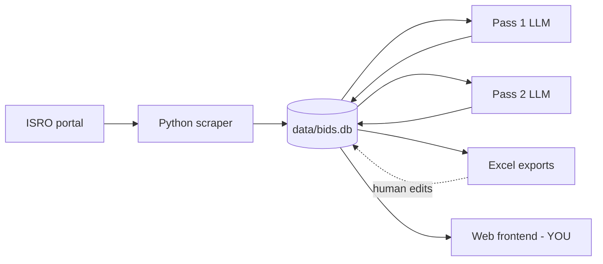

# ISRO Portal — Integration Guide (scraper + frontend)

This folder is a **self-contained copy** of the ISRO tender-automation tool. It is
meant to be dropped into a larger application whose web frontend reads the data this
tool produces and presents it to users.

If you are an agent working in this folder, read this file first, then `README.md`
(full architecture) and `AGENTS.md` (fast orientation + invariants).

---

## What this tool does (one paragraph)

A standalone Python pipeline scrapes the ISRO e-procurement portal daily, stores every
tender in a local SQLite database (`data/bids.db`), runs a cheap LLM **Pass 1** triage
score (0–5) on each new tender, and exports formatted Excel workbooks for human review.
Tenders scoring ≥ 3 (or explicitly flagged by a reviewer) get a deep **Pass 2** analysis
that downloads all documents, extracts text, and produces a richer score plus a
recommendation (PURSUE / PURSUE WITH RAMP-UP / ASSESS FURTHER / DECLINE). The SQLite DB
is the single source of truth.



---

## The contract: `data/bids.db`

The frontend should read from the `bids` table. **Treat the DB as read-mostly**: the
scraper owns all scraped + LLM columns; the frontend (or its API) may write back only the
three human-input columns (see below). The included `data/bids.db` is a **real snapshot**
with ~150 scored tenders — use it for development, schema discovery, and seeding.

### `bids` table columns

| Column | Type | Owner | Meaning |
|---|---|---|---|
| `tender_id` | TEXT PK | scraper | Portal tender id. Stable primary key — upserted, never duplicated. |
| `center_name` | TEXT | scraper | ISRO centre / unit that floated the tender. |
| `tender_description` | TEXT | scraper | Title / short description shown in the listing. |
| `bid_closing_date` | TEXT | scraper | Closing datetime, portal format `DD-Mon-YYYY HH:MM`. |
| `bid_opening_date` | TEXT | scraper | Opening datetime, same format. |
| `document_url` | TEXT | scraper | Primary document download URL. |
| `detail_url` | TEXT | scraper | Tender detail page URL. |
| `corrigendum_url` | TEXT | scraper | Corrigendum page URL (if any). |
| `detail_text` | TEXT | scraper | Extracted detail-page text used for Pass 1. |
| `doc_links_json` | TEXT (JSON) | scraper | JSON array of document link objects for Pass 2. |
| `pass1_score` | INT 0–5 | Pass 1 | Triage relevance score. `NULL` = not yet scored. |
| `pass1_confidence` | TEXT | Pass 1 | LOW / MEDIUM / HIGH. |
| `pass1_domain` | TEXT | Pass 1 | Inferred capability domain. |
| `pass1_rationale` | TEXT | Pass 1 | Short reasoning. |
| `pass1_gaps` | TEXT | Pass 1 | Capability gaps noted. |
| `pass2_score` | INT 0–5 | Pass 2 | Deep score. `NULL` = Pass 2 not done. |
| `pass2_confidence` | TEXT | Pass 2 | LOW / MEDIUM / HIGH. |
| `pass2_domain` | TEXT | Pass 2 | Domain after reading documents. |
| `pass2_rationale` | TEXT | Pass 2 | Detailed reasoning. |
| `pass2_gaps` | TEXT | Pass 2 | Detailed gaps. |
| `pass2_recommendation` | TEXT | Pass 2 | PURSUE / PURSUE WITH RAMP-UP / ASSESS FURTHER / DECLINE. |
| `human_override_score` | INT | **human** | Reviewer's manual score, overrides LLM for display. |
| `human_override_reason` | TEXT | **human** | Reviewer's note. |
| `run_pass2` | INT | **human** | `1` = force Pass 2, `-1` = suppress Pass 2, `0` = default. |
| `pass2_attempted` | INT | pipeline | `1` once Pass 2 ran (monotonic; prevents retries). |
| `bid_status` | TEXT | pipeline | Lifecycle: `NEW`, `ACTIVE`, `EXTENDED`, `CLOSED`. |
| `previous_closing_date` | TEXT | pipeline | Prior closing date when an extension is detected. |
| `extension_count` | INT | pipeline | Number of times the closing date changed. |
| `first_seen_date` | TEXT | pipeline | Date the tender first appeared. |
| `last_seen_at` | TEXT | pipeline | Last scrape timestamp that saw this tender. |
| `last_updated_date` | TEXT | pipeline | Last date any field changed. |
| `pass1_exported` | INT | pipeline | Excel-delta bookkeeping; ignore in frontend. |

`excel_log` is internal ingest bookkeeping — the frontend can ignore it.

### Lifecycle (`bid_status`)

- `NEW` — first time seen, not yet re-scraped.
- `ACTIVE` — seen again, still open, no date change.
- `EXTENDED` — closing date changed since last scrape (`previous_closing_date` + `extension_count` track history).
- `CLOSED` — closing date is in the past. **Terminal** — never re-opens, excluded from scoring.

A good default frontend view: hide `CLOSED`, surface `pass2_recommendation` when present,
otherwise show `pass1_score`. Prefer `human_override_score` over LLM scores when set.

---

## Recommended frontend read pattern

The DB is plain SQLite — the frontend's backend can query it directly (read-only) or via a
thin API. Suggested "display score" precedence:

```
display_score = human_override_score
             ?? pass2_score
             ?? pass1_score
```

Recommended list query (open tenders, most promising first):

```sql
SELECT tender_id, center_name, tender_description, bid_closing_date,
       bid_status, pass1_score, pass2_score, pass2_recommendation,
       human_override_score
FROM bids
WHERE bid_status != 'CLOSED'
ORDER BY COALESCE(human_override_score, pass2_score, pass1_score) DESC,
         bid_closing_date ASC;
```

If the frontend lets users decide which tenders go to Pass 2, write `run_pass2`
(`1`/`-1`) and optionally `human_override_score` / `human_override_reason`, then trigger
the scraper's `run-pass2` command (below). Do **not** write any scraper-owned column.

---

## Source layout

| Path | Role |
|---|---|
| `isro_tool.py` | CLI entry point / orchestrator for all commands. |
| `config.py` | Paths, portal URLs, model names, batch size, Pass 2 threshold. |
| `modules/fetcher.py` | The only portal-specific module (HTML/URL parsing). |
| `modules/db.py` | All SQL; schema, upserts, lifecycle, Pass 2 candidate query. |
| `modules/scorer_pass1.py` | Pass 1 batch LLM triage (Haiku). |
| `modules/scorer_pass2.py` | Pass 2 deep analysis (Sonnet) + document download/extract. |
| `modules/excel_export.py` | Formatted Excel workbooks (human review surface). |
| `modules/excel_ingest.py` | Read reviewer edits from Excel back into the DB. |
| `modules/logutil.py` | Consistent verbose terminal logging. |
| `data/capability_reference.md` | The LLM scoring rubric — edit to retune relevance. |
| `data/bids.db` | **Sample** SQLite snapshot (schema + real data) for development. |
| `exports/*.xlsx` | **Sample** exports so you can see exact column layouts. |
| `ISRO E Procurement.txt` | Captured portal HTML/endpoints reference used to build the scraper. |
| `README.md` / `AGENTS.md` | Full architecture / agent quick-start + invariants. |

---

## Running the scraper (to populate / refresh the DB)

```bash
python3 -m venv .venv
source .venv/bin/activate
pip install -r requirements.txt
cp .env.example .env        # then set ANTHROPIC_API_KEY
```

Commands (also available via `./run.sh <cmd>`):

| Command | What it does |
|---|---|
| `run` | Daily pipeline: scrape → CLOSED sweep → Pass 1 → export Excel. DB stays master. |
| `run-pass2` | Run Pass 2 for all current candidates (`run_pass2=1` or `pass1_score>=3` and not suppressed). |
| `score-pending` | Pass 1 for any unscored tenders. |
| `export-excel` | Regenerate Excel workbooks from the DB. |
| `ingest-excel <file>` | Read reviewer edits from an Excel file back into the DB (explicit only). |

```bash
./run.sh run
./run.sh run-pass2
```

The daily `run` **never** auto-ingests Excel — ingest is always explicit so the DB
remains the source of truth.

---

## Key design decisions (carry these into the frontend)

1. **DB is the single source of truth.** Excel and the frontend are views; only the three
   human-input columns flow back.
2. **`tender_id` is the stable join key.** Always upserted — safe to use as a URL slug / cache key.
3. **Scores can be `NULL`.** `NULL` means "not scored yet", not "score 0". Handle in UI.
4. **`CLOSED` is terminal.** Filter it out of default views.
5. **Pass 2 is gated** by score threshold (config `PASS2_THRESHOLD`, default 3) plus human override.
6. **Portal coupling is isolated** to `modules/fetcher.py`; nothing else knows the portal HTML.

---

## Notes for committing this into the larger app

- The bundled `.gitignore` ignores `data/*.db` and `exports/`. The sample `bids.db` and
  `exports/*.xlsx` here are intentional dev fixtures — if you want them tracked in the
  parent repo, add explicit exceptions or remove those ignore lines for this folder.
- Never commit a real `.env` / `ANTHROPIC_API_KEY`.
