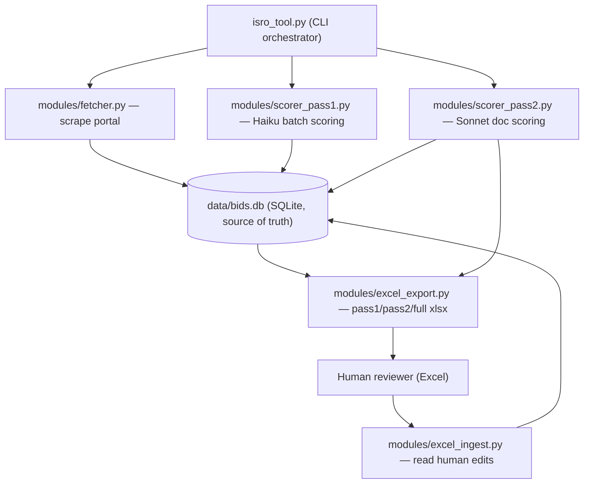

# ISRO Bid Automation

A standalone Python tool that monitors the
[ISRO e-procurement portal](https://eproc.isro.gov.in/home.html), scores every
open tender against Teclever's engineering capabilities using the Anthropic API,
and produces daily Excel review files for a human-in-the-loop workflow.

It is a sibling of the HAL and GeM automations and follows the same high-level
operating model, but is fully self-contained: copy the folder, install
dependencies, set an API key, and run.

---

## 1. Purpose

Teclever needs a repeatable daily way to discover which ISRO tenders are worth
pursuing. Manually reading the portal is slow and inconsistent. This tool:

1. Pulls every tender listed on the ISRO portal.
2. Stores them in a local SQLite database (the system of record).
3. Scores each tender 0–5 (Pass 1) using a fast LLM against a capability rubric.
4. Exports an Excel file for a human to review and mark which tenders go deeper.
5. For shortlisted tenders, downloads the tender documents, extracts their text,
   and runs a deeper LLM scoring (Pass 2) with a PURSUE/DECLINE recommendation.

The database is always the source of truth; Excel is only a review/Control surface.

---

## 2. Two-pass model

| Stage | Trigger | Model | Input | Output |
|-------|---------|-------|-------|--------|
| Scrape | `run` | — | Portal HTML | Tender rows in DB |
| Pass 1 | `run` / `score-pending` | `claude-haiku-4-5` | Title + short detail text | Score 0–5, confidence, domain, rationale |
| Human review | manual | — | `pass1_*.xlsx` | `Run Pass 2` Y/N + override columns |
| Pass 2 | `run-pass2` | `claude-sonnet-4-6` | Full tender PDFs + linked docs | Deep score, recommendation |

### Pass 2 selection rule (exactly as implemented in [`modules/db.py`](modules/db.py) `query_pass2_candidates`)

A tender is scored in Pass 2 if **all** safety guards pass
(`bid_status != 'CLOSED'`, `pass2_score IS NULL`, `pass2_attempted = 0`) **and**:

| Pass 1 Score | `Run Pass 2` column | Included? |
|--------------|---------------------|-----------|
| 3, 4, 5 | blank | Yes (auto, threshold = 3) |
| 3, 4, 5 | `Y` | Yes |
| 3, 4, 5 | `N` | No (excluded) |
| 0, 1, 2 | blank | No |
| 0, 1, 2 | `Y` | Yes (human force-include) |
| 0, 1, 2 | `N` | No |

`Run Pass 2` is stored as an integer flag: `Y → 1`, `N → -1`, blank → `0`.
The threshold (`3`) lives in [`config.py`](config.py) as `PASS2_THRESHOLD`.

---

## 3. Architecture



### Layered design

- **Orchestrator** ([`isro_tool.py`](isro_tool.py)): owns phase control, logging,
  and command routing. Holds no portal/DB logic itself.
- **Portal adapter** ([`modules/fetcher.py`](modules/fetcher.py)): the only module
  that knows ISRO HTML structure and URLs. Replace this to support another portal.
- **Persistence** ([`modules/db.py`](modules/db.py)): all SQLite reads/writes,
  lifecycle rules, and the Pass 2 candidate query.
- **Scoring** ([`modules/scorer_pass1.py`](modules/scorer_pass1.py),
  [`modules/scorer_pass2.py`](modules/scorer_pass2.py)): all Anthropic calls.
- **Excel I/O** ([`modules/excel_export.py`](modules/excel_export.py),
  [`modules/excel_ingest.py`](modules/excel_ingest.py)): the review surface.
- **Logging** ([`modules/logutil.py`](modules/logutil.py)): consistent,
  timestamped, stage-by-stage terminal output.

---

## 4. Source files

| File | Responsibility | Key functions |
|------|----------------|---------------|
| [`isro_tool.py`](isro_tool.py) | CLI entry point; orchestrates all phases | `main`, `cmd_run`, `cmd_run_pass2`, `cmd_score_pending`, `cmd_export_excel`, `cmd_ingest_excel`, `_run_pass1` |
| [`config.py`](config.py) | Paths, portal URLs, model names, thresholds | `ensure_runtime_dirs` |
| [`modules/fetcher.py`](modules/fetcher.py) | Scrape listing + detail + document links | `fetch_all_tenders`, `_parse_row`, `fetch_detail_text`, `collect_doc_links` |
| [`modules/db.py`](modules/db.py) | SQLite schema, upserts, lifecycle, queries | `init_db`, `upsert_raw_bid`, `sweep_closed_bids`, `query_pass2_candidates`, `update_pass1_score`, `update_pass2_score`, `update_human_inputs` |
| [`modules/scorer_pass1.py`](modules/scorer_pass1.py) | Batch Pass 1 scoring with retries | `score_bids_pass1_bulk`, `_score_chunk_with_retries`, `_retry_individually`, `_extract_json` |
| [`modules/scorer_pass2.py`](modules/scorer_pass2.py) | Doc download, text extraction, Pass 2 scoring | `score_bid_pass2`, `_collect_links`, `_extract_pdf_text` |
| [`modules/excel_export.py`](modules/excel_export.py) | Full/pass1/pass2 exports with formatting | `export_to_excel`, `export_pass1_delta`, `export_pass2_delta` |
| [`modules/excel_ingest.py`](modules/excel_ingest.py) | Read human columns back into DB | `ingest_excel`, `ingest_all_pending` |
| [`modules/logutil.py`](modules/logutil.py) | Terminal logging helpers | `log_banner`, `log_phase`, `log_info`, `log_ok`, `log_warn`, `log_done` |
| [`run.sh`](run.sh) / [`run_isro.sh`](run_isro.sh) | venv-activating runner, prompts for API key | — |
| [`data/capability_reference.md`](data/capability_reference.md) | LLM scoring rubric (editable) | — |
| [`ISRO E Procurement.txt`](ISRO%20E%20Procurement.txt) | Captured portal HTML — the reference used to build the scraper | — |

---

## 5. Data model

SQLite database at `data/bids.db`, single table `bids` (PRIMARY KEY `tender_id`),
plus an `excel_log` table for ingest idempotency. Full schema in
[`modules/db.py`](modules/db.py) `init_db`.

| Group | Columns |
|-------|---------|
| Identity / listing | `tender_id`, `center_name`, `tender_description`, `bid_closing_date`, `bid_opening_date`, `document_url`, `detail_url`, `corrigendum_url`, `detail_text`, `doc_links_json` |
| Pass 1 | `pass1_score`, `pass1_confidence`, `pass1_domain`, `pass1_rationale`, `pass1_gaps` |
| Pass 2 | `pass2_score`, `pass2_confidence`, `pass2_domain`, `pass2_rationale`, `pass2_gaps`, `pass2_recommendation` |
| Human-owned | `human_override_score`, `human_override_reason`, `run_pass2` |
| Lifecycle | `bid_status`, `previous_closing_date`, `extension_count`, `pass2_attempted`, `first_seen_date`, `last_seen_at`, `last_updated_date`, `pass1_exported` |

### Lifecycle states

`NEW` → `ACTIVE` (seen again) → `EXTENDED` (closing date changed) → `CLOSED`
(closing datetime is in the past). `CLOSED` is terminal and never reopens.

---

## 6. Data flow per command

### `run` (daily)

```
Phase 0  Skip Excel ingest (DB is source of truth)
Phase 1  fetch_all_tenders() -> upsert_raw_bid() per row (tracks inserted/updated)
Phase 2  sweep_closed_bids()  (closes tenders past their closing datetime)
Phase 3  Pass 1: score unscored, non-CLOSED tenders in batches of 20
Phase 4  Export pass1 delta (newly scored) + full snapshot bids_YYYY-MM-DD.xlsx
```

### `run-pass2 <xlsx> | --no-file` (after human review)

```
Phase 0  ingest_excel(force=True) for the given file, OR skip with --no-file
Phase 1  query_pass2_candidates() -> per candidate: download docs, extract text,
         score with Sonnet; mark pass2_attempted at the start to avoid retry loops
Phase 2  Export pass2 delta + refreshed full snapshot
```

### Other commands

- `score-pending` — Pass 1 only for unscored bids (no scrape). Use after an
  interrupted run.
- `export-excel` — regenerate the full snapshot from the DB (no API calls).
- `ingest-excel [path]` — manually sync human edits from one file, or all pending.

---

## 7. Output files (`exports/`)

| File | Contents |
|------|----------|
| `pass1_YYYY-MM-DD.xlsx` | Newly Pass 1-scored tenders; editable `Run Pass 2` / override columns |
| `pass2_YYYY-MM-DD.xlsx` | Pass 2 results with recommendation |
| `bids_YYYY-MM-DD.xlsx` | Full DB snapshot; CLOSED rows hidden |

Excel formatting (in [`modules/excel_export.py`](modules/excel_export.py)):
colour-coded scores (5/4/3), green PURSUE rows, frozen header, auto-filter table,
and **human columns are preserved** when a file is regenerated. Pass 2
recommendation colour takes precedence over Pass 1 score colour.

Downloaded Pass 2 documents are stored under
`downloads/YYYY-MM-DD/<sanitised_tender_id>/`.

---

## 8. Setup

```bash
cd ISROAutomation

# Create and populate a virtualenv (.venv is auto-detected by run.sh)
python3 -m venv .venv
source .venv/bin/activate
pip install -r requirements.txt

# Provide the API key (either export it or put it in .env)
cp .env.example .env   # then edit ANTHROPIC_API_KEY=sk-ant-...
```

## 9. Usage

```bash
./run.sh run                                  # daily: scrape + Pass 1 + export
./run.sh run-pass2 exports/bids_2026-06-02.xlsx  # after review: ingest + Pass 2
./run.sh run-pass2 --no-file                  # Pass 2 using existing DB flags
./run.sh score-pending                        # Pass 1 only for unscored bids
./run.sh export-excel                         # regenerate full Excel from DB
./run.sh ingest-excel <path>                  # sync human edits from one file
```

`run.sh` activates `.venv` (or `venv`), prompts for `ANTHROPIC_API_KEY` if not
set, resolves file arguments to absolute paths, then runs `python -u isro_tool.py`.

---

## 10. Dependencies

Declared in [`requirements.txt`](requirements.txt):

| Package | Used for |
|---------|----------|
| `anthropic` | Pass 1 / Pass 2 LLM scoring |
| `requests` | Portal HTTP and document downloads |
| `beautifulsoup4`, `lxml` | Parsing portal HTML |
| `pdfplumber`, `pypdf` | Tender PDF text extraction (pdfplumber primary, pypdf fallback) |
| `openpyxl` | Excel formatting / conditional rules / tables |
| `pandas` | Excel read/write and dataframe shaping |
| `python-dotenv` | Loading `ANTHROPIC_API_KEY` from `.env` |

---

## 11. Key design decisions

- **DB is the source of truth, not Excel.** The daily `run` never auto-ingests
  Excel; ingest is explicit (`ingest-excel` or `run-pass2 <file>`).
- **Full fetch + upsert, no date filtering.** Every run fetches all listed
  tenders and upserts by `tender_id`; scores and human columns are never
  overwritten by a re-scrape.
- **Idempotent, resumable scoring.** Pass 1 only scores `pass1_score IS NULL`;
  Pass 2 sets `pass2_attempted` first so failures don't loop forever.
- **Robust LLM JSON parsing (Pass 1).** Handles code fences, extracts the JSON
  array, sanitises control characters, validates all `tender_id`s are present,
  and falls back to per-bid scoring on repeated parse failures.
- **Human-owned columns are sacred.** `run_pass2`, `human_override_score`,
  `human_override_reason` are preserved across exports and re-scrapes.
- **Lifecycle is monotonic.** `CLOSED` never reopens; `EXTENDED` is recorded with
  `previous_closing_date` + `extension_count`.
- **Portal logic is isolated** in `fetcher.py` so the rest of the system is
  portal-agnostic.

---

## 12. Known limitations / extension points

- **Pass 2 JSON parsing is not as hardened as Pass 1.** A malformed Sonnet
  response causes that single bid to be skipped (it stays `pass2_attempted=1`).
- **No "no longer listed" reconciliation.** Tenders that disappear from the
  portal remain in the DB until their closing date passes. CLOSED happens via the
  date sweep, not via absence from the listing.
- **Scraping is HTTP-only.** If the portal adds anti-bot/JS rendering, add a
  Playwright fallback inside `fetcher.py` only.
- **Capability rubric** lives in [`data/capability_reference.md`](data/capability_reference.md)
  and can be edited to tune scoring; a built-in fallback is used if it is missing.

See [`AGENTS.md`](AGENTS.md) for a fast orientation aimed at automated agents.
