# WEBAPP_DESIGN.md — Teclever Bid Intelligence Platform

**Status:** Authoritative specification for the web application round.  
**Audience:** Backend agent (API contract) · UX/frontend agent (implementation) · Human reviewers.  
**Package location:** This file lives alongside visual references in [`webapp-design/`](.).

**Visual reference (interactive prototype):** [`../UIReference/Teclever Bid intelligence/`](../UIReference/Teclever%20Bid%20intelligence/) — Figma-derived; layout and look-and-feel only. **Behaviour and copy in this document take precedence.**

**Supersedes:** [`../WEBAPP_HANDOFF.md`](../WEBAPP_HANDOFF.md) for all web-app UX and front-end decisions.

---

## Screenshot index

Screenshots live in [`screenshots/`](screenshots/). Prefix `01–29` = captured from the running reference prototype. Prefix `target-` = wireframe mockups for UI not yet built in the prototype.

| # | File | Description |
|---|------|-------------|
| 01 | `01-login-empty-fields.png` | Login — empty fields (reference) |
| 02 | `02-login-filled-fields.png` | Login — filled fields (reference) |
| 03 | `03-login-page-full.png` | Login — full page (reference) |
| 04 | `04-dashboard-full.png` | Dashboard — all three portal cards |
| 05 | `05-dashboard-gem-card.png` | Dashboard — GEM card close-up |
| 06 | `06-header-navigation.png` | Global header: logo, nav, bell, logout |
| 07 | `07-portal-gem-all-bids.png` | GEM bid list — no filter |
| 08 | `08-portal-gem-filter-new-bids.png` | GEM bid list — new bids filter |
| 09 | `09-portal-gem-filter-score5.png` | GEM bid list — score 5 filter |
| 10 | `10-portal-gem-filter-high-priority.png` | GEM bid list — high priority filter |
| 11 | `11-portal-hal-all-bids.png` | HAL bid list |
| 12 | `12-portal-isro-all-bids.png` | ISRO bid list |
| 13 | `13-portal-gem-filters-panel-expanded.png` | Filter panel expanded |
| 14 | `14-portal-gem-active-filter-chips.png` | Active filter chips |
| 15 | `15-bid-detail-score5-with-summary.png` | Bid detail — score 5 with full summary |
| 16 | `16-bid-detail-score4-new.png` | Bid detail — score 4, new |
| 17 | `17-bid-detail-score3-moderate.png` | Bid detail — score 3 |
| 18 | `18-bid-detail-score2-rejected.png` | Bid detail — score 2, rejected |
| 19 | `19-bid-detail-score5-isro.png` | Bid detail — ISRO score 5 |
| 20 | `20-bid-detail-accept-confirmation-modal.png` | Accept confirmation modal |
| 21 | `21-bid-detail-reject-confirmation-modal.png` | Reject confirmation modal |
| 22 | `22-bid-detail-ai-evaluation-section.png` | AI Evaluation section close-up |
| 23 | `23-bid-detail-ai-summary-section.png` | AI Summary section close-up |
| 24 | `24-bid-detail-sidebar-chat-and-documents-to-remove.png` | Sidebar to **remove** (chat + docs) |
| 25 | `25-activity-log-desktop.png` | Activity log — desktop |
| 26 | `26-dashboard-mobile.png` | Dashboard — mobile |
| 27 | `27-portal-gem-mobile-cards.png` | GEM bid list — mobile cards |
| 28 | `28-bid-detail-mobile.png` | Bid detail — mobile |
| 29 | `29-activity-log-mobile.png` | Activity log — mobile |
| 30 | `target-login-page.png` | **Target** login (Teclever email, disabled Sign In, no footer) |
| 31 | `target-login-error-dialog.png` | **Target** login error dialog |
| 32 | `target-dashboard-bids-closing-by.png` | **Target** dashboard card — Bids Closing By + All Bids |
| 33 | `target-portal-filter-banner.png` | **Target** applied-filter banner |
| 34 | `target-portal-filtered-badge.png` | **Target** Filtered badge in bid list |
| 35 | `target-bid-detail-target-layout.png` | **Target** bid detail — single column, no sidebar |
| 36 | `target-bid-detail-generate-summary.png` | **Target** Generate Summary button state |
| 37 | `target-bid-detail-restrictive-eligibility.png` | **Target** restrictive eligibility + unreadable docs notices |
| 38 | `target-notification-panel.png` | **Target** notification panel — desktop |
| 39 | `target-notification-dispute-modal.png` | **Target** dispute auto-filter modal |
| 40 | `36-target-notification-panel-mobile.png` | **Target** notification panel — mobile |

**Regenerate screenshots:** with the UI reference dev server running (`npm run dev` in `UIReference/`), run `node scripts/capture-screenshots.mjs` from this folder.

---

## 1. Product summary

**Teclever Bid Intelligence Platform** is an internal web application for a small team (~5 users) to discover, review, and act on government tender opportunities scraped from three portals:

| Portal | Full name |
|--------|-----------|
| **GEM** | Government e-Marketplace |
| **HAL** | Hindustan Aeronautics Limited |
| **ISRO** | Indian Space Research Organisation |

The app reads from the orchestrator's **parent database** (`parent.db`). Users pick a portal, browse and filter bids, inspect AI-generated ratings and summaries, accept or reject opportunities, and review bids that were **auto-filtered** before the Haiku scoring call.

There are **no user roles**, **no admin panel**, and **no chatbot**.

---

## 2. Design principles

- **Portal-first navigation** — users always work within one portal at a time (GEM, HAL, or ISRO).
- **Simplicity and speed** — minimal clicks to reach high-priority bids; filters are visible and reversible.
- **AI assists, humans decide** — Pass-1 (Haiku) rating and rationale are always shown; deeper document summary is on demand except for top-rated bids.
- **Recoverability** — auto-filtered bids are never silently dropped; the notification bell is the review surface for disagreements.
- **Light enterprise aesthetic** — clean SaaS look (reference: Notion, Linear). Light theme, blue/neutral palette, Teclever branding. Fully responsive (desktop table, mobile cards).

---

## 3. Information architecture

### 3.1 Routes

| Route | Screen | Auth required |
|-------|--------|---------------|
| `/login` | Login | No |
| `/` | Dashboard (portal cards) | Yes |
| `/portal/:portalId` | Bid listing (`gem` \| `hal` \| `isro`) | Yes |
| `/portal/:portalId/bid/:bidKey` | Bid detail (portal-scoped; `bidKey` is the URL-encoded PK — see §16.4) | Yes |
| `/activity` | Activity log | Yes |

No other routes in v1. There is no forgot-password flow, no settings, no admin.

### 3.2 Global chrome (authenticated layout)


Sticky header on all authenticated pages:

- **Left:** Teclever logo (links to Dashboard)
- **Nav links:** Dashboard · Activity Log
- **Right:** Notification bell · Logout

**Notification bell** — see [§8](#8-notifications-auto-filtered-bids-review).  
**Logout** — ends session, returns to `/login`.

### 3.3 Navigation flow

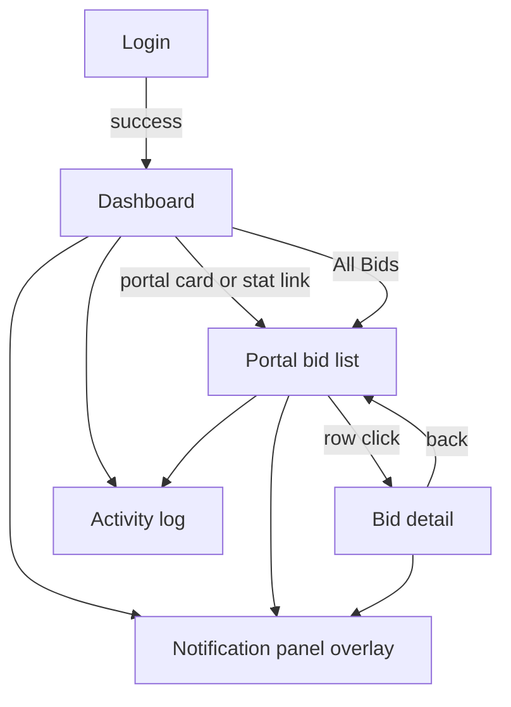
```mermaid
flowchart TD
  login[Login]
  dash[Dashboard]
  list[Portal bid list]
  detail[Bid detail]
  activity[Activity log]
  notif[Notification panel overlay]

  login -->|success| dash
  dash -->|portal card or stat link| list
  dash -->|All Bids| list
  list -->|row click| detail
  detail -->|back| list
  dash --> activity
  list --> activity
  dash --> notif
  list --> notif
  detail --> notif
```

---

## 4. Login

**Reference prototype:** [`01-login-empty-fields.png`](screenshots/01-login-empty-fields.png) · [`03-login-page-full.png`](screenshots/03-login-page-full.png)  
**Target design:** [`target-login-page.png`](screenshots/target-login-page.png) · [`target-login-error-dialog.png`](screenshots/target-login-error-dialog.png)

### 4.1 Layout (keep)

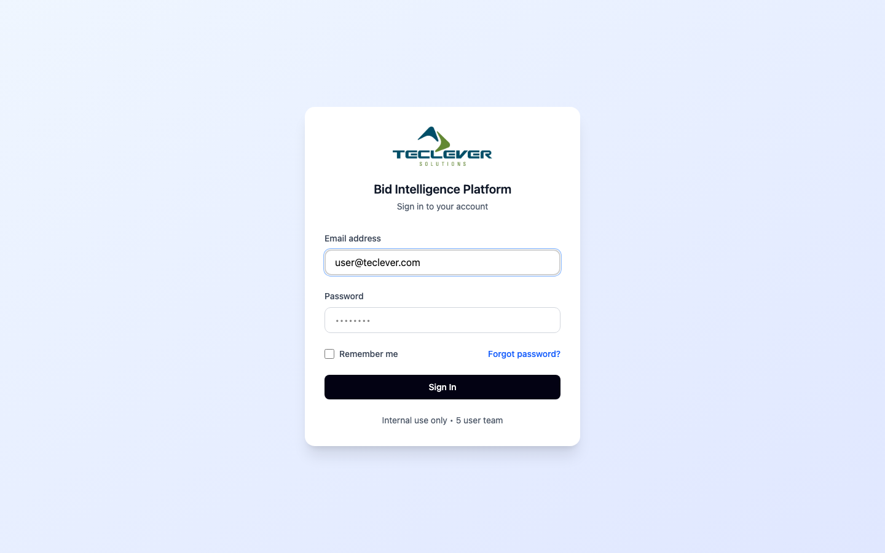

- Centred card on light gradient background
- Teclever logo
- Title: **Bid Intelligence Platform**
- Subtitle: **Sign in to your account**
- Teclever email field
- Password field
- Remember me checkbox
- Sign In button

### 4.2 Required changes from reference

| Item | Reference | Target |
|------|-----------|--------|
| Footer text | "Internal use only • 5 user team" | **Remove** — see reference `03` vs target `target-login-page` |
| Forgot password | Link present in reference | **Remove** |
| Email label | "Email address" | **"Teclever email"** |
| Sign In button | Always enabled when HTML-valid | **Disabled until both fields non-empty** — see `01-login-empty-fields` |
| Wrong credentials | No error UI | **Error dialog** — see `target-login-error-dialog` |
| Success | Redirect to Dashboard | Unchanged |

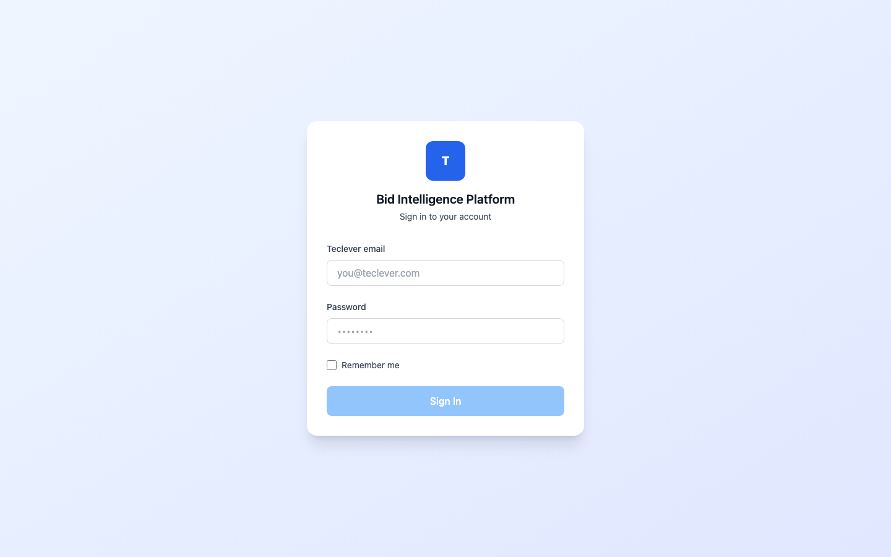

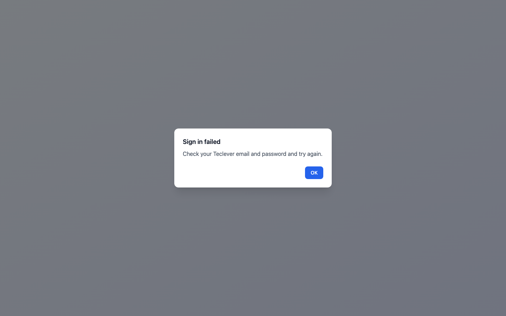

### 4.3 Error handling

- **Invalid credentials:** modal — *"Sign in failed. Check your Teclever email and password."*
- **Server unreachable:** *"Unable to reach the server. Try again later."*

### 4.4 Backend contract (login)

| Action | Expectation |
|--------|-------------|
| `POST /api/auth/login` | Body: `{ email, password }`. Validates against `users` table. |
| `POST /api/auth/logout` | Clears session. |
| `GET /api/auth/me` | Returns current user. |

---

## 5. Dashboard

**Reference:** [`04-dashboard-full.png`](screenshots/04-dashboard-full.png) · [`05-dashboard-gem-card.png`](screenshots/05-dashboard-gem-card.png)  
**Target:** [`target-dashboard-bids-closing-by.png`](screenshots/target-dashboard-bids-closing-by.png)  
**Mobile:** [`26-dashboard-mobile.png`](screenshots/26-dashboard-mobile.png)

### 5.1 Layout (keep)

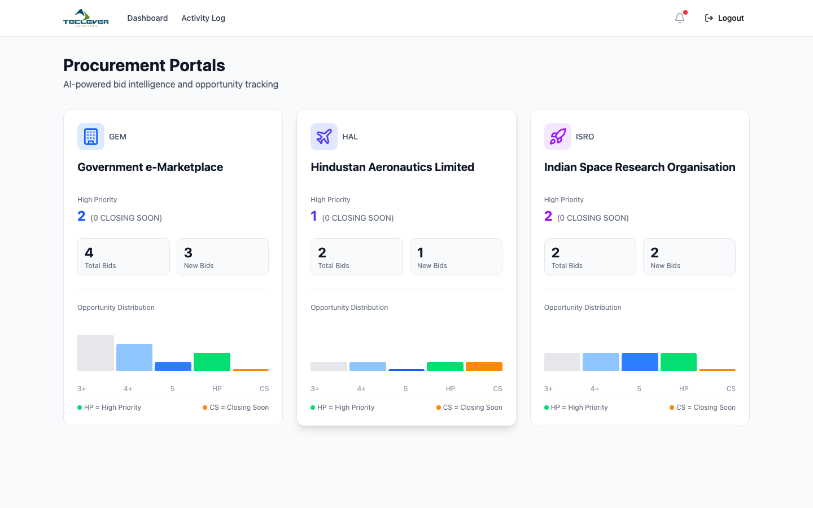

Three portal cards (GEM, HAL, ISRO), each showing:

- Portal icon and short name
- Full organisation name
- **High Priority** block (see §5.2)
- **Total Bids** and **New Bids** stat links
- **Opportunity distribution** bar chart: **3+**, **4+**, **5**, **HP**, **CS**
- Legend for HP and CS

Look and feel **approved as-is** aside from §5.2 and §5.4.

### 5.2 High Priority block — required change

**Reference** (`05-dashboard-gem-card`): shows count + `(N CLOSING SOON)` text.

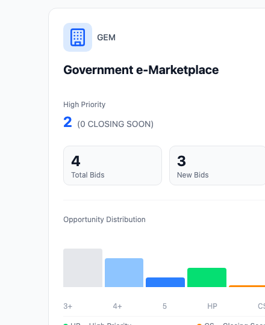

**Target** (`target-dashboard-bids-closing-by`):

- Rename to **"Bids Closing By"**
- Show a **date — always exactly 7 calendar days from today** (hardcoded rule), rendered **explicitly** on the card (e.g. *"Bids Closing By 13 Jun 2026"*) so the window is never ambiguous
- Keep numeric high-priority count (bids rated 4–5, status New, closing on or before that date)

> **Window rule (authoritative — supersedes any "working days" wording above):** the closing
> window is a **hardcoded 7 calendar days** from today. The exact bucket definitions (CS, HP,
> Bids-Closing-By) and the stats endpoint are in **§16.9**.

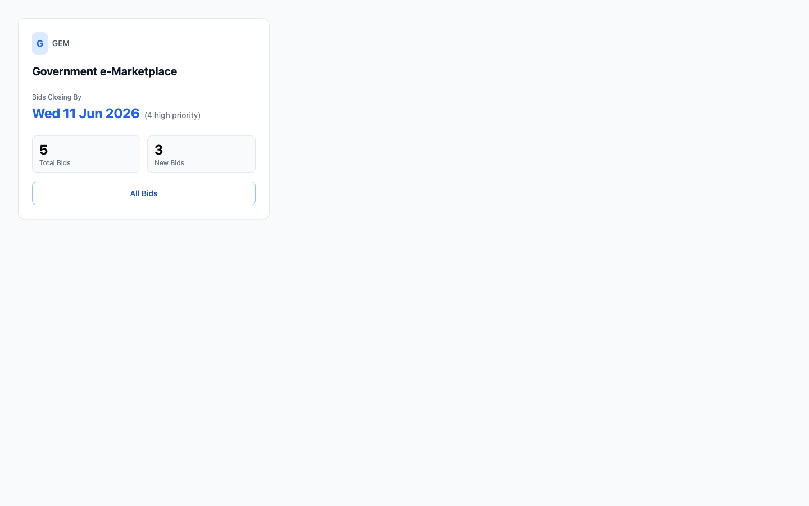

### 5.3 Stat links (keep)

| Click target | Route | Pre-applied filter |
|--------------|-------|-------------------|
| Total Bids | `/portal/{id}?filter=all` | None |
| New Bids | `/portal/{id}?filter=new` | Status = New |
| 3+ | `/portal/{id}?filter=score3plus` | Rating ≥ 3 |
| 4+ | `/portal/{id}?filter=score4plus` | Rating ≥ 4 |
| 5 | `/portal/{id}?filter=score5` | Rating = 5 |
| HP | `/portal/{id}?filter=highpriority` | Rating ≥ 4, New |
| CS | `/portal/{id}?filter=closingsoon` | Closing within window |

### 5.4 New: All Bids entry point

Each portal card gets an **"All Bids"** button navigating to `/portal/{id}` with no filter. See `target-dashboard-bids-closing-by`.

### 5.5 Backend contract (dashboard)

| Data per portal | Source |
|-----------------|--------|
| Count aggregates | `{portal}_bids` in `parent.db` |
| `bidsClosingByDate` | Client-side: today + 3 working days |

---

## 6. Portal bid listing

**Reference:** [`07-portal-gem-all-bids.png`](screenshots/07-portal-gem-all-bids.png) · [`08-portal-gem-filter-new-bids.png`](screenshots/08-portal-gem-filter-new-bids.png) · [`13-portal-gem-filters-panel-expanded.png`](screenshots/13-portal-gem-filters-panel-expanded.png) · [`14-portal-gem-active-filter-chips.png`](screenshots/14-portal-gem-active-filter-chips.png)  
**Target:** [`target-portal-filter-banner.png`](screenshots/target-portal-filter-banner.png) · [`target-portal-filtered-badge.png`](screenshots/target-portal-filtered-badge.png)  
**Mobile:** [`27-portal-gem-mobile-cards.png`](screenshots/27-portal-gem-mobile-cards.png)

### 6.1 Purpose

Searchable, filterable table. Default sort: **highest rating first**.

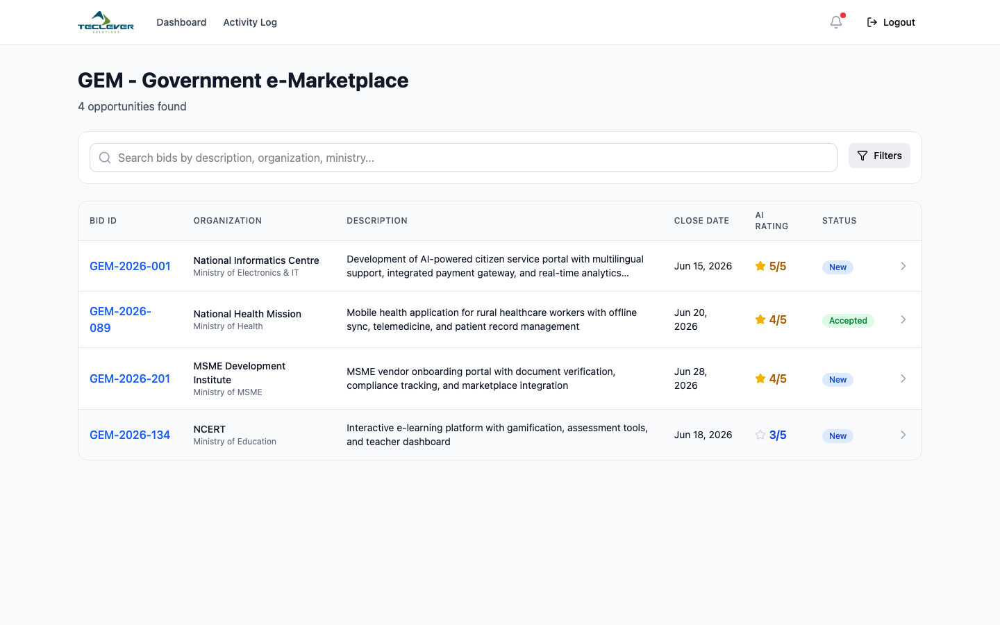

### 6.2 Applied-filter banner — required addition

**Gap in reference:** filtered views (`08`, `09`, `10`) look like unfiltered `07`.

**Target:** prominent banner below title — e.g. *"Showing: Score 4+ bids"* + **Clear filter**.

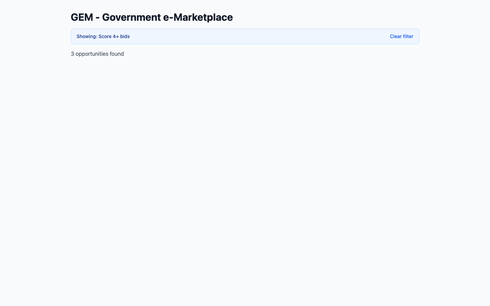

### 6.3 Column changes

| Reference | Target |
|-----------|--------|
| "AI Rating" + star + `4/5` | **"Rating"** — numeric only: `4` |

### 6.4 Search and filters (keep)

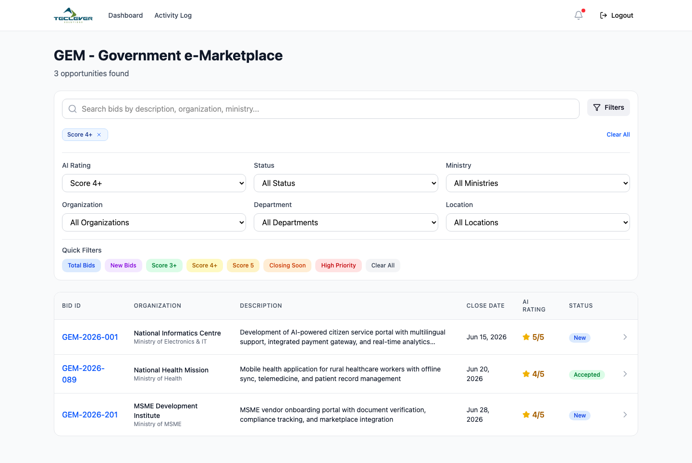

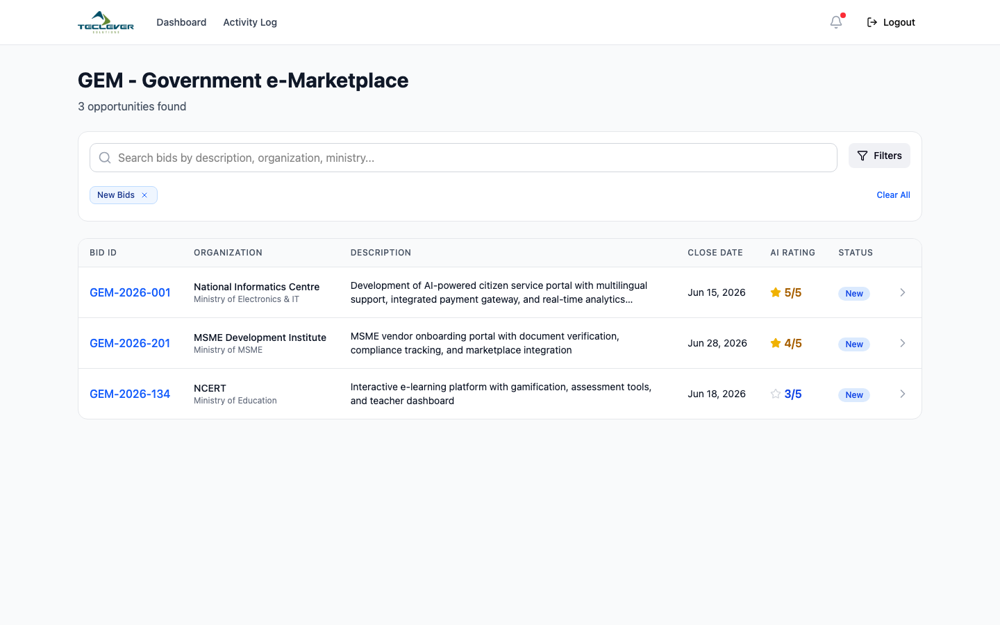

- Global search, filter panel, quick-filter chips, active chips with remove/Clear All
- **Status:** New · Accepted · Rejected

### 6.5 Filtered bids in list

Auto-filtered bids (`pass1_method = 'keyword'`) show as rating **0** + **Filtered** badge + keyword sub-line. Never hidden.

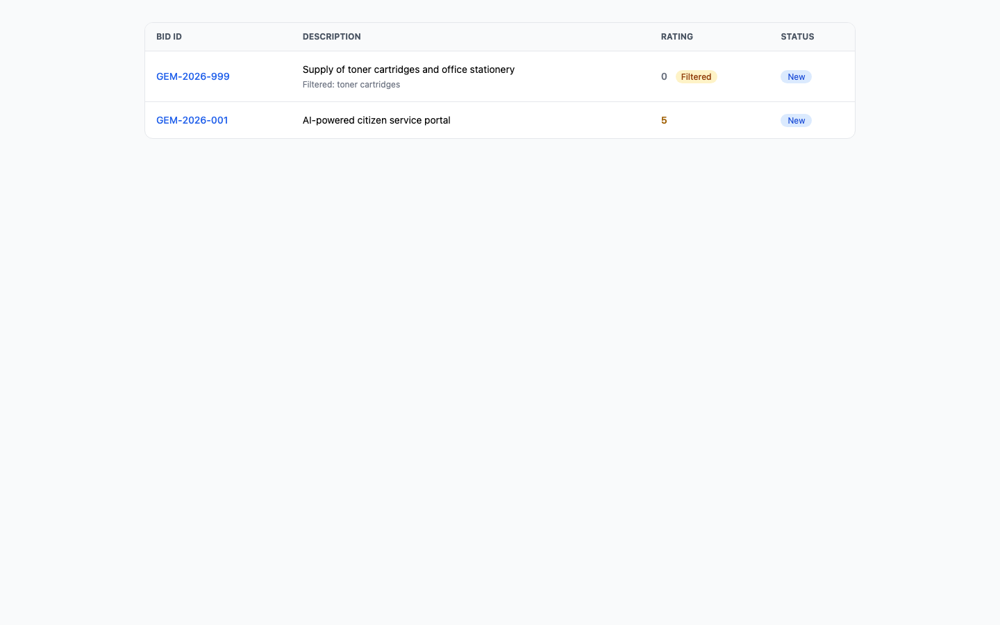

### 6.6 Row actions

Click row → Bid detail. No inline Accept/Reject.

### 6.7 Backend contract (listing)

| Endpoint | Purpose |
|----------|---------|
| `GET /api/portals/{portalId}/bids` | Paginated list with filter/search params |

---

## 7. Bid detail

**Reference:** [`15-bid-detail-score5-with-summary.png`](screenshots/15-bid-detail-score5-with-summary.png) · [`16-bid-detail-score4-new.png`](screenshots/16-bid-detail-score4-new.png) · [`20-bid-detail-accept-confirmation-modal.png`](screenshots/20-bid-detail-accept-confirmation-modal.png)  
**Sections:** [`22-bid-detail-ai-evaluation-section.png`](screenshots/22-bid-detail-ai-evaluation-section.png) · [`23-bid-detail-ai-summary-section.png`](screenshots/23-bid-detail-ai-summary-section.png)  
**Remove:** [`24-bid-detail-sidebar-chat-and-documents-to-remove.png`](screenshots/24-bid-detail-sidebar-chat-and-documents-to-remove.png)  
**Target:** [`target-bid-detail-target-layout.png`](screenshots/target-bid-detail-target-layout.png) · [`target-bid-detail-generate-summary.png`](screenshots/target-bid-detail-generate-summary.png) · [`target-bid-detail-restrictive-eligibility.png`](screenshots/target-bid-detail-restrictive-eligibility.png)  
**Mobile:** [`28-bid-detail-mobile.png`](screenshots/28-bid-detail-mobile.png)

### 7.1 Layout

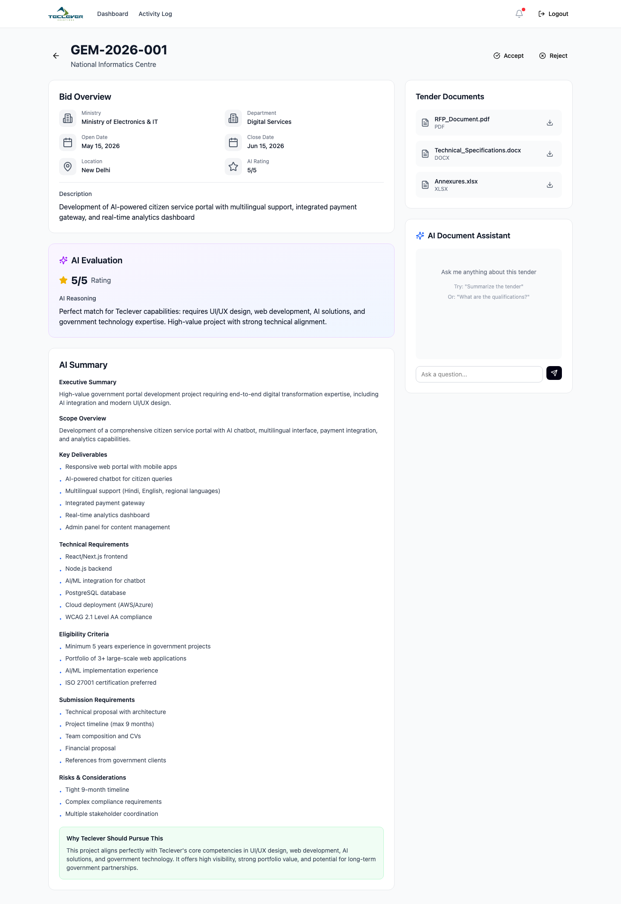

- Back + Bid ID + Accept/Reject (when `user_state = 'new'`)
- **Main column only** in target: Bid Overview · AI Evaluation · AI Summary (conditional)

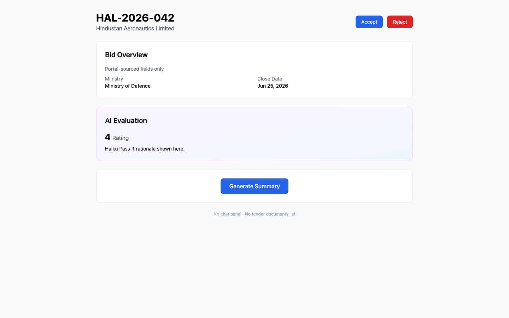

### 7.2 Remove from reference

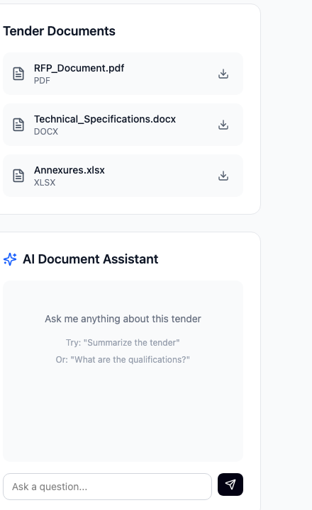

| Remove | Reason |
|--------|--------|
| Star on rating | Plain number only |
| AI Document Assistant | No chatbot |
| Tender Documents list | Not user-facing |

### 7.3 Bid overview

Portal-sourced fields only: ID, ministry, org, department, dates, location, description, bid status.

### 7.4 AI evaluation (always shown)

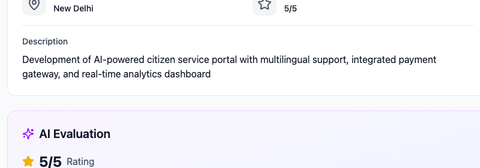

- **Rating** — digit 0–5 (no `/5`, no star)
- **Rationale** — Haiku `pass1_rationale`
- Filtered bids: rating 0 + **Filtered** badge + `pass1_eliminated_by`

### 7.5 AI summary — two tiers

#### Tier A — Detailed summary (when available)

Normally **score 5** bids after overnight pipeline. Render as **Markdown**.

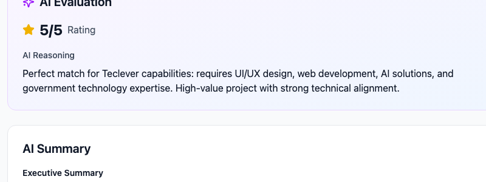

Sections shown only when data exists. Also show:

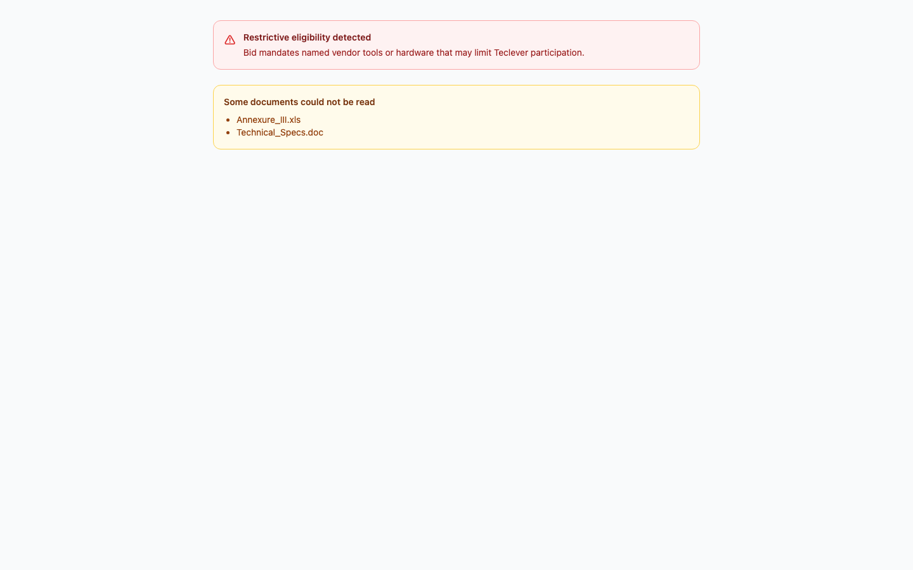

#### Tier B — Generate Summary

For bids without stored summary:

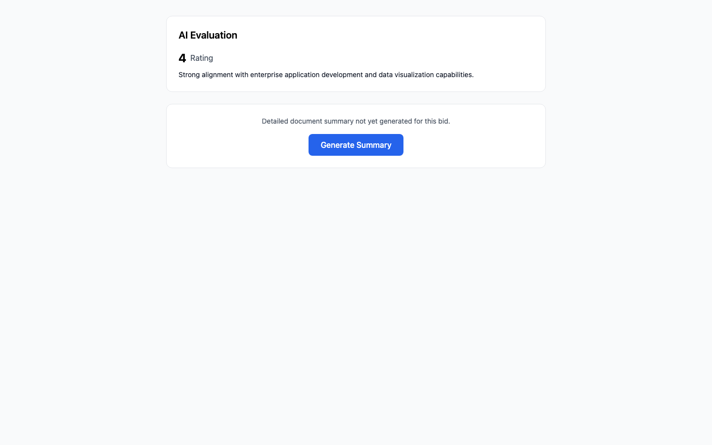

- **"Generate Summary"** button → backend API → render markdown
- Disabled when `bid_status = CLOSED`

**Score 4 example (reference, has summary in mock):** [`16-bid-detail-score4-new.png`](screenshots/16-bid-detail-score4-new.png) — in production, summary section replaced by Generate Summary until invoked.

### 7.6 Accept / Reject


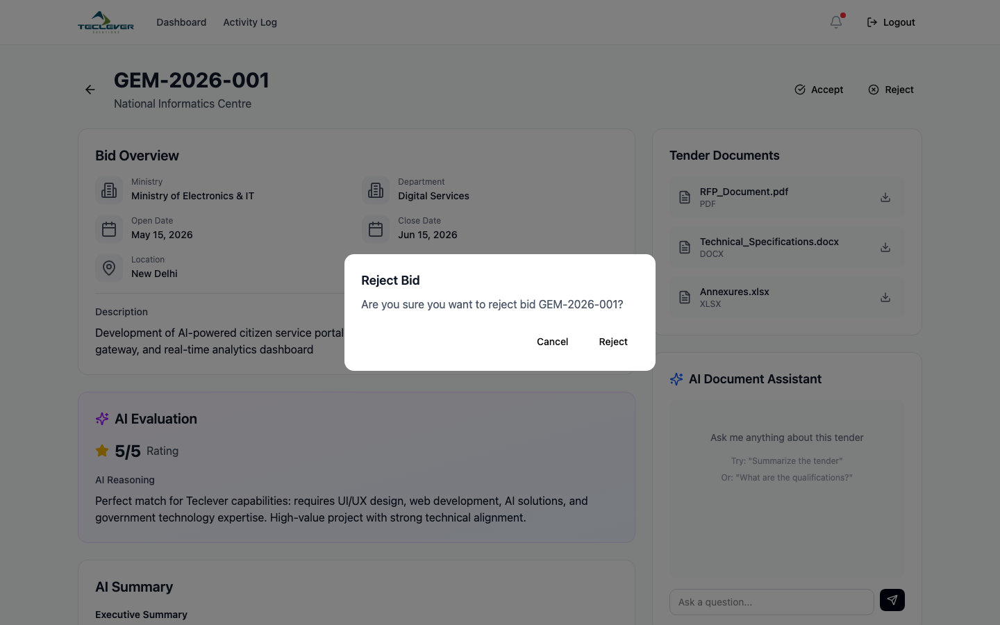

### 7.7 Backend contract (bid detail)

| Endpoint | Purpose |
|----------|---------|
| `GET /api/bids/{bidId}` | Full bid row |
| `POST /api/bids/{bidId}/generate-summary` | Trigger summarization; return markdown |
| `POST /api/bids/{bidId}/disposition` | `{ action: 'accepted' \| 'rejected' }` |

---

## 8. Notifications (auto-filtered bids review)

**Reference bell (visual only):** red dot in [`06-header-navigation.png`](screenshots/06-header-navigation.png)  
**Target:** [`target-notification-panel.png`](screenshots/target-notification-panel.png) · [`36-target-notification-panel-mobile.png`](screenshots/36-target-notification-panel-mobile.png) · [`target-notification-dispute-modal.png`](screenshots/target-notification-dispute-modal.png)

### 8.1 Purpose

Queue of bids **auto-filtered before Haiku** (`auto_rejected = 1`, pending review).

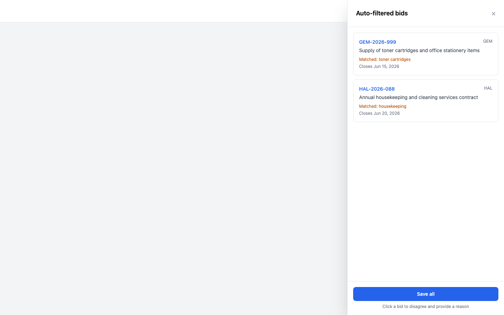

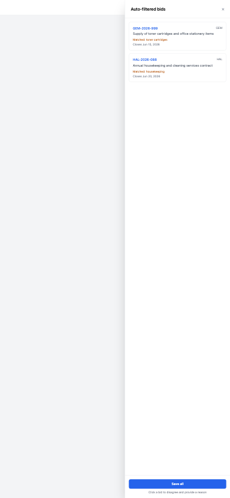

### 8.2 Bell indicator (red dot)

| State | Red dot |
|-------|---------|
| New auto-filtered bids since last panel open | **Shown** |
| User opens panel and closes (no action) | **Hidden** |
| Queue empty after Save all / all disputed | **Hidden** |

### 8.3 Panel behaviour

Each row: Bid ID, portal, description snippet, matched keyword, close date.

- **Save all** — accept every auto-filter; clear queue
- **Click bid** — disagree → reason modal → requeue for Haiku

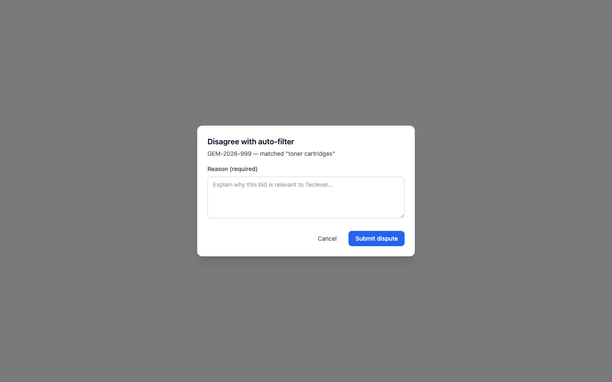

### 8.4 Review completion

List clears only after **Save all** or **every bid disputed**. Opening panel alone clears red dot only, not the list.

### 8.5 Backend contract (notifications)

| Endpoint | Purpose |
|----------|---------|
| `GET /api/notifications/auto-filtered` | Pending queue |
| `GET /api/notifications/auto-filtered/count` | New count for red dot |
| `POST /api/notifications/auto-filtered/viewed` | Mark panel seen |
| `POST /api/notifications/auto-filtered/save-all` | Accept all |
| `POST /api/notifications/auto-filtered/{bidId}/dispute` | `{ reason }` — promote |

---

## 9. Activity log

**Reference:** [`25-activity-log-desktop.png`](screenshots/25-activity-log-desktop.png) · [`29-activity-log-mobile.png`](screenshots/29-activity-log-mobile.png)

**Keep as-is.**

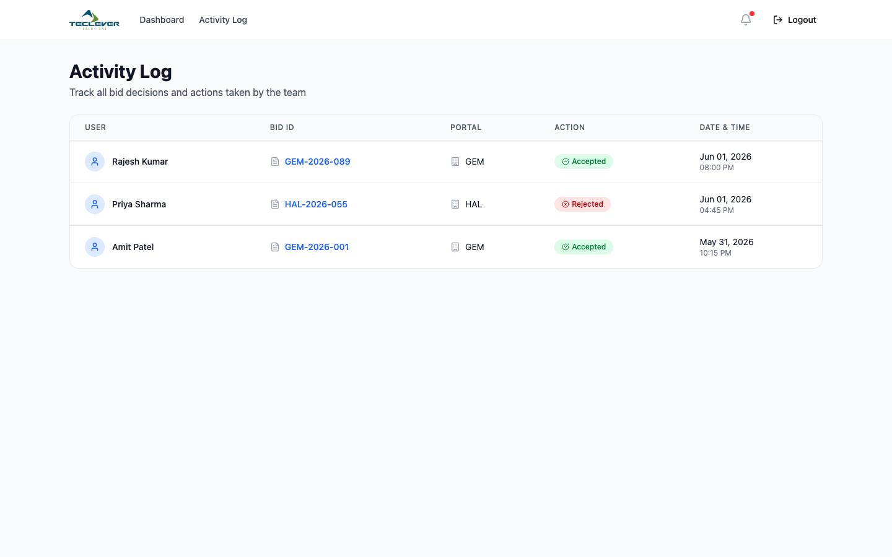

| Column | Content |
|--------|---------|
| User | Who acted |
| Bid ID | Which bid |
| Portal | GEM / HAL / ISRO |
| Action | Accepted / Rejected |
| Date & Time | Timestamp |

### Backend contract

| Endpoint | Purpose |
|----------|---------|
| `GET /api/activity` | Paginated team action log |

---

## 10. Visual design system

### 10.1 Reference implementation

- **Prototype:** `../UIReference/Teclever Bid intelligence/`
- **Stack:** Vite + React + React Router + Tailwind 4 + shadcn/Radix
- **Theme:** `UIReference/.../src/styles/theme.css`
- **Logo:** `UIReference/.../src/imports/TECLEVER_Logo.jpg`

### 10.2 Responsive rules

| Breakpoint | Bid list | Bid detail |
|------------|----------|------------|
| Desktop | Table — see `07` | Single column — see `target-bid-detail-target-layout` |
| Mobile | Cards — see `27` | Stacked — see `28` |

### 10.3 Components to reuse

Button, modal, table, badges, search, filter chips, portal cards, layout shell.

### 10.4 Components to drop

Chat, document list, star rating, forgot-password link.

---

## 11. Data model (UI-facing field map)

| UI label | DB field | Notes |
|----------|----------|-------|
| Bid ID | portal PK | GEM / HAL / ISRO shapes differ |
| Rating | `pass1_score` | 0–5 integer |
| Rationale | `pass1_rationale` | Haiku |
| Filtered badge | `pass1_method = 'keyword'` | + `auto_rejected = 1` |
| Matched keyword | `pass1_eliminated_by` | |
| Status | `user_state` | new / accepted / rejected |
| Bid status | `bid_status` | OPEN / EXTENDED / CLOSED |
| Detailed summary | `summary_json` | Markdown when present |
| Generate Summary | S6 module trigger | Server-gated |

---

## 12. Explicit non-goals (v1)

- Forgot-password · roles · admin · chatbot · tender doc list · vector/RAG · eliminator Excel UI · email · re-summarize on EXTENDED

---

## 13. Reference → target checklist

| Area | Reference screenshot | Target screenshot |
|------|---------------------|-------------------|
| Login | `03-login-page-full` | `target-login-page`, `target-login-error-dialog` |
| Dashboard | `04-dashboard-full`, `05-dashboard-gem-card` | `target-dashboard-bids-closing-by` |
| Bid list | `07-portal-gem-all-bids` | `target-portal-filter-banner`, `target-portal-filtered-badge` |
| Bid detail | `15`, `24` (sidebar to drop) | `target-bid-detail-target-layout`, `target-bid-detail-generate-summary` |
| Notifications | `06-header-navigation` (bell only) | `target-notification-panel`, `target-notification-dispute-modal` |
| Activity log | `25-activity-log-desktop` | unchanged |

---

## 14. Agent handoff notes

### Backend agent

**Start at §16** — the authoritative backend/API contract (it supersedes the endpoint sketches
in §4.4, §5.5, §6.7, §7.7, §8.5, §9). Read model = `parent.db` only; stack = Python + FastAPI
reusing `bidplus/` modules.

### UX / front-end agent

**Start with [`BUILD.md`](BUILD.md)** (zero-context build guide) + [`API.md`](API.md) (the API
contract you code against) + [`fixtures/`](fixtures/) (mockable responses). Then:

1. Interactive prototype: `npm i && npm run dev` in `UIReference/Teclever Bid intelligence/`
2. Visual truth: screenshots in this package + this document
3. Build net-new UI from `target-*` screenshots: filter banner, All Bids, notification panel, Generate Summary, login changes

The API layer is built **separately, in-repo** (Python + FastAPI per §16) — you consume it; you
don't build it.

---

## 16. Backend & API contract — gap-closure decisions (2026-06-06)

This section is the outcome of a QA session mapping this spec against the orchestrator's
`parent.db` schema and `bidplus/` modules. **It is authoritative and supersedes the per-section
"Backend contract" endpoint sketches (§4.4, §5.5, §6.7, §7.7, §8.5, §9) wherever they differ.**
The gaps it closes were: no web/API layer, no activity-log table, no notification "viewed"
state, unseeded auth, no global summarization lock, and an under-specified bid route.

> **Status: IMPLEMENTED (2026-06-06).** Built in-repo as `bidplus/web/` (FastAPI) +
> `bidplus/locks.py` + `bidplus/dispositions.py` + `bidplus/users.py`; the request/response
> shapes are in [`API.md`](API.md). Smoke-validated against the live `parent.db` (auth, stats,
> listing incl. closing-soon, HAL composite-key detail, disposition→activity, notifications).
> The front-end (this package) consumes it per `API.md`.

### 16.1 Stack

- **Python + FastAPI**, new package `bidplus/web/`. Reuses bidplus modules **directly** —
  `summarize.summarize_bid`, `governance.promote/accept`, `gate`, `lifecycle.parse_closing`,
  `merge.connect_parent` — so DB and AI logic is never duplicated.
- Reads `parent.db` (WAL, read-mostly). The **only** writes it performs: dispositions,
  `activity_log`, `sessions`, `notification_views`, and the overlay summary fields (via the
  summarize module). Scrape/merge/score remain the nightly CLI's job.
- Serves the **built React UI** (`UIReference/Teclever Bid intelligence/dist`) as static assets
  from the same process. One venv, one **systemd service**, **separate** from the nightly timer.

### 16.2 New `parent.db` tables (additive migrations; the web round owns them)

`users` already exists (`id, username, password_hash, created_at`) — `username` holds the
Teclever email. **No new column is needed for the notification watermark**: all three
`{portal}_bids` tables already carry `first_seen_date` (set-once by the tool).

```sql
CREATE TABLE IF NOT EXISTS sessions (
  token       TEXT PRIMARY KEY,      -- 32-byte urlsafe random
  user_id     INTEGER NOT NULL REFERENCES users(id),
  created_at  TEXT NOT NULL,
  expires_at  TEXT NOT NULL);

CREATE TABLE IF NOT EXISTS activity_log (   -- append-only; never UPDATEd
  id          INTEGER PRIMARY KEY,
  user_id     INTEGER NOT NULL REFERENCES users(id),
  portal      TEXT NOT NULL,          -- gem | hal | isro
  bid_key     TEXT NOT NULL,          -- canonical bidKey (§16.4)
  action      TEXT NOT NULL,          -- accepted | rejected | disputed
  detail      TEXT,                   -- dispute reason (NULL for accept/reject)
  created_at  TEXT NOT NULL);

CREATE TABLE IF NOT EXISTS notification_views (
  user_id        INTEGER PRIMARY KEY REFERENCES users(id),
  last_viewed_at TEXT NOT NULL);
```

### 16.3 Auth (closes the unseeded-users gap)

- **Password hashing:** bcrypt — the `bcrypt` library directly (passlib 1.7.4 is incompatible
  with bcrypt 4.x).
- **Email rule:** the account email **must** be on the `teclever` domain (e.g.
  `test@teclever.com`); reject anything else at **both** account creation and login.
- **User management:** a small CLI `python -m bidplus.users {add|edit|remove|list}` (new
  `bidplus/users.py`), **run manually on the deploy box** by the operator. Seed a test account
  on a `@teclever` email. No self-signup, no admin UI.
- **Sessions:** on login, mint a random `token`, store in `sessions`, deliver as an **httpOnly,
  SameSite=Lax** cookie `bidplus_session`. Expiry: **"Remember me" → 30 days**, otherwise **12
  hours**. Logout deletes the row.
- **Endpoints:** `POST /api/auth/login {email,password}` · `POST /api/auth/logout` ·
  `GET /api/auth/me`.

### 16.4 Bid identity & routing (closes the composite-PK ambiguity)

- Canonical address = **`{portal}` + `{bidKey}`**. `bidKey` is the tool PK, **URL-encoded**;
  HAL's composite is joined with `|` → `tender_number|line_number` (the same `|` convention as
  `governance._split_bid_id`, so it round-trips with no lookup table).
- **API path:** `GET /api/portals/{portal}/bids/{bidKey}`. **UI route:**
  `/portal/:portalId/bid/:bidKey`. The server URL-decodes `bidKey` and splits on `|` into the
  portal's PK columns.

| Portal | bidKey (decoded) example |
|--------|--------------------------|
| gem  | `GEM/2026/B/7605377` |
| isro | `SA202600126601` |
| hal  | `HAL/KPT/ED/E-PROC/WC-1245/1\|WC-1245` |

### 16.5 Activity log (§9) — bid decisions only

- Records **`accepted` · `rejected` · `disputed`** only. **Append-only**, never updated.
- **Re-disposition is allowed** (e.g. accept → later reject): each writes a **new** row; the
  bid's `user_state` always reflects the latest.
- A new helper (`bidplus/dispositions.py`) writes `user_state` + `disposed_by` + `disposed_at`
  **and** appends the `activity_log` row in **one transaction** — used by §16.6 and §16.7.
- `disputed` rows originate from the notification promote path (§16.7) and carry the reason in
  `detail`.
- **`GET /api/activity`** — paginated, joined to `users` for the display name/email.

### 16.6 Disposition — Accept / Reject (§7.6)

- **`POST /api/portals/{portal}/bids/{bidKey}/disposition  { action: "accepted" | "rejected" }`**
- Sets `user_state`, `disposed_by` (current user), `disposed_at`; appends an `activity_log` row
  (§16.5). Applies to **model-scored** bids; the UI shows the buttons while `user_state='new'`.
  (Eliminated/filtered bids are handled via the notification panel, not these buttons — §16.10.)

### 16.7 Notifications (§8) — shared live queue, per-user red dot

- **The queue is GLOBAL and LIVE:** `auto_rejected=1 AND human_disposition IS NULL`. It changes
  as **any** user disputes/accepts — a bid one user disposes **disappears from everyone's**
  queue. The UI must tolerate the list shrinking/refreshing between fetches (per the user's
  explicit note that content shifts with others' actions).
- **The red dot is PER-USER:** `notification_views(user_id, last_viewed_at)`. New-count =
  pending auto-filtered bids whose **`first_seen_date > last_viewed_at`** for that user.
- **Endpoints:**
  - `GET  /api/notifications/auto-filtered` — current shared pending queue (paginated).
  - `GET  /api/notifications/auto-filtered/count` — **per-user** new count (red dot).
  - `POST /api/notifications/auto-filtered/viewed` — set this user's `last_viewed_at = now`
    (**clears the red dot only**, never the queue — per §8.4).
  - `POST /api/notifications/auto-filtered/save-all` — `governance.accept(bid_ids=None)` across
    the portals in the queue (writes `human_disposition='accepted'` + ledger
    `confirmed_rejections++`). Clears the queue.
  - `POST /api/notifications/auto-filtered/{portal}/{bidKey}/dispute  { reason }` —
    `governance.promote(...)` (`false_positives++`, requeue for Haiku,
    `human_disposition='promoted'`) **and** appends `activity_log` `action='disputed'`.

### 16.8 Generate Summary lock (§7.5 Tier B) — closes the concurrency gap

- A **cross-process file lock** `$BIDPLUS_RUNTIME_DIR/summarize.lock` (`fcntl.flock`) guards the
  single summarization path. Both the nightly `_run_pass2` and the web endpoint acquire it
  around each `summarize_bid` call. New helper `bidplus/locks.py`, used by **both**.
- **`POST /api/portals/{portal}/bids/{bidKey}/generate-summary`** → **non-blocking** try-acquire:
  - acquired → `summarize_bid` (re-fetches docs if the 7-day window aged them out) → returns the
    rendered markdown + `summary_json`, releases the lock.
  - held (e.g. nightly run in progress) → **HTTP 409**, UI shows *"Summarization is busy (nightly
    run in progress). Try again shortly."*
- **Disabled when `bid_status='CLOSED'`** (button disabled client-side; server also rejects).

### 16.9 Dashboard aggregates (§5) — buckets + window

- **Closing window = hardcoded 7 calendar days** from today (overrides §5.2's "working days").
  The card **must display the actual date** ("Bids Closing By 13 Jun 2026").
- **`GET /api/portals/{portal}/stats`** returns these counts + the window date. Closing
  comparisons parse each portal's closing column via `lifecycle.parse_closing` / `_portal_spec`
  (HAL `closing_date` · ISRO `bid_closing_date` · GeM `end_date`).

| Bucket | Definition (over `{portal}_bids`) |
|--------|-----------------------------------|
| Total | all rows |
| New | `user_state='new'` |
| 3+ | `pass1_score >= 3` |
| 4+ | `pass1_score >= 4` |
| 5 | `pass1_score = 5` |
| HP | `pass1_score >= 4 AND user_state='new'` |
| CS | `user_state='new' AND closing <= today+7d` |
| **Bids Closing By** (card headline) | `pass1_score IN (4,5) AND user_state='new' AND closing <= today+7d` |

### 16.10 Filtered bids are not Accept/Reject targets

`pass1_method='keyword'` (filtered) bids are reviewed **only** through the notification panel
(dispute = promote, or accept). The bid-detail Accept/Reject (§16.6) is for model-scored bids
(`user_state='new'`). This keeps the eliminator ledger the single source of filtered-bid
feedback.

### 16.11 New / changed backend artifacts (build checklist)

| Artifact | Type | Purpose |
|----------|------|---------|
| `bidplus/web/` (FastAPI app) | new | All endpoints above; serves the React `dist` |
| `bidplus/users.py` | new | `add/edit/remove/list` user CLI (deploy-box, bcrypt, `@teclever` guard) |
| `bidplus/locks.py` | new | `flock` helper shared by nightly Pass-2 + web generate-summary |
| `bidplus/dispositions.py` | new | Accept/reject helper: `user_state` + `disposed_*` + `activity_log` in one txn |
| `sessions`, `activity_log`, `notification_views` tables | new | §16.2 DDL (additive) |
| `fastapi`, `uvicorn`, `bcrypt` | new deps | web server + session password hashing |
| `launcher._run_pass2` | change | acquire the `summarize.lock` around the score-5 loop |

Nothing here touches the locked S0–S7 invariants (one path to Sonnet, overlay never overwritten,
soft-flag recoverability) — the web layer reads the master DB and routes all AI work back through
the existing single summarization module behind the new lock.

---

## 15. Document history

| Date | Change |
|------|--------|
| 2026-06-06 | Initial spec from product review |
| 2026-06-06 | Moved to `webapp-design/` package with 40 screenshots |
| 2026-06-06 | **§16 added** — backend/API gap-closure decisions (FastAPI stack, DB-session auth + user CLI, activity_log, per-user notification watermark, bid routing, summarize file-lock, 7-day closing window). Inline fixes: §3.1 bid route, §5.2 closing rule. |
| 2026-06-06 | **§16 IMPLEMENTED** — `bidplus/web/` FastAPI app + `locks.py`/`dispositions.py`/`users.py`; `API.md` + `fixtures/` + `BUILD.md` front-end handoff added; smoke-validated against `parent.db`. (bcrypt direct, not passlib.) |
| 2026-06-06 | **Frontend build started** — React UI in `UIReference/Teclever Bid intelligence/`. `npm run build` → `dist/`. FastAPI serving at `localhost:8000`. Login working. CORS middleware added. Three known issues in progress: dashboard 0s (missing `credentials: "include"`), no pagination UI, Generate Summary spinner/states. Screen build order: login → dashboard → list → detail → activity → notifications. |
